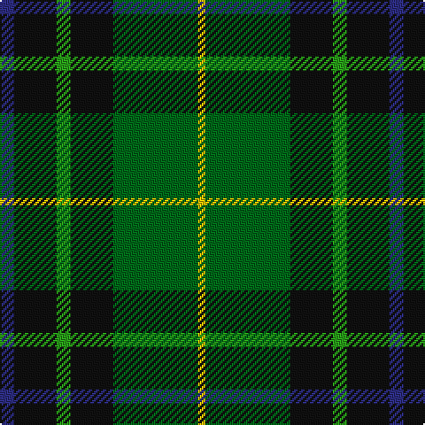

In pattern [BKGKGY](/stripes/bkgkgy/).

This was sourced from tartans-authority.  It is a [6 stripe tartan](/stripes/stripes6/).

Original link http://www.tartansauthority.com/tartan-ferret/display/10308/

## Thread count
DB/8 K24 G8 K24 Ga48 Y/4

## Palette
Each colour and the base-6 reference it is a variant of.

| Colour | Shade | Base |
|---|---|---|
| DB | <code style="background-color:#2C2C80;">#2C2C80</code> `oklch(35.0% 0.138 276.6)` <small>#2C2C80</small> | B <code style="background-color:#2A418A;">#2A418A</code> |
| G | <code style="background-color:#289C18;">#289C18</code> `oklch(60.6% 0.191 141.6)` <small>#289C18</small> | G <code style="background-color:#006100;">#006100</code> |
| Ga | <code style="background-color:#006818;">#006818</code> `oklch(45.0% 0.142 145.0)` <small>#006818</small> | G <code style="background-color:#006100;">#006100</code> |
| K | <code style="background-color:#101010;">#101010</code> `oklch(17.3% 0.000 89.9)` <small>#101010</small> | K <code style="background-color:#000000;">#000000</code> |
| Y | <code style="background-color:#E8C000;">#E8C000</code> `oklch(81.9% 0.168 93.7)` <small>#E8C000</small> | Y <code style="background-color:#F2BF00;">#F2BF00</code> |

# Sample pattern

## Nearest tartans

The nearest existing variants by ΔTartan distance, with this tartan at the top so the swatches line up against it.

ΔTartan

Tartan

Sett

—

<a href="/ttd/edit/#slug=db2k6g2k6g12ly1~x4">Leahy (Australia) (Personal)</a> <a class="nn-out" href="/setts/s6/db2k6g2k6g12ly1~x4/" title="open its dictionary page">↗</a>

0.89

<a href="/ttd/edit/#slug=r3db22k11g32ly3~x2">Cultoquhey Hotel</a> <a class="nn-out" href="/setts/s5/r3db22k11g32ly3~x2/" title="open its dictionary page">↗</a>

0.89

<a href="/ttd/edit/#slug=g6ly3g26dg10dt30lb3~x2">Wcwm 1716</a> <a class="nn-out" href="/setts/s6/g6ly3g26dg10dt30lb3~x2/" title="open its dictionary page">↗</a>

1.11

<a href="/ttd/edit/#slug=g3db12w1k12g13r2g2~x2">Paterson (Personal)</a> <a class="nn-out" href="/setts/s7/g3db12w1k12g13r2g2~x2/" title="open its dictionary page">↗</a>

1.12

<a href="/ttd/edit/#slug=dg24k5dg6r6dg6k20b20w2~x2">Dunfermline Bank of Scotland (Corp)</a> <a class="nn-out" href="/setts/s8/dg24k5dg6r6dg6k20b20w2~x2/" title="open its dictionary page">↗</a>

1.14

<a href="/ttd/edit/#slug=r5dg18ly2k14t5k4~x2">Unidentified No 79</a> <a class="nn-out" href="/setts/s6/r5dg18ly2k14t5k4~x2/" title="open its dictionary page">↗</a>

1.15

<a href="/ttd/edit/#slug=g3r3g31dg18g4k22ly3">MacSween Hunting (Lochs, Isle of Lew</a> <a class="nn-out" href="/setts/s7/g3r3g31dg18g4k22ly3/" title="open its dictionary page">↗</a>

1.15

<a href="/ttd/edit/#slug=g28k4g5dr4g5k19db19y2~x2">City of Guelph</a> <a class="nn-out" href="/setts/s8/g28k4g5dr4g5k19db19y2~x2/" title="open its dictionary page">↗</a>

1.19

<a href="/ttd/edit/#slug=g2b22r2k21g23ly2~x2">Royal Ashburn Golf Club</a> <a class="nn-out" href="/setts/s6/g2b22r2k21g23ly2~x2/" title="open its dictionary page">↗</a>

1.19

<a href="/ttd/edit/#slug=g10db42r5dg42g42ly5g10">New Mexico</a> <a class="nn-out" href="/setts/s7/g10db42r5dg42g42ly5g10/" title="open its dictionary page">↗</a>

1.21

<a href="/ttd/edit/#slug=g3db12lr1k12g13r2g2~x2">MacPhadran</a> <a class="nn-out" href="/setts/s7/g3db12lr1k12g13r2g2~x2/" title="open its dictionary page">↗</a>

## Neighbour map

Every grey dot is one of 14299 variants placed by the first two principal components of the ΔTartan feature space (44% of its variance). Red is this tartan; blue dots are its nearest — click one to open its page.

<svg viewBox="0 0 640 380" role="img" style="max-width:100%;height:auto;border:1px solid #e0e0e0;border-radius:4px;display:block" xmlns="http://www.w3.org/2000/svg"><image href="/nn/cloud.v1.png" width="640" height="380"/><a href="/setts/s5/r3db22k11g32ly3~x2/"><circle cx="226.5" cy="217.8" r="4" fill="#3465a4"><title>Cultoquhey Hotel</title></circle></a><a href="/setts/s6/g6ly3g26dg10dt30lb3~x2/"><circle cx="216.4" cy="211.9" r="4" fill="#3465a4"><title>Wcwm 1716</title></circle></a><a href="/setts/s7/g3db12w1k12g13r2g2~x2/"><circle cx="200.8" cy="194.5" r="4" fill="#3465a4"><title>Paterson (Personal)</title></circle></a><a href="/setts/s8/dg24k5dg6r6dg6k20b20w2~x2/"><circle cx="182.1" cy="193.7" r="4" fill="#3465a4"><title>Dunfermline Bank of Scotland (Corp)</title></circle></a><a href="/setts/s6/r5dg18ly2k14t5k4~x2/"><circle cx="171.0" cy="212.9" r="4" fill="#3465a4"><title>Unidentified No 79</title></circle></a><a href="/setts/s7/g3r3g31dg18g4k22ly3/"><circle cx="240.1" cy="207.8" r="4" fill="#3465a4"><title>MacSween Hunting (Lochs, Isle of Lew</title></circle></a><a href="/setts/s8/g28k4g5dr4g5k19db19y2~x2/"><circle cx="209.4" cy="179.4" r="4" fill="#3465a4"><title>City of Guelph</title></circle></a><a href="/setts/s6/g2b22r2k21g23ly2~x2/"><circle cx="175.6" cy="199.3" r="4" fill="#3465a4"><title>Royal Ashburn Golf Club</title></circle></a><a href="/setts/s7/g10db42r5dg42g42ly5g10/"><circle cx="187.9" cy="218.1" r="4" fill="#3465a4"><title>New Mexico</title></circle></a><a href="/setts/s7/g3db12lr1k12g13r2g2~x2/"><circle cx="168.9" cy="180.1" r="4" fill="#3465a4"><title>MacPhadran</title></circle></a><circle cx="217.2" cy="208.1" r="5" fill="#c00000"/></svg>

ID: /setts/s6/db2k6g2k6g12ly1~x4/
