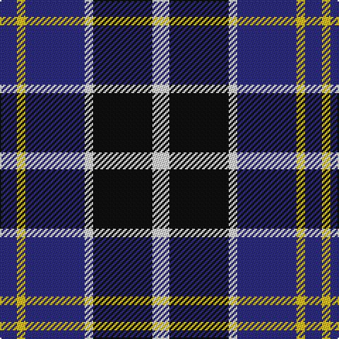

**Bands:** [BYBWKW](/stripes/bybwkw/) · **Stripes:** [DB LY DB W K W](/stripes/stripes6/) DB LY DB W K W

This was sourced from tartans-authority.  It is a [6 band tartan](/bands/bands6/).

Original link http://www.tartansauthority.com/tartan-ferret/display/5834/

## Thread count
DB/12 Y6 DB42 LN6 K42 LN/12

## Palette
Each colour and its ΔE from the base-6 reference it is a variant of.

| Colour | Shade | Base | ΔE (OKLab) |
|---|---|---|---|
| DB | <code style="background-color:#2C2C80;">#2C2C80</code> `#2C2C80` | B <code style="background-color:#2A418A;">#2A418A</code> | 0.06 |
| K | <code style="background-color:#101010;">#101010</code> `#101010` | K <code style="background-color:#000000;">#000000</code> | 0.17 |
| LN | <code style="background-color:#E0E0E0;">#E0E0E0</code> `#E0E0E0` | W <code style="background-color:#F7F7F7;">#F7F7F7</code> | 0.07 |
| Y | <code style="background-color:#E8C000;">#E8C000</code> `#E8C000` | Y <code style="background-color:#F2BF00;">#F2BF00</code> | 0.02 |

# Sample pattern

## Nearest tartans

The nearest existing variants by ΔTartan distance.

1. [University of Notre Dame](/setts/s6/r5db35k25db8ly10r5~x2/) — ΔT 0.78
1. [Eglinton](/setts/s7/k3dg3k3b16k3r3k3~x2/) — ΔT 1.03
1. [Eglinton](/setts/s7/k3dg3k3b16k3r3k3/) — ΔT 1.03
1. [Crombie House Check](/setts/s6/k3lb10db2g6db18g2~x2/) — ΔT 1.05
1. [Greyhound Grenadiers (Corporate)](/setts/s7/db9k7o5r1o5k1o2~x4/) — ΔT 1.06
1. [Hawick Rugby Club](/setts/s10/db2ly1db7w1k7w2~x6/) — ΔT 1.08
1. [Eglinton](/setts/s7/k3r3k3t16k3g3k3~x2/) — ΔT 1.10
1. [Lands of Liberty (Fashion)](/setts/s5/r15w10db48t32r6~x2/) — ΔT 1.12
1. [Dunbog Primary (School)](/setts/s6/r12db3g5db16ly2g2~x2/) — ΔT 1.20
1. [Thom(p)son, Navy](/setts/s7/r3db15w13o6db2o2r2~x2/) — ΔT 1.24

## Neighbour map

Every grey dot is one of 14299 variants placed by the first two principal components of the ΔTartan feature space (44% of its variance). Red is this tartan; blue dots are its nearest — click one to open its page.

<svg viewBox="0 0 640 380" role="img" style="max-width:100%;height:auto;border:1px solid #e0e0e0;border-radius:4px;display:block" xmlns="http://www.w3.org/2000/svg"><image href="/nn/cloud.v1.png" width="640" height="380"/><a href="/setts/s6/r5db35k25db8ly10r5~x2/"><circle cx="220.8" cy="221.1" r="4" fill="#3465a4"><title>University of Notre Dame</title></circle></a><a href="/setts/s7/k3dg3k3b16k3r3k3~x2/"><circle cx="212.3" cy="215.0" r="4" fill="#3465a4"><title>Eglinton</title></circle></a><a href="/setts/s7/k3dg3k3b16k3r3k3/"><circle cx="212.3" cy="215.0" r="4" fill="#3465a4"><title>Eglinton</title></circle></a><a href="/setts/s6/k3lb10db2g6db18g2~x2/"><circle cx="227.3" cy="208.4" r="4" fill="#3465a4"><title>Crombie House Check</title></circle></a><a href="/setts/s7/db9k7o5r1o5k1o2~x4/"><circle cx="185.6" cy="220.7" r="4" fill="#3465a4"><title>Greyhound Grenadiers (Corporate)</title></circle></a><a href="/setts/s10/db2ly1db7w1k7w2~x6/"><circle cx="195.3" cy="201.4" r="4" fill="#3465a4"><title>Hawick Rugby Club</title></circle></a><a href="/setts/s7/k3r3k3t16k3g3k3~x2/"><circle cx="201.0" cy="208.1" r="4" fill="#3465a4"><title>Eglinton</title></circle></a><a href="/setts/s5/r15w10db48t32r6~x2/"><circle cx="186.1" cy="222.9" r="4" fill="#3465a4"><title>Lands of Liberty (Fashion)</title></circle></a><a href="/setts/s6/r12db3g5db16ly2g2~x2/"><circle cx="223.9" cy="209.5" r="4" fill="#3465a4"><title>Dunbog Primary (School)</title></circle></a><a href="/setts/s7/r3db15w13o6db2o2r2~x2/"><circle cx="151.7" cy="188.8" r="4" fill="#3465a4"><title>Thom(p)son, Navy</title></circle></a><circle cx="197.2" cy="217.3" r="5" fill="#c00000"/></svg>

ID: /setts/s6/db2ly1db7w1k7w2~x6/
