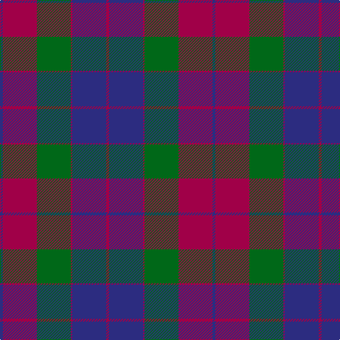

This page is one **sett** — a single exact thread-count. It belongs to the [tartan](/tartans/db2m24g24m1db24m2/)
(the same proportion at any scale), whose colour order is pattern [BRGRBR](/stripes/brgrbr/).

Sourced from register-of-tartans.  It is a [6 stripe tartan](/stripes/stripes6/).

Original link https://www.tartanregister.gov.uk/tartanDetails.aspx?ref=2828

## Register references

External register numbers recorded for this tartan.

- Scottish Register of Tartans: [2828](https://www.tartanregister.gov.uk/tartanDetails.aspx?ref=2828)
- Scottish Tartans Authority (ITI): 529
- Scottish Tartans World Register: 529

## Thread count
DB/4 R48 G48 R2 DB48 R/4

## Palette

Palette: <strong>Tartan Register</strong>
<table><thead><tr><th>Colour</th><th>Threads</th><th>Shade</th><th>Base</th><th>OKLCh</th></tr></thead><tbody><tr><td>DB/</td><td style="text-align:right;font-variant-numeric:tabular-nums">4</td><td><code style="background-color:#2C2C80;">#2C2C80</code> <small style="color:#888">#2C2C80</small></td><td>B <code style="background-color:#2A418A;">#2A418A</code></td><td><small style="color:#888">oklch(35.0% 0.138 276.6)</small></td></tr><tr><td>R</td><td style="text-align:right;font-variant-numeric:tabular-nums">48</td><td><code style="background-color:#A00048;">#A00048</code> <small style="color:#888">#A00048</small></td><td>R <code style="background-color:#CC0000;">#CC0000</code></td><td><small style="color:#888">oklch(45.4% 0.182 5.3)</small></td></tr><tr><td>G</td><td style="text-align:right;font-variant-numeric:tabular-nums">48</td><td><code style="background-color:#006818;">#006818</code> <small style="color:#888">#006818</small></td><td>G <code style="background-color:#006100;">#006100</code></td><td><small style="color:#888">oklch(45.0% 0.142 145.0)</small></td></tr><tr><td>R</td><td style="text-align:right;font-variant-numeric:tabular-nums">2</td><td><code style="background-color:#A00048;">#A00048</code> <small style="color:#888">#A00048</small></td><td>R <code style="background-color:#CC0000;">#CC0000</code></td><td><small style="color:#888">oklch(45.4% 0.182 5.3)</small></td></tr><tr><td>DB</td><td style="text-align:right;font-variant-numeric:tabular-nums">48</td><td><code style="background-color:#2C2C80;">#2C2C80</code> <small style="color:#888">#2C2C80</small></td><td>B <code style="background-color:#2A418A;">#2A418A</code></td><td><small style="color:#888">oklch(35.0% 0.138 276.6)</small></td></tr><tr><td>R/</td><td style="text-align:right;font-variant-numeric:tabular-nums">4</td><td><code style="background-color:#A00048;">#A00048</code> <small style="color:#888">#A00048</small></td><td>R <code style="background-color:#CC0000;">#CC0000</code></td><td><small style="color:#888">oklch(45.4% 0.182 5.3)</small></td></tr></tbody></table>

# Sample pattern

## Nearest tartans

The nearest existing variants by ΔTartan distance, with this tartan at the top so the swatches line up against it.

ΔTartan

Tartan

Sett

—

<a href="/ttd/edit/#slug=db2m24g24m1db24m2~x2">Mar Dress</a> <a class="nn-out" href="/setts/s6/db2m24g24m1db24m2~x2/" title="open its dictionary page">↗</a>

0.88

<a href="/ttd/edit/#slug=db2r24g24r1db24r2~x2">Mar, Red</a> <a class="nn-out" href="/setts/s6/db2r24g24r1db24r2~x2/" title="open its dictionary page">↗</a>

1.36

<a href="/ttd/edit/#slug=db8r3db1r3dg14r3db1~x4">Logan</a> <a class="nn-out" href="/setts/s7/db8r3db1r3dg14r3db1~x4/" title="open its dictionary page">↗</a>

1.41

<a href="/ttd/edit/#slug=db18r18dp2g12db1~x4">Wyeth (Personal)</a> <a class="nn-out" href="/setts/s5/db18r18dp2g12db1~x4/" title="open its dictionary page">↗</a>

1.46

<a href="/ttd/edit/#slug=db2r39g39r1db39r2~x2">Mar</a> <a class="nn-out" href="/setts/s6/db2r39g39r1db39r2~x2/" title="open its dictionary page">↗</a>

1.49

<a href="/ttd/edit/#slug=g22k3g1k3g2dp8r1dp8r16~x2">Queen of Scots (Commemorative))</a> <a class="nn-out" href="/setts/s9/g22k3g1k3g2dp8r1dp8r16~x2/" title="open its dictionary page">↗</a>

1.50

<a href="/ttd/edit/#slug=db3y2db30y19lo14y2lo3~x2">Bannockbane Brown #2</a> <a class="nn-out" href="/setts/s7/db3y2db30y19lo14y2lo3~x2/" title="open its dictionary page">↗</a>

1.51

<a href="/ttd/edit/#slug=w3dg18db22r19dg1r2~x2">Nibley (Personal)</a> <a class="nn-out" href="/setts/s6/w3dg18db22r19dg1r2~x2/" title="open its dictionary page">↗</a>

1.55

<a href="/ttd/edit/#slug=db2lo21db11dt21db1~x2">St. Matthews Check (School)</a> <a class="nn-out" href="/setts/s5/db2lo21db11dt21db1~x2/" title="open its dictionary page">↗</a>

1.55

<a href="/ttd/edit/#slug=r6db2r2db21dg20r4dg4~x2">Robertson of Struan</a> <a class="nn-out" href="/setts/s7/r6db2r2db21dg20r4dg4~x2/" title="open its dictionary page">↗</a>

1.59

<a href="/ttd/edit/#slug=db37o18k37r2k2r2~x2">Hakkarain Personal Finnish Tartan Tartan Number: 6110. Earliest known date: 2003 A personal tartan designed by Jari Hakkarainen of Porvoo in Finland. See products available Copyright © Blair Urquhart, Comrie, 2015</a> <a class="nn-out" href="/setts/s6/db37o18k37r2k2r2~x2/" title="open its dictionary page">↗</a>

## Neighbour map

Every grey dot is one of 14359 variants placed by the first two principal components of the ΔTartan feature space (44% of its variance). Red is this tartan; blue dots are its nearest — click one to open its page.

<svg viewBox="0 0 640 380" role="img" style="max-width:100%;height:auto;border:1px solid #e0e0e0;border-radius:4px;display:block" xmlns="http://www.w3.org/2000/svg"><image href="/nn/cloud.v1.png" width="640" height="380"/><a href="/setts/s6/db2r24g24r1db24r2~x2/"><circle cx="269.2" cy="194.6" r="4" fill="#3465a4"><title>Mar, Red</title></circle></a><a href="/setts/s7/db8r3db1r3dg14r3db1~x4/"><circle cx="288.6" cy="210.5" r="4" fill="#3465a4"><title>Logan</title></circle></a><a href="/setts/s5/db18r18dp2g12db1~x4/"><circle cx="241.5" cy="208.1" r="4" fill="#3465a4"><title>Wyeth (Personal)</title></circle></a><a href="/setts/s6/db2r39g39r1db39r2~x2/"><circle cx="292.2" cy="174.7" r="4" fill="#3465a4"><title>Mar</title></circle></a><a href="/setts/s9/g22k3g1k3g2dp8r1dp8r16~x2/"><circle cx="267.3" cy="166.7" r="4" fill="#3465a4"><title>Queen of Scots (Commemorative))</title></circle></a><a href="/setts/s7/db3y2db30y19lo14y2lo3~x2/"><circle cx="297.7" cy="202.6" r="4" fill="#3465a4"><title>Bannockbane Brown #2</title></circle></a><a href="/setts/s6/w3dg18db22r19dg1r2~x2/"><circle cx="224.2" cy="180.7" r="4" fill="#3465a4"><title>Nibley (Personal)</title></circle></a><a href="/setts/s5/db2lo21db11dt21db1~x2/"><circle cx="254.5" cy="213.1" r="4" fill="#3465a4"><title>St. Matthews Check (School)</title></circle></a><a href="/setts/s7/r6db2r2db21dg20r4dg4~x2/"><circle cx="284.4" cy="229.6" r="4" fill="#3465a4"><title>Robertson of Struan</title></circle></a><a href="/setts/s6/db37o18k37r2k2r2~x2/"><circle cx="272.7" cy="196.6" r="4" fill="#3465a4"><title>Hakkarain Personal Finnish Tartan Tartan Number: 6110. Earliest known date: 2003 A personal tartan designed by Jari Hakkarainen of Porvoo in Finland. See products available Copyright © Blair Urquhart, Comrie, 2015</title></circle></a><circle cx="290.9" cy="206.9" r="5" fill="#c00000"/></svg>

ID: /setts/s6/db2m24g24m1db24m2~x2/
