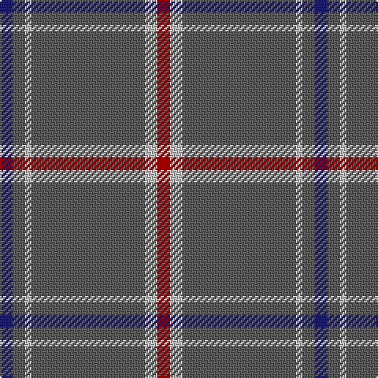

**Bands:** [BBWBWR](/stripes/bbwbwr/) · **Stripes:** [DB N LB N LB R](/stripes/stripes6/) DB N LB N LB R

This was sourced from tartans-authority.  It is a [6 band tartan](/bands/bands6/).

Original link http://www.tartansauthority.com/tartan-ferret/display/3220/

## Attestations

This cloth appears in 2 source records; the oldest owns this page.

- 1995 — St. Giles Cathedral (Corporate) (tartans-authority, [record](http://www.tartansauthority.com/tartan-ferret/display/3220/))
- undated — St. Giles Cathedral (register-of-tartans, [record](https://www.tartanregister.gov.uk/tartanDetails.aspx?ref=4970))

## Register references

External register numbers recorded for this tartan.

- Scottish Register of Tartans: [4970](https://www.tartanregister.gov.uk/tartanDetails.aspx?ref=4970)
- Scottish Tartans Authority (ITI): 3220

## Thread count
DB/8 N8 Na4 N72 Na8 DR/8

## Palette
Each colour and its ΔE from the base-6 reference it is a variant of.

| Colour | Shade | Base | ΔE (OKLab) |
|---|---|---|---|
| DB | <code style="background-color:#202060;">#202060</code> `#202060` | B <code style="background-color:#2A418A;">#2A418A</code> | 0.11 |
| DR | <code style="background-color:#880000;">#880000</code> `#880000` | R <code style="background-color:#CC0000;">#CC0000</code> | 0.15 |
| N | <code style="background-color:#5C5C5C;">#5C5C5C</code> `#5C5C5C` | B <code style="background-color:#2A418A;">#2A418A</code> | 0.15 |
| Na | <code style="background-color:#C0C0C0;">#C0C0C0</code> `#C0C0C0` | W <code style="background-color:#F7F7F7;">#F7F7F7</code> | 0.17 |

# Sample pattern

## Nearest tartans

The nearest existing variants by ΔTartan distance.

1. [Highland Autumn (Fashion)](/setts/s8/lo2k1n9k8n28k2n2r2~x2/) — ΔT 1.15
1. [Ballantyne Personal Tartan Tartan Number: 7563. Earliest known date: 2007 Andrew Ballantyne said, l finally decided to purchase a tartan of my own design. The first kilt was made for my father and he was very pleased with it. The fabric was designed online at House of Tartan and woven by Edgars, Perth. See products available Copyright © Blair Urquhart, Comrie, 2015](/setts/s5/o60dg13o9o8ly4~x2/) — ΔT 1.22
1. [Norsemen, The](/setts/s6/n65k2n4k2n10r24~x2/) — ΔT 1.26
1. [St Giles, Check](/setts/s7/db3y1w1y25w1y1p3~x2/) — ΔT 1.30
1. [St Giles Check Tartan Tartan Number: 387. Earliest known date: 1984 St Giles Church is in the Royal Mile, Edinburgh See products available Copyright © Blair Urquhart, Comrie, 2015](/setts/s7/db3o1w1o25w1o1dp3~x2/) — ΔT 1.40
1. [Norsemen (Corporate)](/setts/s6/n65k2n4lr2n10r24~x2/) — ΔT 1.46
1. [Ballantyne (Personal)](/setts/s5/y60g13y9r8ly4~x2/) — ΔT 1.54
1. [VersaCold/Atlas (Corporate)](/setts/s9/db3n44k9n10k9n10k9n44r3~x2/) — ΔT 1.55
1. [St. Giles Check (Corporate)](/setts/s7/db3o1w1o25w1o1dp3~x4/) — ΔT 1.56
1. [Wilson](/setts/s6/db48g14r3g2r3g2~x2/) — ΔT 1.71

## Neighbour map

Every grey dot is one of 14313 variants placed by the first two principal components of the ΔTartan feature space (44% of its variance). Red is this tartan; blue dots are its nearest — click one to open its page.

<svg viewBox="0 0 640 380" role="img" style="max-width:100%;height:auto;border:1px solid #e0e0e0;border-radius:4px;display:block" xmlns="http://www.w3.org/2000/svg"><image href="/nn/cloud.v1.png" width="640" height="380"/><a href="/setts/s8/lo2k1n9k8n28k2n2r2~x2/"><circle cx="518.6" cy="164.9" r="4" fill="#3465a4"><title>Highland Autumn (Fashion)</title></circle></a><a href="/setts/s5/o60dg13o9o8ly4~x2/"><circle cx="507.1" cy="212.8" r="4" fill="#3465a4"><title>Ballantyne Personal Tartan Tartan Number: 7563. Earliest known date: 2007 Andrew Ballantyne said, l finally decided to purchase a tartan of my own design. The first kilt was made for my father and he was very pleased with it. The fabric was designed online at House of Tartan and woven by Edgars, Perth. See products available Copyright © Blair Urquhart, Comrie, 2015</title></circle></a><a href="/setts/s6/n65k2n4k2n10r24~x2/"><circle cx="552.8" cy="177.3" r="4" fill="#3465a4"><title>Norsemen, The</title></circle></a><a href="/setts/s7/db3y1w1y25w1y1p3~x2/"><circle cx="575.0" cy="154.0" r="4" fill="#3465a4"><title>St Giles, Check</title></circle></a><a href="/setts/s7/db3o1w1o25w1o1dp3~x2/"><circle cx="558.0" cy="144.3" r="4" fill="#3465a4"><title>St Giles Check Tartan Tartan Number: 387. Earliest known date: 1984 St Giles Church is in the Royal Mile, Edinburgh See products available Copyright © Blair Urquhart, Comrie, 2015</title></circle></a><a href="/setts/s6/n65k2n4lr2n10r24~x2/"><circle cx="579.9" cy="186.6" r="4" fill="#3465a4"><title>Norsemen (Corporate)</title></circle></a><a href="/setts/s5/y60g13y9r8ly4~x2/"><circle cx="527.9" cy="226.0" r="4" fill="#3465a4"><title>Ballantyne (Personal)</title></circle></a><a href="/setts/s9/db3n44k9n10k9n10k9n44r3~x2/"><circle cx="520.2" cy="207.3" r="4" fill="#3465a4"><title>VersaCold/Atlas (Corporate)</title></circle></a><a href="/setts/s7/db3o1w1o25w1o1dp3~x4/"><circle cx="545.7" cy="137.9" r="4" fill="#3465a4"><title>St. Giles Check (Corporate)</title></circle></a><a href="/setts/s6/db48g14r3g2r3g2~x2/"><circle cx="490.5" cy="188.5" r="4" fill="#3465a4"><title>Wilson</title></circle></a><circle cx="522.1" cy="185.5" r="5" fill="#c00000"/></svg>

ID: /setts/s6/db2n2lb1n18lb2r2~x4/
