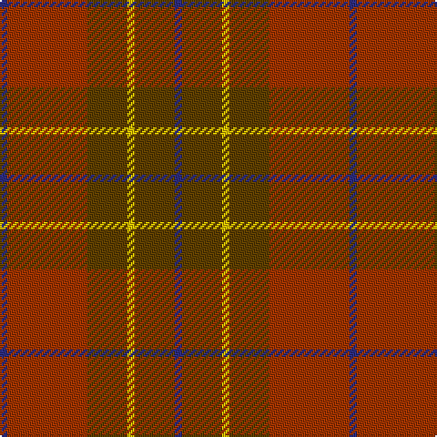

**Bands:** [BGYGRB](/stripes/bgygrb/) · **Stripes:** [DB DY LY DY O DB](/stripes/stripes6/) DB DY LY DY O DB

This was sourced from house-of-tartan.  It is a [6 band tartan](/bands/bands6/).

Original link http://www.house-of-tartan.scotland.net/house/TartanViewjs.asp?colr=Def&tnam=2049

## Thread count
DB/4 R44 T22 Y4 T22 DB/4

## Palette
Each colour and its ΔE from the base-6 reference it is a variant of.

| Colour | Shade | Base | ΔE (OKLab) |
|---|---|---|---|
| DB | <code style="background-color:#2C2C80;">#2C2C80</code> `#2C2C80` | B <code style="background-color:#2A418A;">#2A418A</code> | 0.06 |
| R | <code style="background-color:#A03400;">#A03400</code> `#A03400` | R <code style="background-color:#CC0000;">#CC0000</code> | 0.09 |
| T | <code style="background-color:#604000;">#604000</code> `#604000` | G <code style="background-color:#006100;">#006100</code> | 0.14 |
| Y | <code style="background-color:#E8C000;">#E8C000</code> `#E8C000` | Y <code style="background-color:#F2BF00;">#F2BF00</code> | 0.02 |

# Sample pattern

## Nearest tartans

The nearest existing variants by ΔTartan distance.

1. [Cetoloni](/setts/s6/db2r22dy11y2dy11db2~x2/) — ΔT 0.89
1. [Pubcrawlers (Corporate)](/setts/s7/g3dy4g2dy22n5r16ly3~x2/) — ΔT 1.26
1. [Cypress](/setts/s6/do2m2do17o17o2o2~x4/) — ΔT 1.32
1. [Wasko (Personal)](/setts/s7/r8lr2o30dg12o3dg12o3~x2/) — ΔT 1.37
1. [Earle's Flame (Fashion)](/setts/s8/do10y24r3y3r24dg3y6do6~x2/) — ΔT 1.58
1. [Loch Rannoch](/setts/s8/dr24g2dr5o14g2o5o17dr2~x2/) — ΔT 1.67
1. [Chisholm](/setts/s8/r12n2lr1n2r3dg8r3n1~x2/) — ΔT 1.69
1. [Chisholm](/setts/s8/r12n2lr1n2r3dg8r3n1/) — ΔT 1.69
1. [Dewar (Name)](/setts/s6/dg1r1dg7r4r7r1~x6/) — ΔT 1.72
1. [Trinity Bicycles](/setts/s5/dy4lg11dy14o30r4~x2/) — ΔT 1.74

## Neighbour map

Every grey dot is one of 14313 variants placed by the first two principal components of the ΔTartan feature space (44% of its variance). Red is this tartan; blue dots are its nearest — click one to open its page.

<svg viewBox="0 0 640 380" role="img" style="max-width:100%;height:auto;border:1px solid #e0e0e0;border-radius:4px;display:block" xmlns="http://www.w3.org/2000/svg"><image href="/nn/cloud.v1.png" width="640" height="380"/><a href="/setts/s6/db2r22dy11y2dy11db2~x2/"><circle cx="354.4" cy="233.0" r="4" fill="#3465a4"><title>Cetoloni</title></circle></a><a href="/setts/s7/g3dy4g2dy22n5r16ly3~x2/"><circle cx="317.3" cy="215.3" r="4" fill="#3465a4"><title>Pubcrawlers (Corporate)</title></circle></a><a href="/setts/s6/do2m2do17o17o2o2~x4/"><circle cx="379.2" cy="250.8" r="4" fill="#3465a4"><title>Cypress</title></circle></a><a href="/setts/s7/r8lr2o30dg12o3dg12o3~x2/"><circle cx="385.9" cy="226.1" r="4" fill="#3465a4"><title>Wasko (Personal)</title></circle></a><a href="/setts/s8/do10y24r3y3r24dg3y6do6~x2/"><circle cx="341.8" cy="261.3" r="4" fill="#3465a4"><title>Earle's Flame (Fashion)</title></circle></a><a href="/setts/s8/dr24g2dr5o14g2o5o17dr2~x2/"><circle cx="292.6" cy="212.3" r="4" fill="#3465a4"><title>Loch Rannoch</title></circle></a><a href="/setts/s8/r12n2lr1n2r3dg8r3n1~x2/"><circle cx="377.4" cy="207.0" r="4" fill="#3465a4"><title>Chisholm</title></circle></a><a href="/setts/s8/r12n2lr1n2r3dg8r3n1/"><circle cx="377.4" cy="207.0" r="4" fill="#3465a4"><title>Chisholm</title></circle></a><a href="/setts/s6/dg1r1dg7r4r7r1~x6/"><circle cx="285.7" cy="263.6" r="4" fill="#3465a4"><title>Dewar (Name)</title></circle></a><a href="/setts/s5/dy4lg11dy14o30r4~x2/"><circle cx="317.6" cy="270.1" r="4" fill="#3465a4"><title>Trinity Bicycles</title></circle></a><circle cx="357.9" cy="242.6" r="5" fill="#c00000"/></svg>

ID: /setts/s6/db2o22dy11ly2dy11db2~x2/
