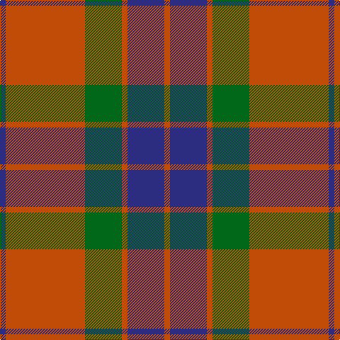

In pattern [BRGRBR](/stripes/brgrbr/).

This was sourced from register-of-tartans.  It is a [6 stripe tartan](/stripes/stripes6/).

Original link https://www.tartanregister.gov.uk/tartanDetails.aspx?ref=1506

## Also known as

This cloth is also recorded under:

- Grant of Edinchat

## Attestations

This cloth appears in 2 source records; the oldest owns this page.

- 01/01/1720 — Edinchat (register-of-tartans, [record](https://www.tartanregister.gov.uk/tartanDetails.aspx?ref=1506))
- pre 1720 — Grant of Edinchat (Clan) (tartans-authority, [record](http://www.tartansauthority.com/tartan-ferret/display/6241/))

## Register references

External register numbers recorded for this tartan.

- Scottish Register of Tartans: [1506](https://www.tartanregister.gov.uk/tartanDetails.aspx?ref=1506)
- Scottish Tartans Authority (ITI): 6241

## Thread count
DO/8 DB52 DO8 G52 DO112 DB/8

## Palette
Each colour and the base-6 reference it is a variant of.

| Colour | Shade | Base |
|---|---|---|
| DB | <code style="background-color:#2C2C80;">#2C2C80</code> `oklch(35.0% 0.138 276.6)` <small>#2C2C80</small> | B <code style="background-color:#2A418A;">#2A418A</code> |
| DO | <code style="background-color:#C04C08;">#C04C08</code> `oklch(56.4% 0.163 43.2)` <small>#C04C08</small> | R <code style="background-color:#CC0000;">#CC0000</code> |
| G | <code style="background-color:#006818;">#006818</code> `oklch(45.0% 0.142 145.0)` <small>#006818</small> | G <code style="background-color:#006100;">#006100</code> |
| R | <code style="background-color:#C80000;">#C80000</code> `oklch(52.3% 0.215 29.2)` <small>#C80000</small> | R <code style="background-color:#CC0000;">#CC0000</code> |

# Sample pattern

## Nearest tartans

The nearest existing variants by ΔTartan distance, with this tartan at the top so the swatches line up against it.

ΔTartan

Tartan

Sett

—

<a href="/ttd/edit/#slug=db2o28g13o2db13o2~x4">Edinchat</a> <a class="nn-out" href="/setts/s6/db2o28g13o2db13o2~x4/" title="open its dictionary page">↗</a>

0.80

<a href="/ttd/edit/#slug=r1r14g7db7r1~x4">Hugh Fraser of Boblainy</a> <a class="nn-out" href="/setts/s5/r1r14g7db7r1~x4/" title="open its dictionary page">↗</a>

0.86

<a href="/ttd/edit/#slug=db2r25g10r2db10r2~x2">Grant of Lurg</a> <a class="nn-out" href="/setts/s6/db2r25g10r2db10r2~x2/" title="open its dictionary page">↗</a>

1.00

<a href="/ttd/edit/#slug=db1r14g7db7r1~x4">Fraser of Boblainy, Hugh (Personal)</a> <a class="nn-out" href="/setts/s5/db1r14g7db7r1~x4/" title="open its dictionary page">↗</a>

1.06

<a href="/ttd/edit/#slug=g28r4dp25r22g27r4dp2~x2">Glasgow, City of</a> <a class="nn-out" href="/setts/s7/g28r4dp25r22g27r4dp2~x2/" title="open its dictionary page">↗</a>

1.14

<a href="/ttd/edit/#slug=r1g10r1db4r18g1~x4">Robertson 6</a> <a class="nn-out" href="/setts/s6/r1g10r1db4r18g1~x4/" title="open its dictionary page">↗</a>

1.14

<a href="/ttd/edit/#slug=db6r3g1r3g12r3g1~x4">Skene - 1831 (Clan)</a> <a class="nn-out" href="/setts/s7/db6r3g1r3g12r3g1~x4/" title="open its dictionary page">↗</a>

1.19

<a href="/ttd/edit/#slug=r8w2m30g12m3g12m3~x2">Wasko (Personal)</a> <a class="nn-out" href="/setts/s7/r8w2m30g12m3g12m3~x2/" title="open its dictionary page">↗</a>

1.22

<a href="/ttd/edit/#slug=r2db1r16db4r1g10r1~x4">Robertson - 1988 (Corporate)</a> <a class="nn-out" href="/setts/s7/r2db1r16db4r1g10r1~x4/" title="open its dictionary page">↗</a>

1.24

<a href="/ttd/edit/#slug=r6g21k8r28k2r4~x2">Dunbar</a> <a class="nn-out" href="/setts/s6/r6g21k8r28k2r4~x2/" title="open its dictionary page">↗</a>

1.24

<a href="/ttd/edit/#slug=dg28r4dp25r22dg27r4dp2~x2">Glasgow, Ciity of (District)</a> <a class="nn-out" href="/setts/s7/dg28r4dp25r22dg27r4dp2~x2/" title="open its dictionary page">↗</a>

## Neighbour map

Every grey dot is one of 14299 variants placed by the first two principal components of the ΔTartan feature space (44% of its variance). Red is this tartan; blue dots are its nearest — click one to open its page.

<svg viewBox="0 0 640 380" role="img" style="max-width:100%;height:auto;border:1px solid #e0e0e0;border-radius:4px;display:block" xmlns="http://www.w3.org/2000/svg"><image href="/nn/cloud.v1.png" width="640" height="380"/><a href="/setts/s5/r1r14g7db7r1~x4/"><circle cx="341.5" cy="222.8" r="4" fill="#3465a4"><title>Hugh Fraser of Boblainy</title></circle></a><a href="/setts/s6/db2r25g10r2db10r2~x2/"><circle cx="370.3" cy="206.8" r="4" fill="#3465a4"><title>Grant of Lurg</title></circle></a><a href="/setts/s5/db1r14g7db7r1~x4/"><circle cx="319.2" cy="220.3" r="4" fill="#3465a4"><title>Fraser of Boblainy, Hugh (Personal)</title></circle></a><a href="/setts/s7/g28r4dp25r22g27r4dp2~x2/"><circle cx="298.8" cy="223.8" r="4" fill="#3465a4"><title>Glasgow, City of</title></circle></a><a href="/setts/s6/r1g10r1db4r18g1~x4/"><circle cx="397.7" cy="186.3" r="4" fill="#3465a4"><title>Robertson 6</title></circle></a><a href="/setts/s7/db6r3g1r3g12r3g1~x4/"><circle cx="298.8" cy="216.7" r="4" fill="#3465a4"><title>Skene - 1831 (Clan)</title></circle></a><a href="/setts/s7/r8w2m30g12m3g12m3~x2/"><circle cx="331.5" cy="186.3" r="4" fill="#3465a4"><title>Wasko (Personal)</title></circle></a><a href="/setts/s7/r2db1r16db4r1g10r1~x4/"><circle cx="375.6" cy="177.4" r="4" fill="#3465a4"><title>Robertson - 1988 (Corporate)</title></circle></a><a href="/setts/s6/r6g21k8r28k2r4~x2/"><circle cx="345.5" cy="207.7" r="4" fill="#3465a4"><title>Dunbar</title></circle></a><a href="/setts/s7/dg28r4dp25r22dg27r4dp2~x2/"><circle cx="306.2" cy="229.0" r="4" fill="#3465a4"><title>Glasgow, Ciity of (District)</title></circle></a><circle cx="348.3" cy="208.3" r="5" fill="#c00000"/></svg>

ID: /setts/s6/db2o28g13o2db13o2~x4/
