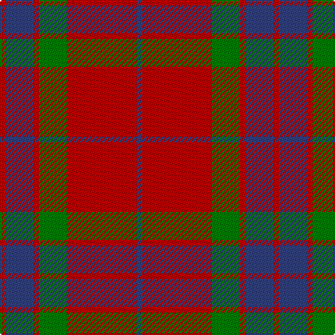

In pattern [BRGRBR](/stripes/brgrbr/).

This was sourced from weddslist.  It is a [6 stripe tartan](/stripes/stripes6/).

Original link http://www.weddslist.com/cgi-bin/tartans/pg.pl?source=sts

## Also known as

This cloth is also recorded under:

- Grant of Lurg Artifact

## Attestations

This cloth appears in 2 source records; the oldest owns this page.

- undated — Grant of Lurg (weddslist, [record](http://www.weddslist.com/cgi-bin/tartans/pg.pl?source=sts))
- undated — Grant of Lurg Artifact Tartan Tartan Number: 527. Earliest known date: pre 1859 Owned by the family Dunbar. Count not given. A plaid. Previously marked 'Unidentified' See products available Copyright © Blair Urquhart, Comrie, 2015 (house-of-tartan, [record](http://www.house-of-tartan.scotland.net/house/TartanViewjs.asp?colr=Def&tnam=527))

## Thread count
R/4 B20 R4 G20 R50 B/4

## Palette
Each colour and the base-6 reference it is a variant of.

| Colour | Shade | Base |
|---|---|---|
| B | <code style="background-color:#304080;">#304080</code> `oklch(39.4% 0.109 270.2)` <small>#304080</small> | B <code style="background-color:#2A418A;">#2A418A</code> |
| G | <code style="background-color:#008000;">#008000</code> `oklch(52.0% 0.177 142.5)` <small>#008000</small> | G <code style="background-color:#006100;">#006100</code> |
| R | <code style="background-color:#C00000;">#C00000</code> `oklch(50.7% 0.208 29.2)` <small>#C00000</small> | R <code style="background-color:#CC0000;">#CC0000</code> |

# Sample pattern

## Nearest tartans

The nearest existing variants by ΔTartan distance.

1. [MacKintosh, Plaid](/setts/s6/r16db6r2g6r2db1~x2/) — ΔT 0.60
1. [MacKintosh Plaid](/setts/s6/r16db6r2dg6r2db1~x2/) — ΔT 0.79
1. [Hugh Fraser of Boblainy](/setts/s5/r1r14g7db7r1~x4/) — ΔT 0.80
1. [Robertson - 1988 (Corporate)](/setts/s7/r2db1r16db4r1g10r1~x4/) — ΔT 0.82
1. [Edinchat](/setts/s6/db2o28g13o2db13o2~x4/) — ΔT 0.86
1. [Robertson 6](/setts/s6/r1g10r1db4r18g1~x4/) — ΔT 0.94
1. [Dunbar](/setts/s6/r6g21k8r28k2r4~x2/) — ΔT 0.97
1. [Auld Reekie](/setts/s6/db4r3db3r22g8r2~x2/) — ΔT 1.01
1. [MacKintosh](/setts/s6/r70db20r10g40r10db3/) — ΔT 1.02
1. [Wotherspoon](/setts/s5/r12g8r54db45g6/) — ΔT 1.03

## Neighbour map

Every grey dot is one of 14299 variants placed by the first two principal components of the ΔTartan feature space (44% of its variance). Red is this tartan; blue dots are its nearest — click one to open its page.

<svg viewBox="0 0 640 380" role="img" style="max-width:100%;height:auto;border:1px solid #e0e0e0;border-radius:4px;display:block" xmlns="http://www.w3.org/2000/svg"><image href="/nn/cloud.v1.png" width="640" height="380"/><a href="/setts/s6/r16db6r2g6r2db1~x2/"><circle cx="402.7" cy="201.7" r="4" fill="#3465a4"><title>MacKintosh, Plaid</title></circle></a><a href="/setts/s6/r16db6r2dg6r2db1~x2/"><circle cx="402.9" cy="199.9" r="4" fill="#3465a4"><title>MacKintosh Plaid</title></circle></a><a href="/setts/s5/r1r14g7db7r1~x4/"><circle cx="341.5" cy="222.8" r="4" fill="#3465a4"><title>Hugh Fraser of Boblainy</title></circle></a><a href="/setts/s7/r2db1r16db4r1g10r1~x4/"><circle cx="375.6" cy="177.4" r="4" fill="#3465a4"><title>Robertson - 1988 (Corporate)</title></circle></a><a href="/setts/s6/db2o28g13o2db13o2~x4/"><circle cx="348.3" cy="208.3" r="4" fill="#3465a4"><title>Edinchat</title></circle></a><a href="/setts/s6/r1g10r1db4r18g1~x4/"><circle cx="397.7" cy="186.3" r="4" fill="#3465a4"><title>Robertson 6</title></circle></a><a href="/setts/s6/r6g21k8r28k2r4~x2/"><circle cx="345.5" cy="207.7" r="4" fill="#3465a4"><title>Dunbar</title></circle></a><a href="/setts/s6/db4r3db3r22g8r2~x2/"><circle cx="417.3" cy="207.2" r="4" fill="#3465a4"><title>Auld Reekie</title></circle></a><a href="/setts/s6/r70db20r10g40r10db3/"><circle cx="401.2" cy="187.7" r="4" fill="#3465a4"><title>MacKintosh</title></circle></a><a href="/setts/s5/r12g8r54db45g6/"><circle cx="341.4" cy="240.6" r="4" fill="#3465a4"><title>Wotherspoon</title></circle></a><circle cx="370.3" cy="206.8" r="5" fill="#c00000"/></svg>

ID: /setts/s6/db2r25g10r2db10r2~x2/
