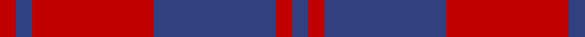
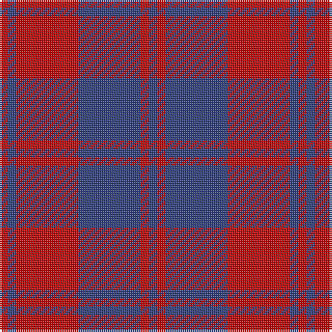

This page is one **sett** — a single exact thread-count. It belongs to the [tartan](/tartans/db2r2db15r15db2r2/)
(the same proportion at any scale), whose colour order is pattern [BRBRBR](/stripes/brbrbr/).

Sourced from weddslist.  It is a [6 stripe tartan](/stripes/stripes6/).

Original link http://www.weddslist.com/cgi-bin/tartans/pg.pl?source=sts

## Thread count
R/4 B4 R30 B30 R4 B/4

## Palette

Palette: <strong>custom</strong>
<table><thead><tr><th>Colour</th><th>Threads</th><th>Shade</th><th>Base</th><th>OKLCh</th></tr></thead><tbody><tr><td>R/</td><td style="text-align:right;font-variant-numeric:tabular-nums">4</td><td><code style="background-color:#C00000;">#C00000</code> <small style="color:#888">#C00000</small></td><td>R <code style="background-color:#CC0000;">#CC0000</code></td><td><small style="color:#888">oklch(50.7% 0.208 29.2)</small></td></tr><tr><td>B</td><td style="text-align:right;font-variant-numeric:tabular-nums">4</td><td><code style="background-color:#304080;">#304080</code> <small style="color:#888">#304080</small></td><td>B <code style="background-color:#2A418A;">#2A418A</code></td><td><small style="color:#888">oklch(39.4% 0.109 270.2)</small></td></tr><tr><td>R</td><td style="text-align:right;font-variant-numeric:tabular-nums">30</td><td><code style="background-color:#C00000;">#C00000</code> <small style="color:#888">#C00000</small></td><td>R <code style="background-color:#CC0000;">#CC0000</code></td><td><small style="color:#888">oklch(50.7% 0.208 29.2)</small></td></tr><tr><td>B</td><td style="text-align:right;font-variant-numeric:tabular-nums">30</td><td><code style="background-color:#304080;">#304080</code> <small style="color:#888">#304080</small></td><td>B <code style="background-color:#2A418A;">#2A418A</code></td><td><small style="color:#888">oklch(39.4% 0.109 270.2)</small></td></tr><tr><td>R</td><td style="text-align:right;font-variant-numeric:tabular-nums">4</td><td><code style="background-color:#C00000;">#C00000</code> <small style="color:#888">#C00000</small></td><td>R <code style="background-color:#CC0000;">#CC0000</code></td><td><small style="color:#888">oklch(50.7% 0.208 29.2)</small></td></tr><tr><td>B/</td><td style="text-align:right;font-variant-numeric:tabular-nums">4</td><td><code style="background-color:#304080;">#304080</code> <small style="color:#888">#304080</small></td><td>B <code style="background-color:#2A418A;">#2A418A</code></td><td><small style="color:#888">oklch(39.4% 0.109 270.2)</small></td></tr></tbody></table>

# Sample pattern

## Nearest tartans

The nearest existing variants by ΔTartan distance, with this tartan at the top so the swatches line up against it.

ΔTartan

Tartan

Sett

—

<a href="/ttd/edit/#slug=db2r2db15r15db2r2~x2">Hebridean 2</a> <a class="nn-out" href="/setts/s6/db2r2db15r15db2r2~x2/" title="open its dictionary page">↗</a>

1.05

<a href="/ttd/edit/#slug=db1r1db7r7db1r1~x4">MacGregor of Glengyle</a> <a class="nn-out" href="/setts/s6/db1r1db7r7db1r1~x4/" title="open its dictionary page">↗</a>

1.30

<a href="/setts/s10/db2r2db15r15db2r2~x2/">Hebrides #7</a>

1.30

<a href="/ttd/edit/#slug=db6r39db10r10db21ly5~x2">Rajput</a> <a class="nn-out" href="/setts/s6/db6r39db10r10db21ly5~x2/" title="open its dictionary page">↗</a>

1.44

<a href="/ttd/edit/#slug=r12db2r12db17w2r2~x2">British European</a> <a class="nn-out" href="/setts/s6/r12db2r12db17w2r2~x2/" title="open its dictionary page">↗</a>

1.44

<a href="/ttd/edit/#slug=r12db2r12db17w2r2~x4">British European (Corporate)</a> <a class="nn-out" href="/setts/s6/r12db2r12db17w2r2~x4/" title="open its dictionary page">↗</a>

1.53

<a href="/ttd/edit/#slug=db3o3db24o30db3o2~x2">Auburn University (Alabama) (Corp)</a> <a class="nn-out" href="/setts/s6/db3o3db24o30db3o2~x2/" title="open its dictionary page">↗</a>

1.53

<a href="/ttd/edit/#slug=r12g8r54db45g6">Wotherspoon</a> <a class="nn-out" href="/setts/s5/r12g8r54db45g6/" title="open its dictionary page">↗</a>

1.57

<a href="/ttd/edit/#slug=db3r24db3r3db25w3~x2">Matthews (Personal)</a> <a class="nn-out" href="/setts/s6/db3r24db3r3db25w3~x2/" title="open its dictionary page">↗</a>

1.61

<a href="/ttd/edit/#slug=db48r18db6r13ly4r14~x2">Butler</a> <a class="nn-out" href="/setts/s6/db48r18db6r13ly4r14~x2/" title="open its dictionary page">↗</a>

1.61

<a href="/ttd/edit/#slug=db6r1db6r9w1~x2">Hamilton, (Red)</a> <a class="nn-out" href="/setts/s5/db6r1db6r9w1~x2/" title="open its dictionary page">↗</a>

## Neighbour map

Every grey dot is one of 14299 variants placed by the first two principal components of the ΔTartan feature space (44% of its variance). Red is this tartan; blue dots are its nearest — click one to open its page.

<svg viewBox="0 0 640 380" role="img" style="max-width:100%;height:auto;border:1px solid #e0e0e0;border-radius:4px;display:block" xmlns="http://www.w3.org/2000/svg"><image href="/nn/cloud.v1.png" width="640" height="380"/><a href="/setts/s6/db1r1db7r7db1r1~x4/"><circle cx="364.3" cy="244.8" r="4" fill="#3465a4"><title>MacGregor of Glengyle</title></circle></a><a href="/setts/s10/db2r2db15r15db2r2~x2/"><circle cx="358.4" cy="225.9" r="4" fill="#3465a4"><title>Hebrides #7</title></circle></a><a href="/setts/s6/db6r39db10r10db21ly5~x2/"><circle cx="349.0" cy="247.3" r="4" fill="#3465a4"><title>Rajput</title></circle></a><a href="/setts/s6/r12db2r12db17w2r2~x2/"><circle cx="347.9" cy="235.0" r="4" fill="#3465a4"><title>British European</title></circle></a><a href="/setts/s6/r12db2r12db17w2r2~x4/"><circle cx="347.9" cy="235.0" r="4" fill="#3465a4"><title>British European (Corporate)</title></circle></a><a href="/setts/s6/db3o3db24o30db3o2~x2/"><circle cx="411.9" cy="211.4" r="4" fill="#3465a4"><title>Auburn University (Alabama) (Corp)</title></circle></a><a href="/setts/s5/r12g8r54db45g6/"><circle cx="341.4" cy="240.6" r="4" fill="#3465a4"><title>Wotherspoon</title></circle></a><a href="/setts/s6/db3r24db3r3db25w3~x2/"><circle cx="332.0" cy="211.1" r="4" fill="#3465a4"><title>Matthews (Personal)</title></circle></a><a href="/setts/s6/db48r18db6r13ly4r14~x2/"><circle cx="348.9" cy="213.1" r="4" fill="#3465a4"><title>Butler</title></circle></a><a href="/setts/s5/db6r1db6r9w1~x2/"><circle cx="332.6" cy="250.7" r="4" fill="#3465a4"><title>Hamilton, (Red)</title></circle></a><circle cx="392.0" cy="250.5" r="5" fill="#c00000"/></svg>

ID: /setts/s6/db2r2db15r15db2r2~x2/
