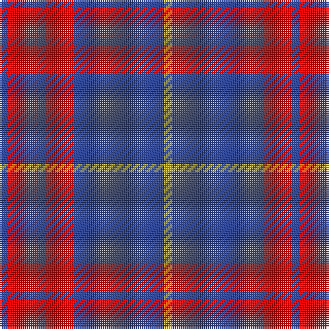

In pattern [BRBRBY](/stripes/brbrby/).

This was sourced from register-of-tartans.  It is a [6 stripe tartan](/stripes/stripes6/).

Original link https://www.tartanregister.gov.uk/tartanDetails.aspx?ref=2737

## Also known as

This cloth is also recorded under:

- MacQueen, variant

## Attestations

This cloth appears in 2 source records; the oldest owns this page.

- undated — MacQueen variant (register-of-tartans, [record](https://www.tartanregister.gov.uk/tartanDetails.aspx?ref=2737))
- undated — MacQueen, variant (weddslist, [record](http://www.weddslist.com/cgi-bin/tartans/pg.pl?source=sts))

## Register references

External register numbers recorded for this tartan.

- Scottish Register of Tartans: [2737](https://www.tartanregister.gov.uk/tartanDetails.aspx?ref=2737)
- Scottish Tartans World Register: 486

## Thread count
Y/4 B44 R14 B4 R14 B/4

## Palette
Each colour and the base-6 reference it is a variant of.

| Colour | Shade | Base |
|---|---|---|
| B | <code style="background-color:#2C4084;">#2C4084</code> `oklch(39.4% 0.117 268.3)` <small>#2C4084</small> | B <code style="background-color:#2A418A;">#2A418A</code> |
| R | <code style="background-color:#DC0000;">#DC0000</code> `oklch(56.2% 0.230 29.2)` <small>#DC0000</small> | R <code style="background-color:#CC0000;">#CC0000</code> |
| Y | <code style="background-color:#E8C000;">#E8C000</code> `oklch(81.9% 0.168 93.7)` <small>#E8C000</small> | Y <code style="background-color:#F2BF00;">#F2BF00</code> |

# Sample pattern

## Nearest tartans

The nearest existing variants by ΔTartan distance.

1. [Coronation](/setts/s7/db11w1r12db6r1db6w1~x2/) — ΔT 0.81
1. [Coronation (1936) #2](/setts/s7/db11w1r12db6r1db6w1~x4/) — ΔT 0.98
1. [South Australian Pipes & Drums (Corp](/setts/s6/db60ly6db11r25~x2/) — ΔT 1.06
1. [Butler](/setts/s6/db48r18db6r13ly4r14~x2/) — ΔT 1.12
1. [Edinburgh TIC (Corporate)](/setts/s8/db32r3db3r4w3r5db4r7~x2/) — ΔT 1.16
1. [BC Corps of Commissionaires, The](/setts/s7/db12lb1r3lb1r3lb1db6~x4/) — ΔT 1.17
1. [Matthews (Personal)](/setts/s6/db3r24db3r3db25w3~x2/) — ΔT 1.20
1. [South Australian Pipes & Drums](/setts/s10/db60ly6db11r25db11ly6~x2/) — ΔT 1.24
1. [Orlando Fire Department (Corporate)](/setts/s9/db12ly1r16db1r1db14r3db14ly1~x4/) — ΔT 1.29
1. [O'Long (Personal)](/setts/s7/g22dp22g3dp11w3dp4w3~x2/) — ΔT 1.31

## Neighbour map

Every grey dot is one of 14299 variants placed by the first two principal components of the ΔTartan feature space (44% of its variance). Red is this tartan; blue dots are its nearest — click one to open its page.

<svg viewBox="0 0 640 380" role="img" style="max-width:100%;height:auto;border:1px solid #e0e0e0;border-radius:4px;display:block" xmlns="http://www.w3.org/2000/svg"><image href="/nn/cloud.v1.png" width="640" height="380"/><a href="/setts/s7/db11w1r12db6r1db6w1~x2/"><circle cx="378.4" cy="218.1" r="4" fill="#3465a4"><title>Coronation</title></circle></a><a href="/setts/s7/db11w1r12db6r1db6w1~x4/"><circle cx="361.5" cy="208.9" r="4" fill="#3465a4"><title>Coronation (1936) #2</title></circle></a><a href="/setts/s6/db60ly6db11r25~x2/"><circle cx="410.4" cy="214.8" r="4" fill="#3465a4"><title>South Australian Pipes &amp; Drums (Corp</title></circle></a><a href="/setts/s6/db48r18db6r13ly4r14~x2/"><circle cx="348.9" cy="213.1" r="4" fill="#3465a4"><title>Butler</title></circle></a><a href="/setts/s8/db32r3db3r4w3r5db4r7~x2/"><circle cx="412.2" cy="185.6" r="4" fill="#3465a4"><title>Edinburgh TIC (Corporate)</title></circle></a><a href="/setts/s7/db12lb1r3lb1r3lb1db6~x4/"><circle cx="406.5" cy="208.3" r="4" fill="#3465a4"><title>BC Corps of Commissionaires, The</title></circle></a><a href="/setts/s6/db3r24db3r3db25w3~x2/"><circle cx="332.0" cy="211.1" r="4" fill="#3465a4"><title>Matthews (Personal)</title></circle></a><a href="/setts/s10/db60ly6db11r25db11ly6~x2/"><circle cx="343.5" cy="190.1" r="4" fill="#3465a4"><title>South Australian Pipes &amp; Drums</title></circle></a><a href="/setts/s9/db12ly1r16db1r1db14r3db14ly1~x4/"><circle cx="420.2" cy="190.8" r="4" fill="#3465a4"><title>Orlando Fire Department (Corporate)</title></circle></a><a href="/setts/s7/g22dp22g3dp11w3dp4w3~x2/"><circle cx="305.3" cy="222.8" r="4" fill="#3465a4"><title>O'Long (Personal)</title></circle></a><circle cx="394.4" cy="206.7" r="5" fill="#c00000"/></svg>

ID: /setts/s6/db2r7db2r7db22ly2~x2/
