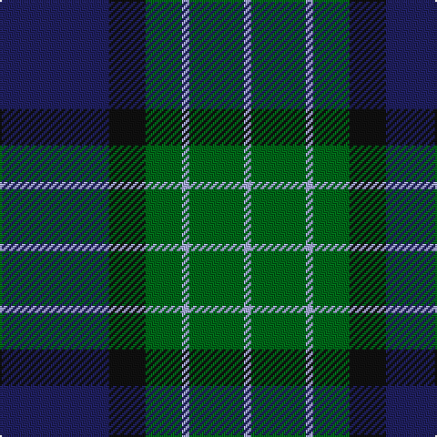

This page is one **sett** — a single exact thread-count. It belongs to the [tartan](/tartans/db30k10g10lb2g15lb2/)
(the same proportion at any scale), whose colour order is pattern [BKGWGW](/stripes/bkgwgw/).

Sourced from register-of-tartans.  It is a [6 stripe tartan](/stripes/stripes6/).

Original link https://www.tartanregister.gov.uk/tartanDetails.aspx?ref=2760

3 attestations — the source records this cloth was collapsed from (oldest owns this page)

<ul>
<li>01/01/1997 — MacRobart (Personal) (register-of-tartans, <a href="https://www.tartanregister.gov.uk/tartanDetails.aspx?ref=2760">record</a>)</li>
<li>January 1997 — MacRobart (Personal) (tartans-authority, <a href="http://www.tartansauthority.com/tartan-ferret/display/2388/">record</a>)</li>
<li>undated — MacRobart Family Tartan Tartan Number: 2388. Earliest known date: January 1997 Designed by Michael Owen Holden for family use only See products available Copyright © Blair Urquhart, Comrie, 2015 (house-of-tartan, <a href="http://www.house-of-tartan.scotland.net/house/TartanViewjs.asp?colr=Def&tnam=2388">record</a>)</li>
</ul>

## Register references

External register numbers recorded for this tartan.

- Scottish Register of Tartans: [2760](https://www.tartanregister.gov.uk/tartanDetails.aspx?ref=2760)
- Scottish Tartans Authority (ITI): 2388
- Scottish Tartans World Register: 2388

## Thread count
DB/60 K20 G20 LP4 G30 LP/4

## Palette

Palette: <strong>Tartan Register</strong>
<table><thead><tr><th>Colour</th><th>Threads</th><th>Shade</th><th>Base</th><th>OKLCh</th></tr></thead><tbody><tr><td>DB/</td><td style="text-align:right;font-variant-numeric:tabular-nums">60</td><td><code style="background-color:#202060;">#202060</code> <small style="color:#888">#202060</small></td><td>B <code style="background-color:#2A418A;">#2A418A</code></td><td><small style="color:#888">oklch(28.9% 0.111 276.9)</small></td></tr><tr><td>K</td><td style="text-align:right;font-variant-numeric:tabular-nums">20</td><td><code style="background-color:#101010;">#101010</code> <small style="color:#888">#101010</small></td><td>K <code style="background-color:#000000;">#000000</code></td><td><small style="color:#888">oklch(17.3% 0.000 89.9)</small></td></tr><tr><td>G</td><td style="text-align:right;font-variant-numeric:tabular-nums">20</td><td><code style="background-color:#006818;">#006818</code> <small style="color:#888">#006818</small></td><td>G <code style="background-color:#006100;">#006100</code></td><td><small style="color:#888">oklch(45.0% 0.142 145.0)</small></td></tr><tr><td>LP</td><td style="text-align:right;font-variant-numeric:tabular-nums">4</td><td><code style="background-color:#A8ACE8;">#A8ACE8</code> <small style="color:#888">#A8ACE8</small></td><td>W <code style="background-color:#F7F7F7;">#F7F7F7</code></td><td><small style="color:#888">oklch(76.3% 0.086 281.2)</small></td></tr><tr><td>G</td><td style="text-align:right;font-variant-numeric:tabular-nums">30</td><td><code style="background-color:#006818;">#006818</code> <small style="color:#888">#006818</small></td><td>G <code style="background-color:#006100;">#006100</code></td><td><small style="color:#888">oklch(45.0% 0.142 145.0)</small></td></tr><tr><td>LP/</td><td style="text-align:right;font-variant-numeric:tabular-nums">4</td><td><code style="background-color:#A8ACE8;">#A8ACE8</code> <small style="color:#888">#A8ACE8</small></td><td>W <code style="background-color:#F7F7F7;">#F7F7F7</code></td><td><small style="color:#888">oklch(76.3% 0.086 281.2)</small></td></tr></tbody></table>

# Sample pattern

## Nearest tartans

The nearest existing variants by ΔTartan distance, with this tartan at the top so the swatches line up against it.

ΔTartan

Tartan

Sett

—

<a href="/ttd/edit/#slug=db30k10g10lb2g15lb2~x2">MacRobart (Personal)</a> <a class="nn-out" href="/setts/s6/db30k10g10lb2g15lb2~x2/" title="open its dictionary page">↗</a>

0.73

<a href="/ttd/edit/#slug=k20db50g50r3k3~x2">Louisville Spaulding (Personal)</a> <a class="nn-out" href="/setts/s5/k20db50g50r3k3~x2/" title="open its dictionary page">↗</a>

0.81

<a href="/ttd/edit/#slug=db24k3db5k23ly2k11g22~x2">Mowat (Clans Originaux)</a> <a class="nn-out" href="/setts/s7/db24k3db5k23ly2k11g22~x2/" title="open its dictionary page">↗</a>

0.85

<a href="/ttd/edit/#slug=db3r2db22k11g22r2g3~x2">Gammell (1978) (Personal)</a> <a class="nn-out" href="/setts/s7/db3r2db22k11g22r2g3~x2/" title="open its dictionary page">↗</a>

0.89

<a href="/ttd/edit/#slug=k4db16k12g12r1g2k2~x2">Dundas #2</a> <a class="nn-out" href="/setts/s7/k4db16k12g12r1g2k2~x2/" title="open its dictionary page">↗</a>

0.91

<a href="/ttd/edit/#slug=r2g12k12g1db12g2~x2">Gunn</a> <a class="nn-out" href="/setts/s6/r2g12k12g1db12g2~x2/" title="open its dictionary page">↗</a>

0.95

<a href="/ttd/edit/#slug=r2g23dbi11db22r2~x2">Skibo</a> <a class="nn-out" href="/setts/s5/r2g23dbi11db22r2~x2/" title="open its dictionary page">↗</a>

0.99

<a href="/ttd/edit/#slug=db40k4db12k21g27w4~x2">Granger (Personal)</a> <a class="nn-out" href="/setts/s6/db40k4db12k21g27w4~x2/" title="open its dictionary page">↗</a>

1.00

<a href="/ttd/edit/#slug=g26db10k3db2dy2db10~x4">St. Andrews Old Course Hotel (Corp)</a> <a class="nn-out" href="/setts/s6/g26db10k3db2dy2db10~x4/" title="open its dictionary page">↗</a>

1.03

<a href="/ttd/edit/#slug=t2db29t12g29w2~x2">Wallace Blue (Fashion)</a> <a class="nn-out" href="/setts/s5/t2db29t12g29w2~x2/" title="open its dictionary page">↗</a>

1.05

<a href="/ttd/edit/#slug=k7g22k22db6r2db15r2~x2">National Galleries of Scotland</a> <a class="nn-out" href="/setts/s7/k7g22k22db6r2db15r2~x2/" title="open its dictionary page">↗</a>

## Neighbour map

Every grey dot is one of 14359 variants placed by the first two principal components of the ΔTartan feature space (44% of its variance). Red is this tartan; blue dots are its nearest — click one to open its page.

<svg viewBox="0 0 640 380" role="img" style="max-width:100%;height:auto;border:1px solid #e0e0e0;border-radius:4px;display:block" xmlns="http://www.w3.org/2000/svg"><image href="/nn/cloud.v1.png" width="640" height="380"/><a href="/setts/s5/k20db50g50r3k3~x2/"><circle cx="255.5" cy="221.7" r="4" fill="#3465a4"><title>Louisville Spaulding (Personal)</title></circle></a><a href="/setts/s7/db24k3db5k23ly2k11g22~x2/"><circle cx="238.5" cy="232.7" r="4" fill="#3465a4"><title>Mowat (Clans Originaux)</title></circle></a><a href="/setts/s7/db3r2db22k11g22r2g3~x2/"><circle cx="231.6" cy="211.5" r="4" fill="#3465a4"><title>Gammell (1978) (Personal)</title></circle></a><a href="/setts/s7/k4db16k12g12r1g2k2~x2/"><circle cx="248.8" cy="217.5" r="4" fill="#3465a4"><title>Dundas #2</title></circle></a><a href="/setts/s6/r2g12k12g1db12g2~x2/"><circle cx="216.6" cy="231.8" r="4" fill="#3465a4"><title>Gunn</title></circle></a><a href="/setts/s5/r2g23dbi11db22r2~x2/"><circle cx="216.3" cy="232.9" r="4" fill="#3465a4"><title>Skibo</title></circle></a><a href="/setts/s6/db40k4db12k21g27w4~x2/"><circle cx="253.8" cy="239.7" r="4" fill="#3465a4"><title>Granger (Personal)</title></circle></a><a href="/setts/s6/g26db10k3db2dy2db10~x4/"><circle cx="315.5" cy="218.3" r="4" fill="#3465a4"><title>St. Andrews Old Course Hotel (Corp)</title></circle></a><a href="/setts/s5/t2db29t12g29w2~x2/"><circle cx="248.9" cy="224.0" r="4" fill="#3465a4"><title>Wallace Blue (Fashion)</title></circle></a><a href="/setts/s7/k7g22k22db6r2db15r2~x2/"><circle cx="218.6" cy="230.6" r="4" fill="#3465a4"><title>National Galleries of Scotland</title></circle></a><circle cx="264.1" cy="218.3" r="5" fill="#c00000"/></svg>

ID: /setts/s6/db30k10g10lb2g15lb2~x2/
