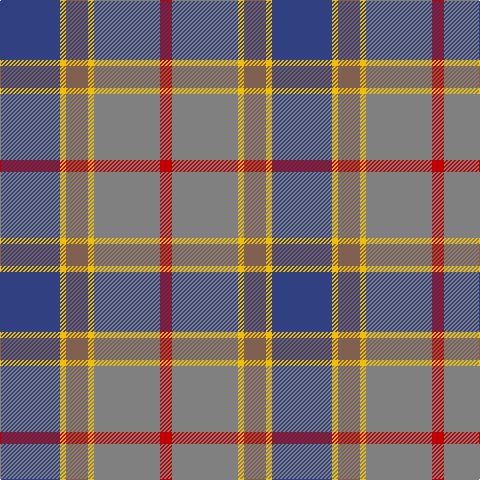

In pattern [BYRYGR](/stripes/byrygr/).

This was sourced from weddslist.  It is a [6 stripe tartan](/stripes/stripes6/).

Original link http://www.weddslist.com/cgi-bin/tartans/pg.pl?source=sts

## Thread count
B/60 Y6 LT22 Y6 N66 R/12

## Palette
Each colour and the base-6 reference it is a variant of.

| Colour | Shade | Base |
|---|---|---|
| B | <code style="background-color:#304080;">#304080</code> `oklch(39.4% 0.109 270.2)` <small>#304080</small> | B <code style="background-color:#2A418A;">#2A418A</code> |
| LT | <code style="background-color:#806050;">#806050</code> `oklch(51.7% 0.049 47.8)` <small>#806050</small> | R <code style="background-color:#CC0000;">#CC0000</code> |
| N | <code style="background-color:#808080;">#808080</code> `oklch(60.0% 0.000 89.9)` <small>#808080</small> | G <code style="background-color:#006100;">#006100</code> |
| R | <code style="background-color:#C00000;">#C00000</code> `oklch(50.7% 0.208 29.2)` <small>#C00000</small> | R <code style="background-color:#CC0000;">#CC0000</code> |
| Y | <code style="background-color:#F0C000;">#F0C000</code> `oklch(82.7% 0.169 90.5)` <small>#F0C000</small> | Y <code style="background-color:#F2BF00;">#F2BF00</code> |

# Sample pattern

## Nearest tartans

The nearest existing variants by ΔTartan distance.

1. [Balfour](/setts/s6/db30ly3dy11ly3y33r6~x2/) — ΔT 0.62
1. [Hawaii (District)](/setts/s8/t4r1ly1t12do4y10ly1r3~x4/) — ΔT 0.99
1. [McHale (Personal)](/setts/s6/y15k10n30o11w3y5~x2/) — ΔT 1.10
1. [Balfour Family Tartan Tartan Number: 683. Earliest known date: 1984 Presented by William Balfour. See products available Copyright © Blair Urquhart, Comrie, 2015](/setts/s6/db30ly3dy11ly3o33r6~x2/) — ΔT 1.21
1. [Brodie Silver Clan Tartan Tartan Number: 1630. Earliest known date: c.1940-50 Probably a trade design based on Hunting Brodie, that has appeared in the last forty years. It is sometimes referred to as muted Brodie. (P.E. MacDonald, STS 1984) See products available Copyright © Blair Urquhart, Comrie, 2015](/setts/s7/r3n20ly2n20o20lb20r3~x2/) — ΔT 1.25
1. [Newmill](/setts/s7/r1o5dt3dt11dt3o5lo1~x8/) — ΔT 1.25
1. [Brodie Silver](/setts/s7/r3n20k2n20o20lb20r3~x2/) — ΔT 1.25
1. [Newmill Corporate Tartan Tartan Number: 2053. Earliest known date: March 1992 Designed to be used in the refurbishing of Johnstons of Elgin new mill shop and based on the colours of the mill shop house style. The lighter square is represented here as green from the 'Antique' colour range, a speciality of Johnstons of Elgin. See products available Copyright © Blair Urquhart, Comrie, 2015](/setts/s7/r5o20dt13db42dt13o20lo5/) — ΔT 1.26
1. [Allman-Jones (Personal)](/setts/s7/r3w2y7n25k8y15dg2~x2/) — ΔT 1.26
1. [Brodie, Silver](/setts/s7/r3n20ly2n20y20lb20r3~x2/) — ΔT 1.27

## Neighbour map

Every grey dot is one of 14299 variants placed by the first two principal components of the ΔTartan feature space (44% of its variance). Red is this tartan; blue dots are its nearest — click one to open its page.

<svg viewBox="0 0 640 380" role="img" style="max-width:100%;height:auto;border:1px solid #e0e0e0;border-radius:4px;display:block" xmlns="http://www.w3.org/2000/svg"><image href="/nn/cloud.v1.png" width="640" height="380"/><a href="/setts/s6/db30ly3dy11ly3y33r6~x2/"><circle cx="214.3" cy="196.8" r="4" fill="#3465a4"><title>Balfour</title></circle></a><a href="/setts/s8/t4r1ly1t12do4y10ly1r3~x4/"><circle cx="249.8" cy="190.8" r="4" fill="#3465a4"><title>Hawaii (District)</title></circle></a><a href="/setts/s6/y15k10n30o11w3y5~x2/"><circle cx="200.7" cy="218.0" r="4" fill="#3465a4"><title>McHale (Personal)</title></circle></a><a href="/setts/s6/db30ly3dy11ly3o33r6~x2/"><circle cx="199.1" cy="187.5" r="4" fill="#3465a4"><title>Balfour Family Tartan Tartan Number: 683. Earliest known date: 1984 Presented by William Balfour. See products available Copyright © Blair Urquhart, Comrie, 2015</title></circle></a><a href="/setts/s7/r3n20ly2n20o20lb20r3~x2/"><circle cx="236.6" cy="214.8" r="4" fill="#3465a4"><title>Brodie Silver Clan Tartan Tartan Number: 1630. Earliest known date: c.1940-50 Probably a trade design based on Hunting Brodie, that has appeared in the last forty years. It is sometimes referred to as muted Brodie. (P.E. MacDonald, STS 1984) See products available Copyright © Blair Urquhart, Comrie, 2015</title></circle></a><a href="/setts/s7/r1o5dt3dt11dt3o5lo1~x8/"><circle cx="206.0" cy="208.4" r="4" fill="#3465a4"><title>Newmill</title></circle></a><a href="/setts/s7/r3n20k2n20o20lb20r3~x2/"><circle cx="220.1" cy="207.2" r="4" fill="#3465a4"><title>Brodie Silver</title></circle></a><a href="/setts/s7/r5o20dt13db42dt13o20lo5/"><circle cx="177.2" cy="218.3" r="4" fill="#3465a4"><title>Newmill Corporate Tartan Tartan Number: 2053. Earliest known date: March 1992 Designed to be used in the refurbishing of Johnstons of Elgin new mill shop and based on the colours of the mill shop house style. The lighter square is represented here as green from the 'Antique' colour range, a speciality of Johnstons of Elgin. See products available Copyright © Blair Urquhart, Comrie, 2015</title></circle></a><a href="/setts/s7/r3w2y7n25k8y15dg2~x2/"><circle cx="214.2" cy="174.1" r="4" fill="#3465a4"><title>Allman-Jones (Personal)</title></circle></a><a href="/setts/s7/r3n20ly2n20y20lb20r3~x2/"><circle cx="221.5" cy="207.7" r="4" fill="#3465a4"><title>Brodie, Silver</title></circle></a><circle cx="229.2" cy="204.1" r="5" fill="#c00000"/></svg>

ID: /setts/s6/db30ly3o11ly3y33r6~x2/
