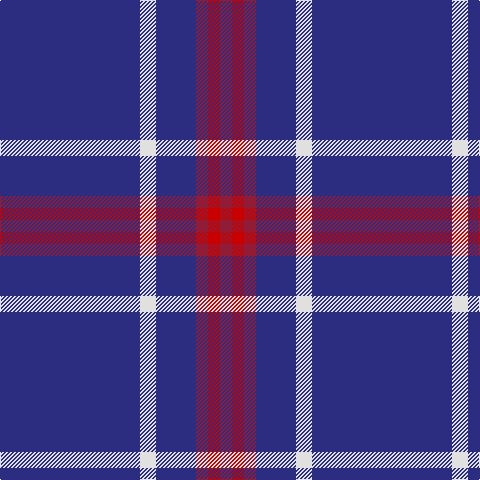

This page is one **sett** — a single exact thread-count. It belongs to the [tartan](/tartans/db35w4db10ri3r3ri3/)
(the same proportion at any scale), whose colour order is pattern [BWBRRR](/stripes/bwbrrr/).

Sourced from tartans-authority.  It is a [6 stripe tartan](/stripes/stripes6/).

Original link http://www.tartansauthority.com/tartan-ferret/display/10448/

## Register references

External register numbers recorded for this tartan.

- Scottish Register of Tartans: [10448](https://www.tartanregister.gov.uk/tartanDetails?ref=10448)
- Scottish Tartans Authority (ITI): 10448

## Thread count
DB/140 LN16 DB40 DR12 R12 DR/12

## Palette

Palette: <strong>Tartan Register</strong>
<table><thead><tr><th>Colour</th><th>Threads</th><th>Shade</th><th>Base</th><th>OKLCh</th></tr></thead><tbody><tr><td>DB/</td><td style="text-align:right;font-variant-numeric:tabular-nums">140</td><td><code style="background-color:#2C2C80;">#2C2C80</code> <small style="color:#888">#2C2C80</small></td><td>B <code style="background-color:#2A418A;">#2A418A</code></td><td><small style="color:#888">oklch(35.0% 0.138 276.6)</small></td></tr><tr><td>LN</td><td style="text-align:right;font-variant-numeric:tabular-nums">16</td><td><code style="background-color:#E0E0E0;">#E0E0E0</code> <small style="color:#888">#E0E0E0</small></td><td>W <code style="background-color:#F7F7F7;">#F7F7F7</code></td><td><small style="color:#888">oklch(90.7% 0.000 89.9)</small></td></tr><tr><td>DB</td><td style="text-align:right;font-variant-numeric:tabular-nums">40</td><td><code style="background-color:#2C2C80;">#2C2C80</code> <small style="color:#888">#2C2C80</small></td><td>B <code style="background-color:#2A418A;">#2A418A</code></td><td><small style="color:#888">oklch(35.0% 0.138 276.6)</small></td></tr><tr><td>DR</td><td style="text-align:right;font-variant-numeric:tabular-nums">12</td><td><code style="background-color:#901C38;">#901C38</code> <small style="color:#888">#901C38</small></td><td>R <code style="background-color:#CC0000;">#CC0000</code></td><td><small style="color:#888">oklch(43.2% 0.150 13.1)</small></td></tr><tr><td>R</td><td style="text-align:right;font-variant-numeric:tabular-nums">12</td><td><code style="background-color:#C80000;">#C80000</code> <small style="color:#888">#C80000</small></td><td>R <code style="background-color:#CC0000;">#CC0000</code></td><td><small style="color:#888">oklch(52.3% 0.215 29.2)</small></td></tr><tr><td>DR/</td><td style="text-align:right;font-variant-numeric:tabular-nums">12</td><td><code style="background-color:#901C38;">#901C38</code> <small style="color:#888">#901C38</small></td><td>R <code style="background-color:#CC0000;">#CC0000</code></td><td><small style="color:#888">oklch(43.2% 0.150 13.1)</small></td></tr></tbody></table>

# Sample pattern

## Nearest tartans

The nearest existing variants by ΔTartan distance, with this tartan at the top so the swatches line up against it.

ΔTartan

Tartan

Sett

—

<a href="/ttd/edit/#slug=db35w4db10ri3r3ri3~x4">Steffen, Morris (Personal)</a> <a class="nn-out" href="/setts/s6/db35w4db10ri3r3ri3~x4/" title="open its dictionary page">↗</a>

1.11

<a href="/ttd/edit/#slug=r2k6db33w2~x4">McCallie</a> <a class="nn-out" href="/setts/s4/r2k6db33w2~x4/" title="open its dictionary page">↗</a>

1.30

<a href="/ttd/edit/#slug=db4w3b6db40b8db12g3~x2">JetBlue (Corporate)</a> <a class="nn-out" href="/setts/s7/db4w3b6db40b8db12g3~x2/" title="open its dictionary page">↗</a>

1.35

<a href="/ttd/edit/#slug=r19db6r14db101g7db7">Lynch Family Tartan Tartan Number: 2163. Earliest known date: 1994 Information from Dr. Phil Smith, Narvon, USA. See products available Copyright © Blair Urquhart, Comrie, 2015</a> <a class="nn-out" href="/setts/s6/r19db6r14db101g7db7/" title="open its dictionary page">↗</a>

1.38

<a href="/ttd/edit/#slug=db100t10k5t10r8">Waugh (Name)</a> <a class="nn-out" href="/setts/s5/db100t10k5t10r8/" title="open its dictionary page">↗</a>

1.41

<a href="/ttd/edit/#slug=db40g7ly3g7db15r5~x2">Wheadon (Name)</a> <a class="nn-out" href="/setts/s6/db40g7ly3g7db15r5~x2/" title="open its dictionary page">↗</a>

1.43

<a href="/ttd/edit/#slug=r5db20r3db20k6db3lb2db1~x2">Masai Shuka 29 (Artefact)</a> <a class="nn-out" href="/setts/s8/r5db20r3db20k6db3lb2db1~x2/" title="open its dictionary page">↗</a>

1.44

<a href="/ttd/edit/#slug=db18r1db1r1db1k7db13w2~x4">Tokyo Bluebells</a> <a class="nn-out" href="/setts/s8/db18r1db1r1db1k7db13w2~x4/" title="open its dictionary page">↗</a>

1.48

<a href="/ttd/edit/#slug=db72t6db12t17w6~x2">Gulfmark (Corporate)</a> <a class="nn-out" href="/setts/s5/db72t6db12t17w6~x2/" title="open its dictionary page">↗</a>

1.48

<a href="/ttd/edit/#slug=db35k10db4w2db3r2ly2~x2">Laidlaw's Highland Drovers (Corp)</a> <a class="nn-out" href="/setts/s7/db35k10db4w2db3r2ly2~x2/" title="open its dictionary page">↗</a>

1.51

<a href="/ttd/edit/#slug=db26r3db3w2db3r3db6r6ly2~x4">Newton Primary School</a> <a class="nn-out" href="/setts/s9/db26r3db3w2db3r3db6r6ly2~x4/" title="open its dictionary page">↗</a>

## Neighbour map

Every grey dot is one of 14359 variants placed by the first two principal components of the ΔTartan feature space (44% of its variance). Red is this tartan; blue dots are its nearest — click one to open its page.

<svg viewBox="0 0 640 380" role="img" style="max-width:100%;height:auto;border:1px solid #e0e0e0;border-radius:4px;display:block" xmlns="http://www.w3.org/2000/svg"><image href="/nn/cloud.v1.png" width="640" height="380"/><a href="/setts/s4/r2k6db33w2~x4/"><circle cx="506.8" cy="205.3" r="4" fill="#3465a4"><title>McCallie</title></circle></a><a href="/setts/s7/db4w3b6db40b8db12g3~x2/"><circle cx="470.9" cy="201.3" r="4" fill="#3465a4"><title>JetBlue (Corporate)</title></circle></a><a href="/setts/s6/r19db6r14db101g7db7/"><circle cx="530.1" cy="198.7" r="4" fill="#3465a4"><title>Lynch Family Tartan Tartan Number: 2163. Earliest known date: 1994 Information from Dr. Phil Smith, Narvon, USA. See products available Copyright © Blair Urquhart, Comrie, 2015</title></circle></a><a href="/setts/s5/db100t10k5t10r8/"><circle cx="511.7" cy="184.1" r="4" fill="#3465a4"><title>Waugh (Name)</title></circle></a><a href="/setts/s6/db40g7ly3g7db15r5~x2/"><circle cx="427.3" cy="202.5" r="4" fill="#3465a4"><title>Wheadon (Name)</title></circle></a><a href="/setts/s8/r5db20r3db20k6db3lb2db1~x2/"><circle cx="452.4" cy="176.6" r="4" fill="#3465a4"><title>Masai Shuka 29 (Artefact)</title></circle></a><a href="/setts/s8/db18r1db1r1db1k7db13w2~x4/"><circle cx="459.7" cy="169.1" r="4" fill="#3465a4"><title>Tokyo Bluebells</title></circle></a><a href="/setts/s5/db72t6db12t17w6~x2/"><circle cx="496.1" cy="233.8" r="4" fill="#3465a4"><title>Gulfmark (Corporate)</title></circle></a><a href="/setts/s7/db35k10db4w2db3r2ly2~x2/"><circle cx="452.2" cy="154.0" r="4" fill="#3465a4"><title>Laidlaw's Highland Drovers (Corp)</title></circle></a><a href="/setts/s9/db26r3db3w2db3r3db6r6ly2~x4/"><circle cx="426.1" cy="162.0" r="4" fill="#3465a4"><title>Newton Primary School</title></circle></a><circle cx="493.9" cy="197.1" r="5" fill="#c00000"/></svg>

ID: /setts/s6/db35w4db10ri3r3ri3~x4/
