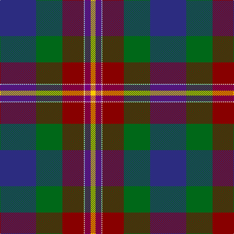

**Bands:** [YBWRGB](/stripes/ybwrgb/) · **Stripes:** [LY DP W R G DB](/stripes/stripes6/) LY DP W R G DB

This was sourced from tartans-authority.  It is a [6 band tartan](/bands/bands6/).

Original link http://www.tartansauthority.com/tartan-ferret/display/10543/

## Thread count
DB/74 G54 DR44 LN2 P12 Y/10

## Palette
Each colour and its ΔE from the base-6 reference it is a variant of.

| Colour | Shade | Base | ΔE (OKLab) |
|---|---|---|---|
| DB | <code style="background-color:#2C2C80;">#2C2C80</code> `#2C2C80` | B <code style="background-color:#2A418A;">#2A418A</code> | 0.06 |
| DR | <code style="background-color:#880000;">#880000</code> `#880000` | R <code style="background-color:#CC0000;">#CC0000</code> | 0.15 |
| G | <code style="background-color:#006818;">#006818</code> `#006818` | G <code style="background-color:#006100;">#006100</code> | 0.02 |
| LN | <code style="background-color:#E0E0E0;">#E0E0E0</code> `#E0E0E0` | W <code style="background-color:#F7F7F7;">#F7F7F7</code> | 0.07 |
| P | <code style="background-color:#780078;">#780078</code> `#780078` | B <code style="background-color:#2A418A;">#2A418A</code> | 0.17 |
| Y | <code style="background-color:#FCCC00;">#FCCC00</code> `#FCCC00` | Y <code style="background-color:#F2BF00;">#F2BF00</code> | 0.04 |

# Sample pattern

## Nearest tartans

The nearest existing variants by ΔTartan distance.

1. [Silver Wedding (Fashion)](/setts/s8/dp8n44k32lp2o53lb8n8lb4/) — ΔT 1.11
1. [Beauly Firth and Glens](/setts/s8/dp3n3dp3n27w1t15k22r3~x2/) — ΔT 1.29
1. [Naysmith (Name)](/setts/s6/r6db32k18g28k1lb2~x2/) — ΔT 1.29
1. [Hegarty, Philip David (Personal)](/setts/s6/dg3k24lo1r18db18w1~x2/) — ΔT 1.34
1. [Hegarty, Philip David (Personal)](/setts/s6/g3k24ly1r18db18w1~x2/) — ΔT 1.35
1. [Diaspora](/setts/s6/dt3dg1r24dt16db28w3~x2/) — ΔT 1.42
1. [Vienna Highlander (Fashion)](/setts/s8/lo3k2o15k10dt23r2dt1w2~x2/) — ΔT 1.44
1. [Scout Mapping Service #1 (Corporate)](/setts/s7/db24r8g8r2g8k1ly2~x2/) — ΔT 1.45
1. [Jones (Name)](/setts/s7/r4lb1y6g25k8db15lb2~x2/) — ΔT 1.45
1. [Tooth (Personal)](/setts/s8/y5lo1r2y25k14db19w2y4~x2/) — ΔT 1.45

## Neighbour map

Every grey dot is one of 14299 variants placed by the first two principal components of the ΔTartan feature space (44% of its variance). Red is this tartan; blue dots are its nearest — click one to open its page.

<svg viewBox="0 0 640 380" role="img" style="max-width:100%;height:auto;border:1px solid #e0e0e0;border-radius:4px;display:block" xmlns="http://www.w3.org/2000/svg"><image href="/nn/cloud.v1.png" width="640" height="380"/><a href="/setts/s8/dp8n44k32lp2o53lb8n8lb4/"><circle cx="183.8" cy="124.6" r="4" fill="#3465a4"><title>Silver Wedding (Fashion)</title></circle></a><a href="/setts/s8/dp3n3dp3n27w1t15k22r3~x2/"><circle cx="233.9" cy="138.6" r="4" fill="#3465a4"><title>Beauly Firth and Glens</title></circle></a><a href="/setts/s6/r6db32k18g28k1lb2~x2/"><circle cx="234.3" cy="167.2" r="4" fill="#3465a4"><title>Naysmith (Name)</title></circle></a><a href="/setts/s6/dg3k24lo1r18db18w1~x2/"><circle cx="212.3" cy="148.3" r="4" fill="#3465a4"><title>Hegarty, Philip David (Personal)</title></circle></a><a href="/setts/s6/g3k24ly1r18db18w1~x2/"><circle cx="196.9" cy="140.5" r="4" fill="#3465a4"><title>Hegarty, Philip David (Personal)</title></circle></a><a href="/setts/s6/dt3dg1r24dt16db28w3~x2/"><circle cx="243.4" cy="158.4" r="4" fill="#3465a4"><title>Diaspora</title></circle></a><a href="/setts/s8/lo3k2o15k10dt23r2dt1w2~x2/"><circle cx="201.9" cy="119.3" r="4" fill="#3465a4"><title>Vienna Highlander (Fashion)</title></circle></a><a href="/setts/s7/db24r8g8r2g8k1ly2~x2/"><circle cx="204.8" cy="118.5" r="4" fill="#3465a4"><title>Scout Mapping Service #1 (Corporate)</title></circle></a><a href="/setts/s7/r4lb1y6g25k8db15lb2~x2/"><circle cx="209.6" cy="147.1" r="4" fill="#3465a4"><title>Jones (Name)</title></circle></a><a href="/setts/s8/y5lo1r2y25k14db19w2y4~x2/"><circle cx="257.8" cy="137.5" r="4" fill="#3465a4"><title>Tooth (Personal)</title></circle></a><circle cx="212.9" cy="139.2" r="5" fill="#c00000"/></svg>

ID: /setts/s6/db37g27r22w1dp6ly5~x2/
