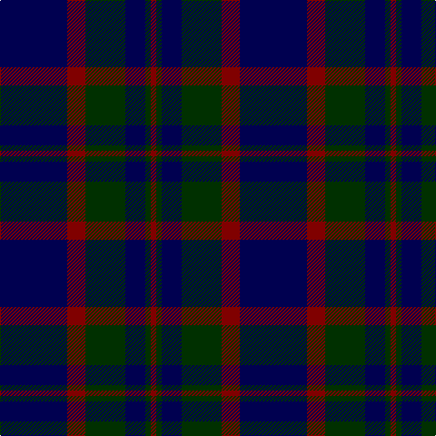

In pattern [BRGBGR](/stripes/brgbgr/).

This was sourced from weddslist.  It is a [6 stripe tartan](/stripes/stripes6/).

Original link http://www.weddslist.com/cgi-bin/tartans/pg.pl?source=sts

## Thread count
DB/74 DR20 DG44 DB22 DG6 DR/6

## Palette
Each colour and the base-6 reference it is a variant of.

| Colour | Shade | Base |
|---|---|---|
| DB | <code style="background-color:#000050;">#000050</code> `oklch(19.5% 0.135 264.1)` <small>#000050</small> | B <code style="background-color:#2A418A;">#2A418A</code> |
| DG | <code style="background-color:#003000;">#003000</code> `oklch(26.8% 0.091 142.5)` <small>#003000</small> | G <code style="background-color:#006100;">#006100</code> |
| DR | <code style="background-color:#800000;">#800000</code> `oklch(37.7% 0.155 29.2)` <small>#800000</small> | R <code style="background-color:#CC0000;">#CC0000</code> |

# Sample pattern

## Nearest tartans

The nearest existing variants by ΔTartan distance.

1. [Marchmont (Personal)](/setts/s7/k1db12k12g1k12db12g1~x4/) — ΔT 0.93
1. [Largan (?)](/setts/s6/db8k39db8k39db87r6/) — ΔT 1.07
1. [MacKay (Blue) #2](/setts/s5/k15db4k15db28r2~x2/) — ΔT 1.11
1. [Oban](/setts/s8/k6db10k10b1k1b1k10b6~x4/) — ΔT 1.19
1. [Hutton](/setts/s6/k2dg7db2dg7db16r1~x6/) — ΔT 1.22
1. [Wellington Variation](/setts/s4/k3db23k17r2~x2/) — ΔT 1.23
1. [Black Watch (Miniature) Regimental Tartan Tartan Number: 2200. Earliest known date: pre 2003 This is a miniture version of the regular Black Watch sett. See products available Copyright © Blair Urquhart, Comrie, 2015](/setts/s8/db12k1db1k1db1k3g6k1~x2/) — ΔT 1.23
1. [Black Watch (variation)](/setts/s6/k5g23k18db21k33db3~x2/) — ΔT 1.30
1. [Robert Gordon University](/setts/s6/k4r2k12db12k1lo2~x2/) — ΔT 1.30
1. [Morgan (MacKay Blue) Clan Tartan Tartan Number: 264. Earliest known date: 1842 The design comes from the Vestiarium Scoticum (1842). The authors, the Sobieski Stuart brothers, enjoyed a popular following among the Scottish gentry in the early Victorian era, and in the spirit of the times, added mystery, romance and some spurious historical documentation to the subject of tartan. Of the better known tartans, the book offers some minor variation, but in other cases it provides the only recorded version of many tartans in use today. See products available Copyright © Blair Urquhart, Comrie, 2015](/setts/s6/db1k3db1k3db8r1~x4/) — ΔT 1.30

## Neighbour map

Every grey dot is one of 14299 variants placed by the first two principal components of the ΔTartan feature space (44% of its variance). Red is this tartan; blue dots are its nearest — click one to open its page.

<svg viewBox="0 0 640 380" role="img" style="max-width:100%;height:auto;border:1px solid #e0e0e0;border-radius:4px;display:block" xmlns="http://www.w3.org/2000/svg"><image href="/nn/cloud.v1.png" width="640" height="380"/><a href="/setts/s7/k1db12k12g1k12db12g1~x4/"><circle cx="366.9" cy="264.5" r="4" fill="#3465a4"><title>Marchmont (Personal)</title></circle></a><a href="/setts/s6/db8k39db8k39db87r6/"><circle cx="429.9" cy="254.8" r="4" fill="#3465a4"><title>Largan (?)</title></circle></a><a href="/setts/s5/k15db4k15db28r2~x2/"><circle cx="378.4" cy="270.1" r="4" fill="#3465a4"><title>MacKay (Blue) #2</title></circle></a><a href="/setts/s8/k6db10k10b1k1b1k10b6~x4/"><circle cx="367.7" cy="263.7" r="4" fill="#3465a4"><title>Oban</title></circle></a><a href="/setts/s6/k2dg7db2dg7db16r1~x6/"><circle cx="360.6" cy="234.7" r="4" fill="#3465a4"><title>Hutton</title></circle></a><a href="/setts/s4/k3db23k17r2~x2/"><circle cx="394.5" cy="285.2" r="4" fill="#3465a4"><title>Wellington Variation</title></circle></a><a href="/setts/s8/db12k1db1k1db1k3g6k1~x2/"><circle cx="385.9" cy="231.2" r="4" fill="#3465a4"><title>Black Watch (Miniature) Regimental Tartan Tartan Number: 2200. Earliest known date: pre 2003 This is a miniture version of the regular Black Watch sett. See products available Copyright © Blair Urquhart, Comrie, 2015</title></circle></a><a href="/setts/s6/k5g23k18db21k33db3~x2/"><circle cx="346.4" cy="289.3" r="4" fill="#3465a4"><title>Black Watch (variation)</title></circle></a><a href="/setts/s6/k4r2k12db12k1lo2~x2/"><circle cx="338.7" cy="237.6" r="4" fill="#3465a4"><title>Robert Gordon University</title></circle></a><a href="/setts/s6/db1k3db1k3db8r1~x4/"><circle cx="404.3" cy="271.9" r="4" fill="#3465a4"><title>Morgan (MacKay Blue) Clan Tartan Tartan Number: 264. Earliest known date: 1842 The design comes from the Vestiarium Scoticum (1842). The authors, the Sobieski Stuart brothers, enjoyed a popular following among the Scottish gentry in the early Victorian era, and in the spirit of the times, added mystery, romance and some spurious historical documentation to the subject of tartan. Of the better known tartans, the book offers some minor variation, but in other cases it provides the only recorded version of many tartans in use today. See products available Copyright © Blair Urquhart, Comrie, 2015</title></circle></a><circle cx="387.9" cy="265.7" r="5" fill="#c00000"/></svg>

ID: /setts/s6/db37r10dg22db11dg3r3~x2/
