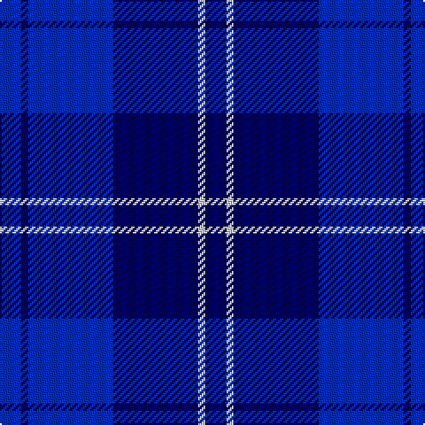

**Bands:** [BBBBWB](/stripes/bbbbwb/) · **Stripes:** [DB DB DB DB LB DB](/stripes/stripes6/) DB DB DB DB LB DB

This was sourced from tartans-authority.  It is a [6 band tartan](/bands/bands6/).

Original link http://www.tartansauthority.com/tartan-ferret/display/4821/

## Thread count
B/12 DB4 B48 DB48 N4 DB/12

## Palette
Each colour and its ΔE from the base-6 reference it is a variant of.

| Colour | Shade | Base | ΔE (OKLab) |
|---|---|---|---|
| B | <code style="background-color:#002CC0;">#002CC0</code> `#002CC0` | B <code style="background-color:#2A418A;">#2A418A</code> | 0.10 |
| DB | <code style="background-color:#000064;">#000064</code> `#000064` | B <code style="background-color:#2A418A;">#2A418A</code> | 0.18 |
| N | <code style="background-color:#C8C8C8;">#C8C8C8</code> `#C8C8C8` | W <code style="background-color:#F7F7F7;">#F7F7F7</code> | 0.14 |

# Sample pattern

## Nearest tartans

The nearest existing variants by ΔTartan distance.

1. [Trotter (Personal)](/setts/s9/db23db2db2db2db2db28r2db4b2~x2/) — ΔT 1.78
1. [U.S.S. John Paul Jones #1](/setts/s6/b3db1db16db16db2lb2~x4/) — ΔT 2.01
1. [Williams (New York) (Personal)](/setts/s5/k30db6k6db41lt2~x2/) — ΔT 2.09
1. [Fujisankei Serene](/setts/s9/n1t6db4t1db16n1db4n6t1~x4/) — ΔT 2.13
1. [Fenston/Morris (Personal)](/setts/s5/k33db8k4db35p3~x2/) — ΔT 2.18
1. [British American School (Corporate)](/setts/s7/db2b2r1b16w1db20r2~x2/) — ΔT 2.18
1. [Mackaw](/setts/s4/r2db35db35ly1~x2/) — ΔT 2.19
1. [Argentina](/setts/s7/db5w3db33k3db3k36db3~x2/) — ΔT 2.21
1. [Van Loo (Personal)](/setts/s7/t5db30k25t5db30dp2t5~x2/) — ΔT 2.35
1. [Van Loo Tartan Tartan Number: 6717. Earliest known date: pre 2005 Nothing See products available Copyright © Blair Urquhart, Comrie, 2015](/setts/s7/t5db30k25t5db30dp3t5~x2/) — ΔT 2.36

## Neighbour map

Every grey dot is one of 14313 variants placed by the first two principal components of the ΔTartan feature space (44% of its variance). Red is this tartan; blue dots are its nearest — click one to open its page.

<svg viewBox="0 0 640 380" role="img" style="max-width:100%;height:auto;border:1px solid #e0e0e0;border-radius:4px;display:block" xmlns="http://www.w3.org/2000/svg"><image href="/nn/cloud.v1.png" width="640" height="380"/><a href="/setts/s9/db23db2db2db2db2db28r2db4b2~x2/"><circle cx="415.2" cy="207.8" r="4" fill="#3465a4"><title>Trotter (Personal)</title></circle></a><a href="/setts/s6/b3db1db16db16db2lb2~x4/"><circle cx="302.5" cy="206.0" r="4" fill="#3465a4"><title>U.S.S. John Paul Jones #1</title></circle></a><a href="/setts/s5/k30db6k6db41lt2~x2/"><circle cx="436.1" cy="253.5" r="4" fill="#3465a4"><title>Williams (New York) (Personal)</title></circle></a><a href="/setts/s9/n1t6db4t1db16n1db4n6t1~x4/"><circle cx="369.2" cy="193.1" r="4" fill="#3465a4"><title>Fujisankei Serene</title></circle></a><a href="/setts/s5/k33db8k4db35p3~x2/"><circle cx="346.6" cy="250.0" r="4" fill="#3465a4"><title>Fenston/Morris (Personal)</title></circle></a><a href="/setts/s7/db2b2r1b16w1db20r2~x2/"><circle cx="395.1" cy="196.5" r="4" fill="#3465a4"><title>British American School (Corporate)</title></circle></a><a href="/setts/s4/r2db35db35ly1~x2/"><circle cx="417.1" cy="236.4" r="4" fill="#3465a4"><title>Mackaw</title></circle></a><a href="/setts/s7/db5w3db33k3db3k36db3~x2/"><circle cx="379.2" cy="224.2" r="4" fill="#3465a4"><title>Argentina</title></circle></a><a href="/setts/s7/t5db30k25t5db30dp2t5~x2/"><circle cx="369.9" cy="225.0" r="4" fill="#3465a4"><title>Van Loo (Personal)</title></circle></a><a href="/setts/s7/t5db30k25t5db30dp3t5~x2/"><circle cx="349.1" cy="240.3" r="4" fill="#3465a4"><title>Van Loo Tartan Tartan Number: 6717. Earliest known date: pre 2005 Nothing See products available Copyright © Blair Urquhart, Comrie, 2015</title></circle></a><circle cx="388.8" cy="268.1" r="5" fill="#c00000"/></svg>

ID: /setts/s6/db3db1db12db12lb1db3~x4/
