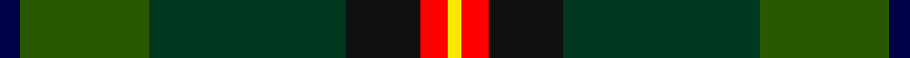

In pattern [BGGKRY](/stripes/bggkry/).

This was sourced from register-of-tartans.  It is a [6 stripe tartan](/stripes/stripes6/).

Original link https://www.tartanregister.gov.uk/tartanDetails.aspx?ref=11399

## Register references

External register numbers recorded for this tartan.

- Scottish Register of Tartans: [11399](https://www.tartanregister.gov.uk/tartanDetails.aspx?ref=11399)

## Thread count
DB/6 G38 DG58 K22 R8 Y/4

## Palette
Each colour and the base-6 reference it is a variant of.

| Colour | Shade | Base |
|---|---|---|
| DB | <code style="background-color:#000048;">#000048</code> `oklch(18.2% 0.126 264.1)` <small>#000048</small> | B <code style="background-color:#2A418A;">#2A418A</code> |
| DG | <code style="background-color:#003820;">#003820</code> `oklch(30.0% 0.070 158.3)` <small>#003820</small> | G <code style="background-color:#006100;">#006100</code> |
| G | <code style="background-color:#285800;">#285800</code> `oklch(41.0% 0.122 135.8)` <small>#285800</small> | G <code style="background-color:#006100;">#006100</code> |
| K | <code style="background-color:#101010;">#101010</code> `oklch(17.3% 0.000 89.9)` <small>#101010</small> | K <code style="background-color:#000000;">#000000</code> |
| R | <code style="background-color:#FF0000;">#FF0000</code> `oklch(62.8% 0.258 29.2)` <small>#FF0000</small> | R <code style="background-color:#CC0000;">#CC0000</code> |
| Y | <code style="background-color:#FFE600;">#FFE600</code> `oklch(91.7% 0.192 101.4)` <small>#FFE600</small> | Y <code style="background-color:#F2BF00;">#F2BF00</code> |

# Sample pattern

## Nearest tartans

The nearest existing variants by ΔTartan distance.

1. [Dobson (Palm Bay) (Personal)](/setts/s6/g15ly1dy2db5k4dg5~x6/) — ΔT 0.81
1. [Waterford Irish County Tartan Tartan Number: 2255. Earliest known date: 1993 One of a series of Irish District tartans designed by Polly Wittering of the House of Edgar, with colours reminiscent of the Country with soft warm colours dominating. See products available Copyright © Blair Urquhart, Comrie, 2015](/setts/s6/dg42ly2g16dt7k16r5~x2/) — ΔT 1.10
1. [Lawson, William](/setts/s8/r3dg1k16w3k15dg13dg22lo3~x2/) — ΔT 1.11
1. [MacSween Hunting (Lochs, Isle of Lew](/setts/s7/g3r3g31dg18g4k22ly3/) — ΔT 1.25
1. [Connelly, James (Personal)](/setts/s8/dg12g6r1dg6g4dp8ly2w2~x4/) — ΔT 1.28
1. [Glencross, Tynron (Name)](/setts/s6/r3y13db13ly2dg34w3~x2/) — ΔT 1.29
1. [Wagland (Name)](/setts/s7/r3db6ly2db15g12dg39w3~x2/) — ΔT 1.34
1. [Hughes](/setts/s7/dg20dg14db9ly2db9k1w2~x4/) — ΔT 1.36
1. [Lisbon](/setts/s6/r2do22g22do3db12y2~x2/) — ΔT 1.37
1. [Symonds (2016)](/setts/s6/g18ly1dp5ly1dg18r1~x4/) — ΔT 1.38

## Neighbour map

Every grey dot is one of 14299 variants placed by the first two principal components of the ΔTartan feature space (44% of its variance). Red is this tartan; blue dots are its nearest — click one to open its page.

<svg viewBox="0 0 640 380" role="img" style="max-width:100%;height:auto;border:1px solid #e0e0e0;border-radius:4px;display:block" xmlns="http://www.w3.org/2000/svg"><image href="/nn/cloud.v1.png" width="640" height="380"/><a href="/setts/s6/g15ly1dy2db5k4dg5~x6/"><circle cx="242.8" cy="195.5" r="4" fill="#3465a4"><title>Dobson (Palm Bay) (Personal)</title></circle></a><a href="/setts/s6/dg42ly2g16dt7k16r5~x2/"><circle cx="250.6" cy="170.9" r="4" fill="#3465a4"><title>Waterford Irish County Tartan Tartan Number: 2255. Earliest known date: 1993 One of a series of Irish District tartans designed by Polly Wittering of the House of Edgar, with colours reminiscent of the Country with soft warm colours dominating. See products available Copyright © Blair Urquhart, Comrie, 2015</title></circle></a><a href="/setts/s8/r3dg1k16w3k15dg13dg22lo3~x2/"><circle cx="204.7" cy="162.1" r="4" fill="#3465a4"><title>Lawson, William</title></circle></a><a href="/setts/s7/g3r3g31dg18g4k22ly3/"><circle cx="240.1" cy="207.8" r="4" fill="#3465a4"><title>MacSween Hunting (Lochs, Isle of Lew</title></circle></a><a href="/setts/s8/dg12g6r1dg6g4dp8ly2w2~x4/"><circle cx="186.7" cy="193.9" r="4" fill="#3465a4"><title>Connelly, James (Personal)</title></circle></a><a href="/setts/s6/r3y13db13ly2dg34w3~x2/"><circle cx="259.6" cy="164.7" r="4" fill="#3465a4"><title>Glencross, Tynron (Name)</title></circle></a><a href="/setts/s7/r3db6ly2db15g12dg39w3~x2/"><circle cx="271.9" cy="154.2" r="4" fill="#3465a4"><title>Wagland (Name)</title></circle></a><a href="/setts/s7/dg20dg14db9ly2db9k1w2~x4/"><circle cx="196.1" cy="176.6" r="4" fill="#3465a4"><title>Hughes</title></circle></a><a href="/setts/s6/r2do22g22do3db12y2~x2/"><circle cx="241.0" cy="217.9" r="4" fill="#3465a4"><title>Lisbon</title></circle></a><a href="/setts/s6/g18ly1dp5ly1dg18r1~x4/"><circle cx="279.1" cy="185.9" r="4" fill="#3465a4"><title>Symonds (2016)</title></circle></a><circle cx="221.0" cy="188.8" r="5" fill="#c00000"/></svg>

ID: /setts/s6/db3dg19dg29k11r4ly2~x2/
