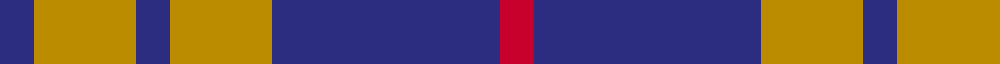

**Bands:** [BYBYBR](/stripes/bybybr/) · **Stripes:** [DB LO DB LO DB R](/stripes/stripes6/) DB LO DB LO DB R

This was sourced from register-of-tartans.  It is a [6 band tartan](/bands/bands6/).

Original link https://www.tartanregister.gov.uk/tartanDetails.aspx?ref=4905

## Attestations

This cloth appears in 2 source records; the oldest owns this page.

- 01/01/1689 — Latin (register-of-tartans, [record](https://www.tartanregister.gov.uk/tartanDetails.aspx?ref=4905))
- 1689 — Latin (Artefact) (tartans-authority, [record](http://www.tartansauthority.com/tartan-ferret/display/3873/))

## Register references

External register numbers recorded for this tartan.

- Scottish Register of Tartans: [4905](https://www.tartanregister.gov.uk/tartanDetails.aspx?ref=4905)
- Scottish Tartans Authority (ITI): 3873

## Thread count
DB/6 DY18 DB6 DY18 DB40 R/6

## Palette
Each colour and its ΔE from the base-6 reference it is a variant of.

| Colour | Shade | Base | ΔE (OKLab) |
|---|---|---|---|
| DB | <code style="background-color:#2C2C80;">#2C2C80</code> `#2C2C80` | B <code style="background-color:#2A418A;">#2A418A</code> | 0.06 |
| DY | <code style="background-color:#BC8C00;">#BC8C00</code> `#BC8C00` | Y <code style="background-color:#F2BF00;">#F2BF00</code> | 0.16 |
| R | <code style="background-color:#C8002C;">#C8002C</code> `#C8002C` | R <code style="background-color:#CC0000;">#CC0000</code> | 0.03 |

# Sample pattern

## Nearest tartans

The nearest existing variants by ΔTartan distance.

1. [O'Long (Personal)](/setts/s7/g22dp22g3dp11w3dp4w3~x2/) — ΔT 0.61
1. [Flynn](/setts/s6/o58k22o8k17r5k14~x2/) — ΔT 1.22
1. [Buchanan VS](/setts/s6/lr2dr4lr2dr4lr9k1~x2/) — ΔT 1.25
1. [Buchanan VS](/setts/s6/lr2dr4lr2dr4lr9k1/) — ΔT 1.25
1. [Coronation](/setts/s7/db7w1r7db4r2db4w2~x2/) — ΔT 1.26
1. [MacCrimmon from Skye](/setts/s7/ly5k3t22k17t22k3r5~x2/) — ΔT 1.32
1. [MacArthur-Fox Blue (Personal)](/setts/s6/lb2dr16b3dr3b13r2~x4/) — ΔT 1.37
1. [New York State Police Pipe Band](/setts/s5/o5dp3o18k16ly3~x4/) — ΔT 1.38
1. [Johore Regiment (Military)](/setts/s5/db20k5db18lo26k6~x2/) — ΔT 1.40
1. [Mackay (Blue)](/setts/s6/n1k3n1k3n8r1~x8/) — ΔT 1.40

## Neighbour map

Every grey dot is one of 14313 variants placed by the first two principal components of the ΔTartan feature space (44% of its variance). Red is this tartan; blue dots are its nearest — click one to open its page.

<svg viewBox="0 0 640 380" role="img" style="max-width:100%;height:auto;border:1px solid #e0e0e0;border-radius:4px;display:block" xmlns="http://www.w3.org/2000/svg"><image href="/nn/cloud.v1.png" width="640" height="380"/><a href="/setts/s7/g22dp22g3dp11w3dp4w3~x2/"><circle cx="305.5" cy="223.1" r="4" fill="#3465a4"><title>O'Long (Personal)</title></circle></a><a href="/setts/s6/o58k22o8k17r5k14~x2/"><circle cx="321.5" cy="215.0" r="4" fill="#3465a4"><title>Flynn</title></circle></a><a href="/setts/s6/lr2dr4lr2dr4lr9k1~x2/"><circle cx="317.6" cy="222.1" r="4" fill="#3465a4"><title>Buchanan VS</title></circle></a><a href="/setts/s6/lr2dr4lr2dr4lr9k1/"><circle cx="317.6" cy="222.1" r="4" fill="#3465a4"><title>Buchanan VS</title></circle></a><a href="/setts/s7/db7w1r7db4r2db4w2~x2/"><circle cx="276.9" cy="243.0" r="4" fill="#3465a4"><title>Coronation</title></circle></a><a href="/setts/s7/ly5k3t22k17t22k3r5~x2/"><circle cx="264.8" cy="214.7" r="4" fill="#3465a4"><title>MacCrimmon from Skye</title></circle></a><a href="/setts/s6/lb2dr16b3dr3b13r2~x4/"><circle cx="279.2" cy="216.6" r="4" fill="#3465a4"><title>MacArthur-Fox Blue (Personal)</title></circle></a><a href="/setts/s5/o5dp3o18k16ly3~x4/"><circle cx="235.6" cy="234.1" r="4" fill="#3465a4"><title>New York State Police Pipe Band</title></circle></a><a href="/setts/s5/db20k5db18lo26k6~x2/"><circle cx="227.2" cy="274.9" r="4" fill="#3465a4"><title>Johore Regiment (Military)</title></circle></a><a href="/setts/s6/n1k3n1k3n8r1~x8/"><circle cx="362.3" cy="246.8" r="4" fill="#3465a4"><title>Mackay (Blue)</title></circle></a><circle cx="305.9" cy="239.9" r="5" fill="#c00000"/></svg>

ID: /setts/s6/db3lo9db3lo9db20r3~x2/
