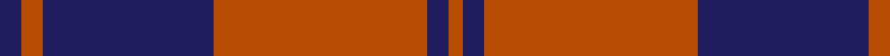

This page is one **sett** — a single exact thread-count. It belongs to the [tartan](/tartans/db3do3db24do30db3do2/)
(the same proportion at any scale), whose colour order is pattern [BRBRBR](/stripes/brbrbr/).

Sourced from tartans-authority.  It is a [6 stripe tartan](/stripes/stripes6/).

Original link http://www.tartansauthority.com/tartan-ferret/display/5881/

## Thread count
DB/6 DO6 DB48 DO60 DB6 DO/4

## Palette
Each colour and the base-6 reference it is a variant of.

| Colour | Shade | Base |
|---|---|---|
| DB | <code style="background-color:#202060;">#202060</code> `oklch(28.9% 0.111 276.9)` <small>#202060</small> | B <code style="background-color:#2A418A;">#2A418A</code> |
| DO | <code style="background-color:#B84C00;">#B84C00</code> `oklch(55.1% 0.156 45.5)` <small>#B84C00</small> | R <code style="background-color:#CC0000;">#CC0000</code> |

# Sample pattern

## Nearest tartans

The nearest existing variants by ΔTartan distance, with this tartan at the top so the swatches line up against it.

ΔTartan

Tartan

Sett

—

<a href="/ttd/edit/#slug=db3o3db24o30db3o2~x2">Auburn University (Alabama) (Corp)</a> <a class="nn-out" href="/setts/s6/db3o3db24o30db3o2~x2/" title="open its dictionary page">↗</a>

1.13

<a href="/ttd/edit/#slug=db3lo3db24lo30db3lo2~x2">Auburn University (Alabama)</a> <a class="nn-out" href="/setts/s6/db3lo3db24lo30db3lo2~x2/" title="open its dictionary page">↗</a>

1.40

<a href="/ttd/edit/#slug=m6w2m30g12m3g12m3~x2">Crawford (Clan)</a> <a class="nn-out" href="/setts/s7/m6w2m30g12m3g12m3~x2/" title="open its dictionary page">↗</a>

1.43

<a href="/ttd/edit/#slug=db2r7db2r7db22ly2~x2">MacQueen variant</a> <a class="nn-out" href="/setts/s6/db2r7db2r7db22ly2~x2/" title="open its dictionary page">↗</a>

1.43

<a href="/ttd/edit/#slug=k3r1k16r16k1r3~x4">The Mary Erskine</a> <a class="nn-out" href="/setts/s6/k3r1k16r16k1r3~x4/" title="open its dictionary page">↗</a>

1.44

<a href="/ttd/edit/#slug=db48r18db6r13ly4r14~x2">Butler</a> <a class="nn-out" href="/setts/s6/db48r18db6r13ly4r14~x2/" title="open its dictionary page">↗</a>

1.46

<a href="/ttd/edit/#slug=m6lb2m30g12m3g12m3~x2">Crawford</a> <a class="nn-out" href="/setts/s7/m6lb2m30g12m3g12m3~x2/" title="open its dictionary page">↗</a>

1.47

<a href="/ttd/edit/#slug=dt6lo2dt27r27lo2r2lo2r2dt4~x2">New Breckon (Fashion?)</a> <a class="nn-out" href="/setts/s9/dt6lo2dt27r27lo2r2lo2r2dt4~x2/" title="open its dictionary page">↗</a>

1.49

<a href="/ttd/edit/#slug=db3r64db3r3db62r3db3r3">Unidentified Plaid #12</a> <a class="nn-out" href="/setts/s8/db3r64db3r3db62r3db3r3/" title="open its dictionary page">↗</a>

1.49

<a href="/ttd/edit/#slug=k2r12k2r12k33r2~x2">Cameron Black &amp; Red (Dress)</a> <a class="nn-out" href="/setts/s6/k2r12k2r12k33r2~x2/" title="open its dictionary page">↗</a>

1.53

<a href="/ttd/edit/#slug=db2r2db15r15db2r2~x2">Hebridean 2</a> <a class="nn-out" href="/setts/s6/db2r2db15r15db2r2~x2/" title="open its dictionary page">↗</a>

## Neighbour map

Every grey dot is one of 14299 variants placed by the first two principal components of the ΔTartan feature space (44% of its variance). Red is this tartan; blue dots are its nearest — click one to open its page.

<svg viewBox="0 0 640 380" role="img" style="max-width:100%;height:auto;border:1px solid #e0e0e0;border-radius:4px;display:block" xmlns="http://www.w3.org/2000/svg"><image href="/nn/cloud.v1.png" width="640" height="380"/><a href="/setts/s6/db3lo3db24lo30db3lo2~x2/"><circle cx="385.0" cy="197.5" r="4" fill="#3465a4"><title>Auburn University (Alabama)</title></circle></a><a href="/setts/s7/m6w2m30g12m3g12m3~x2/"><circle cx="420.8" cy="200.3" r="4" fill="#3465a4"><title>Crawford (Clan)</title></circle></a><a href="/setts/s6/db2r7db2r7db22ly2~x2/"><circle cx="394.4" cy="206.7" r="4" fill="#3465a4"><title>MacQueen variant</title></circle></a><a href="/setts/s6/k3r1k16r16k1r3~x4/"><circle cx="376.1" cy="205.0" r="4" fill="#3465a4"><title>The Mary Erskine</title></circle></a><a href="/setts/s6/db48r18db6r13ly4r14~x2/"><circle cx="348.9" cy="213.1" r="4" fill="#3465a4"><title>Butler</title></circle></a><a href="/setts/s7/m6lb2m30g12m3g12m3~x2/"><circle cx="426.8" cy="203.4" r="4" fill="#3465a4"><title>Crawford</title></circle></a><a href="/setts/s9/dt6lo2dt27r27lo2r2lo2r2dt4~x2/"><circle cx="353.1" cy="170.5" r="4" fill="#3465a4"><title>New Breckon (Fashion?)</title></circle></a><a href="/setts/s8/db3r64db3r3db62r3db3r3/"><circle cx="432.9" cy="160.1" r="4" fill="#3465a4"><title>Unidentified Plaid #12</title></circle></a><a href="/setts/s6/k2r12k2r12k33r2~x2/"><circle cx="454.6" cy="224.8" r="4" fill="#3465a4"><title>Cameron Black &amp; Red (Dress)</title></circle></a><a href="/setts/s6/db2r2db15r15db2r2~x2/"><circle cx="392.0" cy="250.5" r="4" fill="#3465a4"><title>Hebridean 2</title></circle></a><circle cx="411.9" cy="211.4" r="5" fill="#c00000"/></svg>

ID: /setts/s6/db3o3db24o30db3o2~x2/
