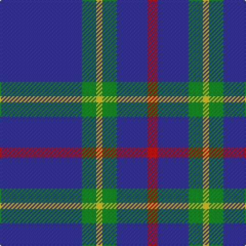

**Bands:** [BGYGBR](/stripes/bgygbr/) · **Stripes:** [DB G LY G DB R](/stripes/stripes6/) DB G LY G DB R

This was sourced from tartans-authority.  It is a [6 band tartan](/bands/bands6/).

Original link http://www.tartansauthority.com/tartan-ferret/display/3972/

## Thread count
B/80 G14 Y6 G14 B30 R/10

## Palette
Each colour and its ΔE from the base-6 reference it is a variant of.

| Colour | Shade | Base | ΔE (OKLab) |
|---|---|---|---|
| B | <code style="background-color:#34349C;">#34349C</code> `#34349C` | B <code style="background-color:#2A418A;">#2A418A</code> | 0.04 |
| G | <code style="background-color:#008C20;">#008C20</code> `#008C20` | G <code style="background-color:#006100;">#006100</code> | 0.13 |
| R | <code style="background-color:#C80000;">#C80000</code> `#C80000` | R <code style="background-color:#CC0000;">#CC0000</code> | 0.01 |
| Y | <code style="background-color:#E8C000;">#E8C000</code> `#E8C000` | Y <code style="background-color:#F2BF00;">#F2BF00</code> | 0.02 |

# Sample pattern

## Nearest tartans

The nearest existing variants by ΔTartan distance.

1. [JetBlue (Corporate)](/setts/s7/db4w3b6db40b8db12g3~x2/) — ΔT 1.16
1. [Tokyo Bluebells (Corporate)](/setts/s8/b18r1b1r1b1k7b13w2~x4/) — ΔT 1.23
1. [Laidlaw's Highland Drovers](/setts/s6/b35k10b4w2b3r2~x2/) — ΔT 1.25
1. [Tokyo Bluebells](/setts/s8/db18r1db1r1db1k7db13w2~x4/) — ΔT 1.36
1. [Laing of Archiestown](/setts/s5/db19r2w2r2k2~x4/) — ΔT 1.38
1. [Hsu (Personal)](/setts/s4/db60g16w8ly3~x2/) — ΔT 1.39
1. [Steffen, Morris (Personal)](/setts/s6/db35w4db10r3r3r3~x4/) — ΔT 1.41
1. [Masai Shuka 29 (Artefact)](/setts/s8/r5db20r3db20k6db3lb2db1~x2/) — ΔT 1.46
1. [Oxford University](/setts/s6/g16db59ly4db59g16db9~x2/) — ΔT 1.49
1. [Scottish Qualifications Auth. (Corp)](/setts/s7/db36lo5db8lb3db8lb10db3~x2/) — ΔT 1.50

## Neighbour map

Every grey dot is one of 14313 variants placed by the first two principal components of the ΔTartan feature space (44% of its variance). Red is this tartan; blue dots are its nearest — click one to open its page.

<svg viewBox="0 0 640 380" role="img" style="max-width:100%;height:auto;border:1px solid #e0e0e0;border-radius:4px;display:block" xmlns="http://www.w3.org/2000/svg"><image href="/nn/cloud.v1.png" width="640" height="380"/><a href="/setts/s7/db4w3b6db40b8db12g3~x2/"><circle cx="471.6" cy="200.9" r="4" fill="#3465a4"><title>JetBlue (Corporate)</title></circle></a><a href="/setts/s8/b18r1b1r1b1k7b13w2~x4/"><circle cx="461.6" cy="171.1" r="4" fill="#3465a4"><title>Tokyo Bluebells (Corporate)</title></circle></a><a href="/setts/s6/b35k10b4w2b3r2~x2/"><circle cx="472.8" cy="175.4" r="4" fill="#3465a4"><title>Laidlaw's Highland Drovers</title></circle></a><a href="/setts/s8/db18r1db1r1db1k7db13w2~x4/"><circle cx="460.6" cy="168.8" r="4" fill="#3465a4"><title>Tokyo Bluebells</title></circle></a><a href="/setts/s5/db19r2w2r2k2~x4/"><circle cx="414.9" cy="193.8" r="4" fill="#3465a4"><title>Laing of Archiestown</title></circle></a><a href="/setts/s4/db60g16w8ly3~x2/"><circle cx="411.3" cy="190.3" r="4" fill="#3465a4"><title>Hsu (Personal)</title></circle></a><a href="/setts/s6/db35w4db10r3r3r3~x4/"><circle cx="495.0" cy="196.7" r="4" fill="#3465a4"><title>Steffen, Morris (Personal)</title></circle></a><a href="/setts/s8/r5db20r3db20k6db3lb2db1~x2/"><circle cx="453.3" cy="176.1" r="4" fill="#3465a4"><title>Masai Shuka 29 (Artefact)</title></circle></a><a href="/setts/s6/g16db59ly4db59g16db9~x2/"><circle cx="454.7" cy="231.1" r="4" fill="#3465a4"><title>Oxford University</title></circle></a><a href="/setts/s7/db36lo5db8lb3db8lb10db3~x2/"><circle cx="454.3" cy="202.1" r="4" fill="#3465a4"><title>Scottish Qualifications Auth. (Corp)</title></circle></a><circle cx="428.2" cy="202.0" r="5" fill="#c00000"/></svg>

ID: /setts/s6/db40g7ly3g7db15r5~x2/
