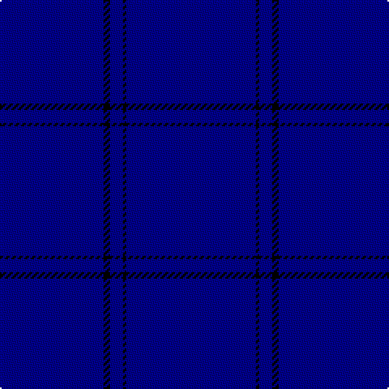

This page is one **sett** — a single exact thread-count. It belongs to the [tartan](/tartans/db40k1db4k2db8db24/)
(the same proportion at any scale), whose colour order is pattern [BBKBKB](/stripes/bbkbkb/).

Sourced from tartans-authority.  It is a [6 stripe tartan](/stripes/stripes6/).

Original link http://www.tartansauthority.com/tartan-ferret/display/3632/

## Thread count
DBa/80 K2 DB8 K4 DBa16 DB/48

## Palette

Palette: <strong>Tartan Register</strong>
<table><thead><tr><th>Colour</th><th>Threads</th><th>Shade</th><th>Base</th><th>OKLCh</th></tr></thead><tbody><tr><td>DBa/</td><td style="text-align:right;font-variant-numeric:tabular-nums">80</td><td><code style="background-color:#00008C;">#00008C</code> <small style="color:#888">#00008C</small></td><td>B <code style="background-color:#2A418A;">#2A418A</code></td><td><small style="color:#888">oklch(28.9% 0.200 264.1)</small></td></tr><tr><td>K</td><td style="text-align:right;font-variant-numeric:tabular-nums">2</td><td><code style="background-color:#000000;">#000000</code> <small style="color:#888">#000000</small></td><td>K <code style="background-color:#000000;">#000000</code></td><td><small style="color:#888">oklch(0.0% 0.000 0.0)</small></td></tr><tr><td>DB</td><td style="text-align:right;font-variant-numeric:tabular-nums">8</td><td><code style="background-color:#00008C;">#00008C</code> <small style="color:#888">#00008C</small></td><td>B <code style="background-color:#2A418A;">#2A418A</code></td><td><small style="color:#888">oklch(28.9% 0.200 264.1)</small></td></tr><tr><td>K</td><td style="text-align:right;font-variant-numeric:tabular-nums">4</td><td><code style="background-color:#000000;">#000000</code> <small style="color:#888">#000000</small></td><td>K <code style="background-color:#000000;">#000000</code></td><td><small style="color:#888">oklch(0.0% 0.000 0.0)</small></td></tr><tr><td>DBa</td><td style="text-align:right;font-variant-numeric:tabular-nums">16</td><td><code style="background-color:#00008C;">#00008C</code> <small style="color:#888">#00008C</small></td><td>B <code style="background-color:#2A418A;">#2A418A</code></td><td><small style="color:#888">oklch(28.9% 0.200 264.1)</small></td></tr><tr><td>DB/</td><td style="text-align:right;font-variant-numeric:tabular-nums">48</td><td><code style="background-color:#00008C;">#00008C</code> <small style="color:#888">#00008C</small></td><td>B <code style="background-color:#2A418A;">#2A418A</code></td><td><small style="color:#888">oklch(28.9% 0.200 264.1)</small></td></tr></tbody></table>

# Sample pattern

ID: /setts/s6/db40k1db4k2db8db24~x2/
