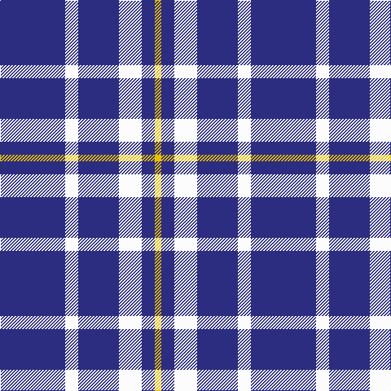

This page is one **sett** — a single exact thread-count. It belongs to the [tartan](/tartans/db40w8db25w14db8ly4/)
(the same proportion at any scale), whose colour order is pattern [BWBWBY](/stripes/bwbwby/).

Sourced from register-of-tartans.  It is a [6 stripe tartan](/stripes/stripes6/).

Original link https://www.tartanregister.gov.uk/tartanDetails.aspx?ref=4941

## Register references

External register numbers recorded for this tartan.

- Scottish Register of Tartans: [4941](https://www.tartanregister.gov.uk/tartanDetails.aspx?ref=4941)
- Scottish Tartans Authority (ITI): 3801

## Thread count
DB/80 W16 DB50 W28 DB16 Y/8

## Palette

Palette: <strong>Tartan Register</strong>
<table><thead><tr><th>Colour</th><th>Threads</th><th>Shade</th><th>Base</th><th>OKLCh</th></tr></thead><tbody><tr><td>DB/</td><td style="text-align:right;font-variant-numeric:tabular-nums">80</td><td><code style="background-color:#2C2C80;">#2C2C80</code> <small style="color:#888">#2C2C80</small></td><td>B <code style="background-color:#2A418A;">#2A418A</code></td><td><small style="color:#888">oklch(35.0% 0.138 276.6)</small></td></tr><tr><td>W</td><td style="text-align:right;font-variant-numeric:tabular-nums">16</td><td><code style="background-color:#FCFCFC;">#FCFCFC</code> <small style="color:#888">#FCFCFC</small></td><td>W <code style="background-color:#F7F7F7;">#F7F7F7</code></td><td><small style="color:#888">oklch(99.1% 0.000 89.9)</small></td></tr><tr><td>DB</td><td style="text-align:right;font-variant-numeric:tabular-nums">50</td><td><code style="background-color:#2C2C80;">#2C2C80</code> <small style="color:#888">#2C2C80</small></td><td>B <code style="background-color:#2A418A;">#2A418A</code></td><td><small style="color:#888">oklch(35.0% 0.138 276.6)</small></td></tr><tr><td>W</td><td style="text-align:right;font-variant-numeric:tabular-nums">28</td><td><code style="background-color:#FCFCFC;">#FCFCFC</code> <small style="color:#888">#FCFCFC</small></td><td>W <code style="background-color:#F7F7F7;">#F7F7F7</code></td><td><small style="color:#888">oklch(99.1% 0.000 89.9)</small></td></tr><tr><td>DB</td><td style="text-align:right;font-variant-numeric:tabular-nums">16</td><td><code style="background-color:#2C2C80;">#2C2C80</code> <small style="color:#888">#2C2C80</small></td><td>B <code style="background-color:#2A418A;">#2A418A</code></td><td><small style="color:#888">oklch(35.0% 0.138 276.6)</small></td></tr><tr><td>Y/</td><td style="text-align:right;font-variant-numeric:tabular-nums">8</td><td><code style="background-color:#E8C000;">#E8C000</code> <small style="color:#888">#E8C000</small></td><td>Y <code style="background-color:#F2BF00;">#F2BF00</code></td><td><small style="color:#888">oklch(81.9% 0.168 93.7)</small></td></tr></tbody></table>

# Sample pattern

## Nearest tartans

The nearest existing variants by ΔTartan distance, with this tartan at the top so the swatches line up against it.

ΔTartan

Tartan

Sett

—

<a href="/ttd/edit/#slug=db40w8db25w14db8ly4~x2">Auchterlonie (Personal)</a> <a class="nn-out" href="/setts/s6/db40w8db25w14db8ly4~x2/" title="open its dictionary page">↗</a>

1.07

<a href="/ttd/edit/#slug=db35lr8db21lr13db6lo4~x2">Ochterlonie</a> <a class="nn-out" href="/setts/s6/db35lr8db21lr13db6lo4~x2/" title="open its dictionary page">↗</a>

1.14

<a href="/ttd/edit/#slug=db8r2db18r1db2w10db4~x2">Nike ACG Lunarstorm (Fashion)</a> <a class="nn-out" href="/setts/s7/db8r2db18r1db2w10db4~x2/" title="open its dictionary page">↗</a>

1.40

<a href="/ttd/edit/#slug=dt30w7dt18w11dt6ly3~x2">Ochterlonie</a> <a class="nn-out" href="/setts/s6/dt30w7dt18w11dt6ly3~x2/" title="open its dictionary page">↗</a>

1.53

<a href="/ttd/edit/#slug=db36lo5db8lb3db8lb10db3~x2">Scottish Qualifications Auth. (Corp)</a> <a class="nn-out" href="/setts/s7/db36lo5db8lb3db8lb10db3~x2/" title="open its dictionary page">↗</a>

1.67

<a href="/ttd/edit/#slug=db26lp11db3lp4k2~x4">Debbie Munro Memorial (Corporate)</a> <a class="nn-out" href="/setts/s5/db26lp11db3lp4k2~x4/" title="open its dictionary page">↗</a>

1.85

<a href="/ttd/edit/#slug=t12ly2t1k5t4k2~x4">Rea</a> <a class="nn-out" href="/setts/s6/t12ly2t1k5t4k2~x4/" title="open its dictionary page">↗</a>

1.86

<a href="/ttd/edit/#slug=b33lo6r3lo6k3lo15b32~x4">Carlisle Family (Name)</a> <a class="nn-out" href="/setts/s7/b33lo6r3lo6k3lo15b32~x4/" title="open its dictionary page">↗</a>

1.89

<a href="/ttd/edit/#slug=w8db16w2db2w1db1~x4">Ikelman #1 (Personal)</a> <a class="nn-out" href="/setts/s6/w8db16w2db2w1db1~x4/" title="open its dictionary page">↗</a>

1.90

<a href="/ttd/edit/#slug=b30ly5b4r12~x4">UEFA (Corporate)</a> <a class="nn-out" href="/setts/s4/b30ly5b4r12~x4/" title="open its dictionary page">↗</a>

1.90

<a href="/setts/s6/db60ly6db11r25~x2/">South Australian Pipes &amp; Drums (Corp</a>

## Neighbour map

Every grey dot is one of 14359 variants placed by the first two principal components of the ΔTartan feature space (44% of its variance). Red is this tartan; blue dots are its nearest — click one to open its page.

<svg viewBox="0 0 640 380" role="img" style="max-width:100%;height:auto;border:1px solid #e0e0e0;border-radius:4px;display:block" xmlns="http://www.w3.org/2000/svg"><image href="/nn/cloud.v1.png" width="640" height="380"/><a href="/setts/s6/db35lr8db21lr13db6lo4~x2/"><circle cx="387.2" cy="240.1" r="4" fill="#3465a4"><title>Ochterlonie</title></circle></a><a href="/setts/s7/db8r2db18r1db2w10db4~x2/"><circle cx="408.2" cy="184.4" r="4" fill="#3465a4"><title>Nike ACG Lunarstorm (Fashion)</title></circle></a><a href="/setts/s6/dt30w7dt18w11dt6ly3~x2/"><circle cx="383.1" cy="229.4" r="4" fill="#3465a4"><title>Ochterlonie</title></circle></a><a href="/setts/s7/db36lo5db8lb3db8lb10db3~x2/"><circle cx="453.2" cy="202.6" r="4" fill="#3465a4"><title>Scottish Qualifications Auth. (Corp)</title></circle></a><a href="/setts/s5/db26lp11db3lp4k2~x4/"><circle cx="377.4" cy="207.0" r="4" fill="#3465a4"><title>Debbie Munro Memorial (Corporate)</title></circle></a><a href="/setts/s6/t12ly2t1k5t4k2~x4/"><circle cx="363.3" cy="219.3" r="4" fill="#3465a4"><title>Rea</title></circle></a><a href="/setts/s7/b33lo6r3lo6k3lo15b32~x4/"><circle cx="359.9" cy="195.3" r="4" fill="#3465a4"><title>Carlisle Family (Name)</title></circle></a><a href="/setts/s6/w8db16w2db2w1db1~x4/"><circle cx="397.6" cy="191.5" r="4" fill="#3465a4"><title>Ikelman #1 (Personal)</title></circle></a><a href="/setts/s4/b30ly5b4r12~x4/"><circle cx="381.0" cy="251.9" r="4" fill="#3465a4"><title>UEFA (Corporate)</title></circle></a><a href="/setts/s6/db60ly6db11r25~x2/"><circle cx="409.5" cy="215.8" r="4" fill="#3465a4"><title>South Australian Pipes &amp; Drums (Corp</title></circle></a><circle cx="396.7" cy="223.5" r="5" fill="#c00000"/></svg>

ID: /setts/s6/db40w8db25w14db8ly4~x2/
