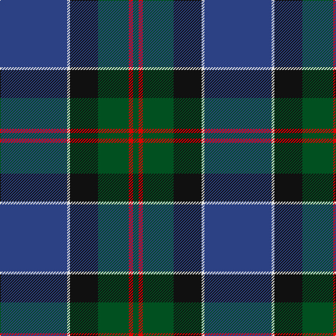

This page is one **sett** — a single exact thread-count. It belongs to the [tartan](/tartans/db48w2k20dg22r3dg4/)
(the same proportion at any scale), whose colour order is pattern [BWKGRG](/stripes/bwkgrg/).

Sourced from register-of-tartans.  It is a [6 stripe tartan](/stripes/stripes6/).

Original link https://www.tartanregister.gov.uk/tartanDetails.aspx?ref=2430

## Register references

External register numbers recorded for this tartan.

- Scottish Register of Tartans: [2430](https://www.tartanregister.gov.uk/tartanDetails.aspx?ref=2430)
- Scottish Tartans World Register: 645

## Thread count
B/96 LN4 K40 G44 R6 G/8

## Palette

Palette: <strong>Tartan Register</strong>
<table><thead><tr><th>Colour</th><th>Threads</th><th>Shade</th><th>Base</th><th>OKLCh</th></tr></thead><tbody><tr><td>B/</td><td style="text-align:right;font-variant-numeric:tabular-nums">96</td><td><code style="background-color:#2C4084;">#2C4084</code> <small style="color:#888">#2C4084</small></td><td>B <code style="background-color:#2A418A;">#2A418A</code></td><td><small style="color:#888">oklch(39.4% 0.117 268.3)</small></td></tr><tr><td>LN</td><td style="text-align:right;font-variant-numeric:tabular-nums">4</td><td><code style="background-color:#E0E0E0;">#E0E0E0</code> <small style="color:#888">#E0E0E0</small></td><td>W <code style="background-color:#F7F7F7;">#F7F7F7</code></td><td><small style="color:#888">oklch(90.7% 0.000 89.9)</small></td></tr><tr><td>K</td><td style="text-align:right;font-variant-numeric:tabular-nums">40</td><td><code style="background-color:#101010;">#101010</code> <small style="color:#888">#101010</small></td><td>K <code style="background-color:#000000;">#000000</code></td><td><small style="color:#888">oklch(17.3% 0.000 89.9)</small></td></tr><tr><td>G</td><td style="text-align:right;font-variant-numeric:tabular-nums">44</td><td><code style="background-color:#005020;">#005020</code> <small style="color:#888">#005020</small></td><td>G <code style="background-color:#006100;">#006100</code></td><td><small style="color:#888">oklch(37.7% 0.105 149.6)</small></td></tr><tr><td>R</td><td style="text-align:right;font-variant-numeric:tabular-nums">6</td><td><code style="background-color:#DC0000;">#DC0000</code> <small style="color:#888">#DC0000</small></td><td>R <code style="background-color:#CC0000;">#CC0000</code></td><td><small style="color:#888">oklch(56.2% 0.230 29.2)</small></td></tr><tr><td>G/</td><td style="text-align:right;font-variant-numeric:tabular-nums">8</td><td><code style="background-color:#005020;">#005020</code> <small style="color:#888">#005020</small></td><td>G <code style="background-color:#006100;">#006100</code></td><td><small style="color:#888">oklch(37.7% 0.105 149.6)</small></td></tr></tbody></table>

# Sample pattern

## Nearest tartans

The nearest existing variants by ΔTartan distance, with this tartan at the top so the swatches line up against it.

ΔTartan

Tartan

Sett

—

<a href="/ttd/edit/#slug=db48w2k20dg22r3dg4~x2">MacFadzean</a> <a class="nn-out" href="/setts/s6/db48w2k20dg22r3dg4~x2/" title="open its dictionary page">↗</a>

0.57

<a href="/ttd/edit/#slug=dp6ly2dp1g25db16k2db4~x2">Lowry</a> <a class="nn-out" href="/setts/s7/dp6ly2dp1g25db16k2db4~x2/" title="open its dictionary page">↗</a>

0.70

<a href="/ttd/edit/#slug=dp6y2dp1g25db16k2db4~x2">Lawrie</a> <a class="nn-out" href="/setts/s7/dp6y2dp1g25db16k2db4~x2/" title="open its dictionary page">↗</a>

0.74

<a href="/ttd/edit/#slug=dp6o2dp1g25db16k2db4~x2">Lawrie Clan Tartan Tartan Number: 3202. Earliest known date: 2000 One of a set of three similar designs for Laurie, Lawrie and Lowry, designed by Peter MacDonald for Iain Laurie. See products available Copyright © Blair Urquhart, Comrie, 2015</a> <a class="nn-out" href="/setts/s7/dp6o2dp1g25db16k2db4~x2/" title="open its dictionary page">↗</a>

0.74

<a href="/ttd/edit/#slug=dp6r2dp1g25db16k2db4~x2">Laurie Clan Tartan Tartan Number: 3201. Earliest known date: 2000 One of a set of three similar designs for Laurie, Lawrie and Lowry, designed by Peter MacDonald for Iain Laurie. See products available Copyright © Blair Urquhart, Comrie, 2015</a> <a class="nn-out" href="/setts/s7/dp6r2dp1g25db16k2db4~x2/" title="open its dictionary page">↗</a>

0.85

<a href="/ttd/edit/#slug=dp6r2dp1dg25db16k2db4~x2">Laurie</a> <a class="nn-out" href="/setts/s7/dp6r2dp1dg25db16k2db4~x2/" title="open its dictionary page">↗</a>

0.87

<a href="/ttd/edit/#slug=lb2dt19k4dt4k4g9db2k1~x4">Dollar Academy (1999)</a> <a class="nn-out" href="/setts/s8/lb2dt19k4dt4k4g9db2k1~x4/" title="open its dictionary page">↗</a>

0.99

<a href="/ttd/edit/#slug=db4k2db16w1k8dg24r4~x2">Colquhoun</a> <a class="nn-out" href="/setts/s7/db4k2db16w1k8dg24r4~x2/" title="open its dictionary page">↗</a>

1.02

<a href="/ttd/edit/#slug=m4dg9w2dg24dt37r3~x2">Hardie (Name)</a> <a class="nn-out" href="/setts/s6/m4dg9w2dg24dt37r3~x2/" title="open its dictionary page">↗</a>

1.13

<a href="/ttd/edit/#slug=r4dg4k2dg29db21k3db3ly3~x2">Peter of Lee (Chief) (Personal)</a> <a class="nn-out" href="/setts/s8/r4dg4k2dg29db21k3db3ly3~x2/" title="open its dictionary page">↗</a>

1.15

<a href="/ttd/edit/#slug=m4g9w2g24db37r3~x2">Hardie Clan Tartan Tartan Number: 3903. Earliest known date: 2001 Designed by Paul Hardie of Ecclesmachan, West Lothian so that the Hardie family could have their own tartan. Hardie's have worn the MacHardie tartan till now. See products available Copyright © Blair Urquhart, Comrie, 2015</a> <a class="nn-out" href="/setts/s6/m4g9w2g24db37r3~x2/" title="open its dictionary page">↗</a>

## Neighbour map

Every grey dot is one of 14359 variants placed by the first two principal components of the ΔTartan feature space (44% of its variance). Red is this tartan; blue dots are its nearest — click one to open its page.

<svg viewBox="0 0 640 380" role="img" style="max-width:100%;height:auto;border:1px solid #e0e0e0;border-radius:4px;display:block" xmlns="http://www.w3.org/2000/svg"><image href="/nn/cloud.v1.png" width="640" height="380"/><a href="/setts/s7/dp6ly2dp1g25db16k2db4~x2/"><circle cx="303.8" cy="170.1" r="4" fill="#3465a4"><title>Lowry</title></circle></a><a href="/setts/s7/dp6y2dp1g25db16k2db4~x2/"><circle cx="310.8" cy="172.0" r="4" fill="#3465a4"><title>Lawrie</title></circle></a><a href="/setts/s7/dp6o2dp1g25db16k2db4~x2/"><circle cx="304.5" cy="170.4" r="4" fill="#3465a4"><title>Lawrie Clan Tartan Tartan Number: 3202. Earliest known date: 2000 One of a set of three similar designs for Laurie, Lawrie and Lowry, designed by Peter MacDonald for Iain Laurie. See products available Copyright © Blair Urquhart, Comrie, 2015</title></circle></a><a href="/setts/s7/dp6r2dp1g25db16k2db4~x2/"><circle cx="299.5" cy="166.8" r="4" fill="#3465a4"><title>Laurie Clan Tartan Tartan Number: 3201. Earliest known date: 2000 One of a set of three similar designs for Laurie, Lawrie and Lowry, designed by Peter MacDonald for Iain Laurie. See products available Copyright © Blair Urquhart, Comrie, 2015</title></circle></a><a href="/setts/s7/dp6r2dp1dg25db16k2db4~x2/"><circle cx="324.3" cy="178.7" r="4" fill="#3465a4"><title>Laurie</title></circle></a><a href="/setts/s8/lb2dt19k4dt4k4g9db2k1~x4/"><circle cx="306.2" cy="182.9" r="4" fill="#3465a4"><title>Dollar Academy (1999)</title></circle></a><a href="/setts/s7/db4k2db16w1k8dg24r4~x2/"><circle cx="265.3" cy="175.7" r="4" fill="#3465a4"><title>Colquhoun</title></circle></a><a href="/setts/s6/m4dg9w2dg24dt37r3~x2/"><circle cx="333.8" cy="201.5" r="4" fill="#3465a4"><title>Hardie (Name)</title></circle></a><a href="/setts/s8/r4dg4k2dg29db21k3db3ly3~x2/"><circle cx="297.5" cy="177.0" r="4" fill="#3465a4"><title>Peter of Lee (Chief) (Personal)</title></circle></a><a href="/setts/s6/m4g9w2g24db37r3~x2/"><circle cx="299.0" cy="181.2" r="4" fill="#3465a4"><title>Hardie Clan Tartan Tartan Number: 3903. Earliest known date: 2001 Designed by Paul Hardie of Ecclesmachan, West Lothian so that the Hardie family could have their own tartan. Hardie's have worn the MacHardie tartan till now. See products available Copyright © Blair Urquhart, Comrie, 2015</title></circle></a><circle cx="314.5" cy="183.4" r="5" fill="#c00000"/></svg>

ID: /setts/s6/db48w2k20dg22r3dg4~x2/
