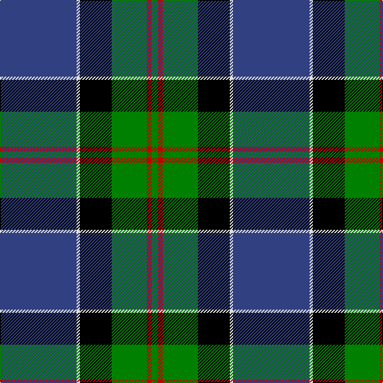

In pattern [BWKGRG](/stripes/bwkgrg/).

This was sourced from weddslist.  It is a [6 stripe tartan](/stripes/stripes6/).

Original link http://www.weddslist.com/cgi-bin/tartans/pg.pl?source=sts

## Attestations

This cloth appears in 2 source records; the oldest owns this page.

- undated — MacFadzean (weddslist, [record](http://www.weddslist.com/cgi-bin/tartans/pg.pl?source=sts))
- undated — MacFadzean Clan Tartan Tartan Number: 645. Earliest known date: pre 2003 Nothing See products available Copyright © Blair Urquhart, Comrie, 2015 (house-of-tartan, [record](http://www.house-of-tartan.scotland.net/house/TartanViewjs.asp?colr=Def&tnam=645))

## Thread count
B/96 LN4 K40 G44 R6 G/8

## Palette
Each colour and the base-6 reference it is a variant of.

| Colour | Shade | Base |
|---|---|---|
| B | <code style="background-color:#304080;">#304080</code> `oklch(39.4% 0.109 270.2)` <small>#304080</small> | B <code style="background-color:#2A418A;">#2A418A</code> |
| G | <code style="background-color:#008000;">#008000</code> `oklch(52.0% 0.177 142.5)` <small>#008000</small> | G <code style="background-color:#006100;">#006100</code> |
| K | <code style="background-color:#000000;">#000000</code> `oklch(0.0% 0.000 0.0)` <small>#000000</small> | K <code style="background-color:#000000;">#000000</code> |
| LN | <code style="background-color:#E0E0E0;">#E0E0E0</code> `oklch(90.7% 0.000 89.9)` <small>#E0E0E0</small> | W <code style="background-color:#F7F7F7;">#F7F7F7</code> |
| R | <code style="background-color:#C00000;">#C00000</code> `oklch(50.7% 0.208 29.2)` <small>#C00000</small> | R <code style="background-color:#CC0000;">#CC0000</code> |

# Sample pattern

## Nearest tartans

The nearest existing variants by ΔTartan distance.

1. [Ferguson of Athol](/setts/s7/db24k8g8r2g8k1w2~x2/) — ΔT 0.54
1. [MacLaren](/setts/s7/db24k8g8r2g8k1ly2~x2/) — ΔT 0.58
1. [Wishart Htg (Clan)](/setts/s7/k7db4dg31db3ly2db27lb4~x2/) — ΔT 0.98
1. [Alexander](/setts/s7/db24k8g8dp2g8k1w2~x2/) — ΔT 0.99
1. [MacLaren](/setts/s7/db24k8dg8r2dg8k1ly2/) — ΔT 1.03
1. [Gillies](/setts/s8/db32k12db12g6r6g18k2ly3~x2/) — ΔT 1.07
1. [Solberg-Bell (Personal)](/setts/s6/lo8k2dt20t4w1k2~x4/) — ΔT 1.08
1. [Sandelin #2 (Personal)](/setts/s8/w10db2w1db35dg10lo3dg10r4~x2/) — ΔT 1.08
1. [Colquhoun](/setts/s7/db4k2db16w1k8g24r4~x2/) — ΔT 1.13
1. [Centennial-King George Lodge No.171](/setts/s5/r2w7db30g36ly2~x2/) — ΔT 1.15

## Neighbour map

Every grey dot is one of 14299 variants placed by the first two principal components of the ΔTartan feature space (44% of its variance). Red is this tartan; blue dots are its nearest — click one to open its page.

<svg viewBox="0 0 640 380" role="img" style="max-width:100%;height:auto;border:1px solid #e0e0e0;border-radius:4px;display:block" xmlns="http://www.w3.org/2000/svg"><image href="/nn/cloud.v1.png" width="640" height="380"/><a href="/setts/s7/db24k8g8r2g8k1w2~x2/"><circle cx="234.9" cy="146.5" r="4" fill="#3465a4"><title>Ferguson of Athol</title></circle></a><a href="/setts/s7/db24k8g8r2g8k1ly2~x2/"><circle cx="236.5" cy="147.1" r="4" fill="#3465a4"><title>MacLaren</title></circle></a><a href="/setts/s7/k7db4dg31db3ly2db27lb4~x2/"><circle cx="246.9" cy="169.1" r="4" fill="#3465a4"><title>Wishart Htg (Clan)</title></circle></a><a href="/setts/s7/db24k8g8dp2g8k1w2~x2/"><circle cx="255.0" cy="159.1" r="4" fill="#3465a4"><title>Alexander</title></circle></a><a href="/setts/s7/db24k8dg8r2dg8k1ly2/"><circle cx="249.8" cy="159.7" r="4" fill="#3465a4"><title>MacLaren</title></circle></a><a href="/setts/s8/db32k12db12g6r6g18k2ly3~x2/"><circle cx="222.0" cy="167.9" r="4" fill="#3465a4"><title>Gillies</title></circle></a><a href="/setts/s6/lo8k2dt20t4w1k2~x4/"><circle cx="281.0" cy="148.0" r="4" fill="#3465a4"><title>Solberg-Bell (Personal)</title></circle></a><a href="/setts/s8/w10db2w1db35dg10lo3dg10r4~x2/"><circle cx="271.8" cy="113.8" r="4" fill="#3465a4"><title>Sandelin #2 (Personal)</title></circle></a><a href="/setts/s7/db4k2db16w1k8g24r4~x2/"><circle cx="212.9" cy="148.6" r="4" fill="#3465a4"><title>Colquhoun</title></circle></a><a href="/setts/s5/r2w7db30g36ly2~x2/"><circle cx="252.6" cy="171.4" r="4" fill="#3465a4"><title>Centennial-King George Lodge No.171</title></circle></a><circle cx="259.6" cy="154.7" r="5" fill="#c00000"/></svg>

ID: /setts/s6/db48w2k20g22r3g4~x2/
