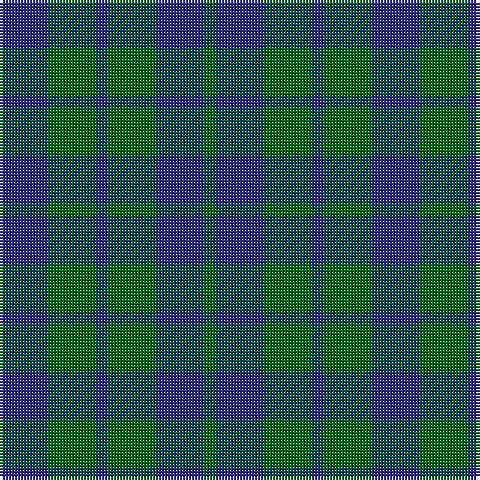

This page is one **sett** — a single exact thread-count. It belongs to the [tartan](/tartans/db4g4db1g4db4g1/)
(the same proportion at any scale), whose colour order is pattern [BGBGBG](/stripes/bgbgbg/).

Sourced from tartans-authority.  It is a [6 stripe tartan](/stripes/stripes6/).

Original link http://www.tartansauthority.com/tartan-ferret/display/9001/

## Thread count
DB/16 G16 DB4 G16 DB16 G/4

## Palette
Each colour and the base-6 reference it is a variant of.

| Colour | Shade | Base |
|---|---|---|
| DB | <code style="background-color:#2C2C80;">#2C2C80</code> `oklch(35.0% 0.138 276.6)` <small>#2C2C80</small> | B <code style="background-color:#2A418A;">#2A418A</code> |
| G | <code style="background-color:#006818;">#006818</code> `oklch(45.0% 0.142 145.0)` <small>#006818</small> | G <code style="background-color:#006100;">#006100</code> |

# Sample pattern

## Nearest tartans

The nearest existing variants by ΔTartan distance, with this tartan at the top so the swatches line up against it.

ΔTartan

Tartan

Sett

—

<a href="/ttd/edit/#slug=db4g4db1g4db4g1~x4">Highland Grey</a> <a class="nn-out" href="/setts/s6/db4g4db1g4db4g1~x4/" title="open its dictionary page">↗</a>

1.65

<a href="/ttd/edit/#slug=k5g14db12g4~x4">MacCurdie (Clan?)</a> <a class="nn-out" href="/setts/s4/k5g14db12g4~x4/" title="open its dictionary page">↗</a>

1.82

<a href="/ttd/edit/#slug=dt12g8t4g8dt12t5">Sheffield High School</a> <a class="nn-out" href="/setts/s6/dt12g8t4g8dt12t5/" title="open its dictionary page">↗</a>

1.87

<a href="/ttd/edit/#slug=db2dg7db7w1~x2">Unidentified No 78</a> <a class="nn-out" href="/setts/s4/db2dg7db7w1~x2/" title="open its dictionary page">↗</a>

1.98

<a href="/ttd/edit/#slug=db11dg2db15dg18w2~x2">Hamilton Hunting</a> <a class="nn-out" href="/setts/s5/db11dg2db15dg18w2~x2/" title="open its dictionary page">↗</a>

1.99

<a href="/setts/s4/g6db2g1~x4/">Montgomery</a>

1.99

<a href="/setts/s4/g6db2g1~x8/">Montgomery - 1842 (VS</a>

2.02

<a href="/ttd/edit/#slug=k19dg10k6dg10k12dg6k4dg14~x2">Menzies Green</a> <a class="nn-out" href="/setts/s8/k19dg10k6dg10k12dg6k4dg14~x2/" title="open its dictionary page">↗</a>

2.04

<a href="/ttd/edit/#slug=k15dt40k9o10~x2">Omega Delta Sigma, National Veterans Fraternity</a> <a class="nn-out" href="/setts/s4/k15dt40k9o10~x2/" title="open its dictionary page">↗</a>

2.11

<a href="/ttd/edit/#slug=db5g2db5g8w1~x8">Hamilton, hunting</a> <a class="nn-out" href="/setts/s5/db5g2db5g8w1~x8/" title="open its dictionary page">↗</a>

2.11

<a href="/ttd/edit/#slug=db4k4db4g9k2~x2">Austin Clan</a> <a class="nn-out" href="/setts/s5/db4k4db4g9k2~x2/" title="open its dictionary page">↗</a>

## Neighbour map

Every grey dot is one of 14299 variants placed by the first two principal components of the ΔTartan feature space (44% of its variance). Red is this tartan; blue dots are its nearest — click one to open its page.

<svg viewBox="0 0 640 380" role="img" style="max-width:100%;height:auto;border:1px solid #e0e0e0;border-radius:4px;display:block" xmlns="http://www.w3.org/2000/svg"><image href="/nn/cloud.v1.png" width="640" height="380"/><a href="/setts/s4/k5g14db12g4~x4/"><circle cx="265.3" cy="345.9" r="4" fill="#3465a4"><title>MacCurdie (Clan?)</title></circle></a><a href="/setts/s6/dt12g8t4g8dt12t5/"><circle cx="242.3" cy="364.1" r="4" fill="#3465a4"><title>Sheffield High School</title></circle></a><a href="/setts/s4/db2dg7db7w1~x2/"><circle cx="333.1" cy="303.9" r="4" fill="#3465a4"><title>Unidentified No 78</title></circle></a><a href="/setts/s5/db11dg2db15dg18w2~x2/"><circle cx="365.9" cy="291.4" r="4" fill="#3465a4"><title>Hamilton Hunting</title></circle></a><a href="/setts/s4/g6db2g1~x4/"><circle cx="426.5" cy="330.6" r="4" fill="#3465a4"><title>Montgomery</title></circle></a><a href="/setts/s4/g6db2g1~x8/"><circle cx="426.5" cy="330.6" r="4" fill="#3465a4"><title>Montgomery - 1842 (VS</title></circle></a><a href="/setts/s8/k19dg10k6dg10k12dg6k4dg14~x2/"><circle cx="357.8" cy="356.9" r="4" fill="#3465a4"><title>Menzies Green</title></circle></a><a href="/setts/s4/k15dt40k9o10~x2/"><circle cx="319.1" cy="320.7" r="4" fill="#3465a4"><title>Omega Delta Sigma, National Veterans Fraternity</title></circle></a><a href="/setts/s5/db5g2db5g8w1~x8/"><circle cx="285.4" cy="282.8" r="4" fill="#3465a4"><title>Hamilton, hunting</title></circle></a><a href="/setts/s5/db4k4db4g9k2~x2/"><circle cx="209.1" cy="323.4" r="4" fill="#3465a4"><title>Austin Clan</title></circle></a><circle cx="318.9" cy="350.1" r="5" fill="#c00000"/></svg>

ID: /setts/s6/db4g4db1g4db4g1~x4/
