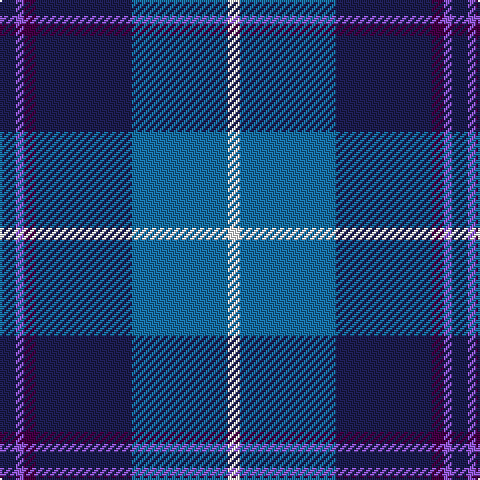

In pattern [BBBBBW](/stripes/bbbbbw/).

This was sourced from register-of-tartans.  It is a [6 stripe tartan](/stripes/stripes6/).

Original link https://www.tartanregister.gov.uk/tartanDetails.aspx?ref=11181

## Also known as

This cloth is also recorded under:

- Aberdeen Academy of Performing Arts

## Register references

External register numbers recorded for this tartan.

- Scottish Register of Tartans: [11181](https://www.tartanregister.gov.uk/tartanDetails.aspx?ref=11181)

## Thread count
DB/8 P4 DP6 DB48 B48 W/6

## Palette
Each colour and the base-6 reference it is a variant of.

| Colour | Shade | Base |
|---|---|---|
| B | <code style="background-color:#1870A4;">#1870A4</code> `oklch(52.2% 0.113 241.2)` <small>#1870A4</small> | B <code style="background-color:#2A418A;">#2A418A</code> |
| DB | <code style="background-color:#1C1C50;">#1C1C50</code> `oklch(26.2% 0.093 277.9)` <small>#1C1C50</small> | B <code style="background-color:#2A418A;">#2A418A</code> |
| DP | <code style="background-color:#440044;">#440044</code> `oklch(27.1% 0.125 328.4)` <small>#440044</small> | B <code style="background-color:#2A418A;">#2A418A</code> |
| P | <code style="background-color:#9058D8;">#9058D8</code> `oklch(58.4% 0.190 300.8)` <small>#9058D8</small> | B <code style="background-color:#2A418A;">#2A418A</code> |
| W | <code style="background-color:#FFFFFF;">#FFFFFF</code> `oklch(100.0% 0.000 89.9)` <small>#FFFFFF</small> | W <code style="background-color:#F7F7F7;">#F7F7F7</code> |

# Sample pattern

## Nearest tartans

The nearest existing variants by ΔTartan distance, with this tartan at the top so the swatches line up against it.

ΔTartan

Tartan

Sett

—

<a href="/ttd/edit/#slug=db4p2dp3db24b24w3~x2">Aberdeen Academy of Performing Arts</a> <a class="nn-out" href="/setts/s6/db4p2dp3db24b24w3~x2/" title="open its dictionary page">↗</a>

0.66

<a href="/ttd/edit/#slug=db4dp2dp3db24t24w3~x2">Aberdeen Academy of Performing Art</a> <a class="nn-out" href="/setts/s6/db4dp2dp3db24t24w3~x2/" title="open its dictionary page">↗</a>

0.93

<a href="/ttd/edit/#slug=t3k2g2k1db10w1~x8">Isle of Harris (District)</a> <a class="nn-out" href="/setts/s6/t3k2g2k1db10w1~x8/" title="open its dictionary page">↗</a>

0.96

<a href="/ttd/edit/#slug=w4db24ly2db24t5db4ly4~x2">Mina Perhonen Japanese Corporate Tartan Tartan Number: 5797. Earliest known date: pre 2003 Designed by Fiona Hall of Lochcarron as a corporate tartan for the Mina Company of Tokyo whose logo is a butterfly. The blues are from the company's colours and represent the sky, the yellow represents the butterfly and the white is for the clouds.'Perhonen' is Finnish for butterfly and chosen because the Japanese design world has a great affinity with some Scandinavian countries. See products available Copyright © Blair Urquhart, Comrie, 2015</a> <a class="nn-out" href="/setts/s7/w4db24ly2db24t5db4ly4~x2/" title="open its dictionary page">↗</a>

1.03

<a href="/ttd/edit/#slug=db3t24k11db20w2db5lo3~x2">Icelandair</a> <a class="nn-out" href="/setts/s7/db3t24k11db20w2db5lo3~x2/" title="open its dictionary page">↗</a>

1.05

<a href="/ttd/edit/#slug=db6lb2db2lb3db16b26r2~x2">Federal Bureau of Investigation</a> <a class="nn-out" href="/setts/s7/db6lb2db2lb3db16b26r2~x2/" title="open its dictionary page">↗</a>

1.10

<a href="/ttd/edit/#slug=db35w3db8t36dg9o3~x2">Georgian Bay, Waters of</a> <a class="nn-out" href="/setts/s6/db35w3db8t36dg9o3~x2/" title="open its dictionary page">↗</a>

1.24

<a href="/ttd/edit/#slug=m4k3b18r3dt34w3~x2">Margach, William (Personal)</a> <a class="nn-out" href="/setts/s6/m4k3b18r3dt34w3~x2/" title="open its dictionary page">↗</a>

1.24

<a href="/ttd/edit/#slug=b30k12dt12k2w3~x2">MacNeil - 1994 (Personal)</a> <a class="nn-out" href="/setts/s5/b30k12dt12k2w3~x2/" title="open its dictionary page">↗</a>

1.24

<a href="/ttd/edit/#slug=p30db5p3db33lg8k3db8w2~x2">Saint Margaret of Scotland Youth Group</a> <a class="nn-out" href="/setts/s8/p30db5p3db33lg8k3db8w2~x2/" title="open its dictionary page">↗</a>

1.25

<a href="/ttd/edit/#slug=db7r3db26t2db2t26ly4~x2">Int. Police Association (Official)</a> <a class="nn-out" href="/setts/s7/db7r3db26t2db2t26ly4~x2/" title="open its dictionary page">↗</a>

## Neighbour map

Every grey dot is one of 14299 variants placed by the first two principal components of the ΔTartan feature space (44% of its variance). Red is this tartan; blue dots are its nearest — click one to open its page.

<svg viewBox="0 0 640 380" role="img" style="max-width:100%;height:auto;border:1px solid #e0e0e0;border-radius:4px;display:block" xmlns="http://www.w3.org/2000/svg"><image href="/nn/cloud.v1.png" width="640" height="380"/><a href="/setts/s6/db4dp2dp3db24t24w3~x2/"><circle cx="266.1" cy="183.5" r="4" fill="#3465a4"><title>Aberdeen Academy of Performing Art</title></circle></a><a href="/setts/s6/t3k2g2k1db10w1~x8/"><circle cx="243.4" cy="184.7" r="4" fill="#3465a4"><title>Isle of Harris (District)</title></circle></a><a href="/setts/s7/w4db24ly2db24t5db4ly4~x2/"><circle cx="212.8" cy="176.4" r="4" fill="#3465a4"><title>Mina Perhonen Japanese Corporate Tartan Tartan Number: 5797. Earliest known date: pre 2003 Designed by Fiona Hall of Lochcarron as a corporate tartan for the Mina Company of Tokyo whose logo is a butterfly. The blues are from the company's colours and represent the sky, the yellow represents the butterfly and the white is for the clouds.'Perhonen' is Finnish for butterfly and chosen because the Japanese design world has a great affinity with some Scandinavian countries. See products available Copyright © Blair Urquhart, Comrie, 2015</title></circle></a><a href="/setts/s7/db3t24k11db20w2db5lo3~x2/"><circle cx="206.9" cy="187.5" r="4" fill="#3465a4"><title>Icelandair</title></circle></a><a href="/setts/s7/db6lb2db2lb3db16b26r2~x2/"><circle cx="288.5" cy="190.6" r="4" fill="#3465a4"><title>Federal Bureau of Investigation</title></circle></a><a href="/setts/s6/db35w3db8t36dg9o3~x2/"><circle cx="248.0" cy="195.8" r="4" fill="#3465a4"><title>Georgian Bay, Waters of</title></circle></a><a href="/setts/s6/m4k3b18r3dt34w3~x2/"><circle cx="276.1" cy="175.6" r="4" fill="#3465a4"><title>Margach, William (Personal)</title></circle></a><a href="/setts/s5/b30k12dt12k2w3~x2/"><circle cx="280.4" cy="211.0" r="4" fill="#3465a4"><title>MacNeil - 1994 (Personal)</title></circle></a><a href="/setts/s8/p30db5p3db33lg8k3db8w2~x2/"><circle cx="280.0" cy="156.9" r="4" fill="#3465a4"><title>Saint Margaret of Scotland Youth Group</title></circle></a><a href="/setts/s7/db7r3db26t2db2t26ly4~x2/"><circle cx="288.6" cy="179.7" r="4" fill="#3465a4"><title>Int. Police Association (Official)</title></circle></a><circle cx="264.6" cy="188.0" r="5" fill="#c00000"/></svg>

ID: /setts/s6/db4p2dp3db24b24w3~x2/
