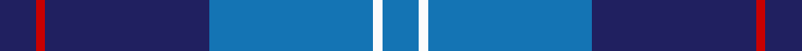
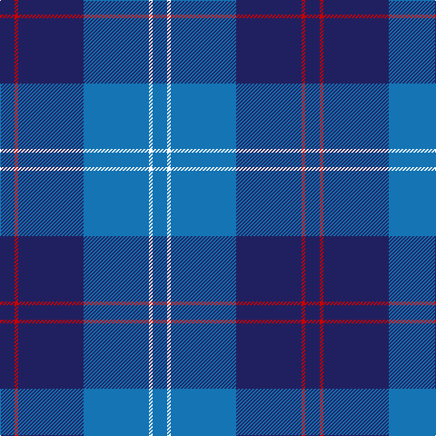

In pattern [BRBBWB](/stripes/brbbwb/).

This was sourced from tartans-authority.  It is a [6 stripe tartan](/stripes/stripes6/).

Original link http://www.tartansauthority.com/tartan-ferret/display/11288/

## Thread count
DB/16 R4 DB72 B72 W4 B/16

## Palette
Each colour and the base-6 reference it is a variant of.

| Colour | Shade | Base |
|---|---|---|
| B | <code style="background-color:#1474B4;">#1474B4</code> `oklch(54.0% 0.129 245.1)` <small>#1474B4</small> | B <code style="background-color:#2A418A;">#2A418A</code> |
| DB | <code style="background-color:#202060;">#202060</code> `oklch(28.9% 0.111 276.9)` <small>#202060</small> | B <code style="background-color:#2A418A;">#2A418A</code> |
| R | <code style="background-color:#C80000;">#C80000</code> `oklch(52.3% 0.215 29.2)` <small>#C80000</small> | R <code style="background-color:#CC0000;">#CC0000</code> |
| W | <code style="background-color:#FCFCFC;">#FCFCFC</code> `oklch(99.1% 0.000 89.9)` <small>#FCFCFC</small> | W <code style="background-color:#F7F7F7;">#F7F7F7</code> |

# Sample pattern

## Nearest tartans

The nearest existing variants by ΔTartan distance.

1. [Gilt Edge (Corporate)](/setts/s5/db3db2t31db34w2~x2/) — ΔT 0.70
1. [Federal Bureau of Investigation](/setts/s7/db6lb2db2lb3db16b26r2~x2/) — ΔT 1.08
1. [Port Authority of NY & NJ](/setts/s6/t9db2t39dt33lo2dt5~x2/) — ΔT 1.31
1. [Joker, The](/setts/s6/b18k2b4k6dp12lo1~x2/) — ΔT 1.33
1. [St Andrews Earl of Royal family Tartan Tartan Number: 85. Earliest known date: c.1930 Count taken from a 'MacKinlay Strip'. Prince George is reputed to have worn this tartan at a Scottish Society dinner in 1919 and kept everyone guessing the name of the tartan. However, MacKinlay's record shows the design dating to 1930. No further details can be found. The sett has much in common with the Clan Donald. Royal titles of territorial origin provide a precedent for considering tartans of the name, District tartans. See products available Copyright © Blair Urquhart, Comrie, 2015](/setts/s6/t52db28w3db2w2db10~x2/) — ΔT 1.42
1. [Corries](/setts/s6/t28dt15r2dt2w1dt6~x2/) — ΔT 1.45
1. [MacKerral Family Tartan Tartan Number: 1757. Earliest known date: 1975 A sample was presented to the Scottish Tartans Society by John Drummond Bowman. This version of the tartan has the unusual feature of exchanging red for yellow in the weft. It is larger than the sett recorded in the Lyon Court Books in 1982. The name, MacKerral or MacKerrell, is recorded in Ayrshire in the 12th century. See products available Copyright © Blair Urquhart, Comrie, 2015](/setts/s4/w4t34db60ly3~x2/) — ΔT 1.45
1. [Edzell, U.S. Navy](/setts/s6/db104db16w8db66r3db16/) — ΔT 1.47
1. [MacNeil - 1994 (Personal)](/setts/s5/b30k12dt12k2w3~x2/) — ΔT 1.47
1. [Van Loo (Personal)](/setts/s7/t5db30k25t5db30dp2t5~x2/) — ΔT 1.49

## Neighbour map

Every grey dot is one of 14299 variants placed by the first two principal components of the ΔTartan feature space (44% of its variance). Red is this tartan; blue dots are its nearest — click one to open its page.

<svg viewBox="0 0 640 380" role="img" style="max-width:100%;height:auto;border:1px solid #e0e0e0;border-radius:4px;display:block" xmlns="http://www.w3.org/2000/svg"><image href="/nn/cloud.v1.png" width="640" height="380"/><a href="/setts/s5/db3db2t31db34w2~x2/"><circle cx="345.8" cy="201.8" r="4" fill="#3465a4"><title>Gilt Edge (Corporate)</title></circle></a><a href="/setts/s7/db6lb2db2lb3db16b26r2~x2/"><circle cx="288.5" cy="190.6" r="4" fill="#3465a4"><title>Federal Bureau of Investigation</title></circle></a><a href="/setts/s6/t9db2t39dt33lo2dt5~x2/"><circle cx="381.6" cy="202.7" r="4" fill="#3465a4"><title>Port Authority of NY &amp; NJ</title></circle></a><a href="/setts/s6/b18k2b4k6dp12lo1~x2/"><circle cx="306.7" cy="199.2" r="4" fill="#3465a4"><title>Joker, The</title></circle></a><a href="/setts/s6/t52db28w3db2w2db10~x2/"><circle cx="401.7" cy="191.4" r="4" fill="#3465a4"><title>St Andrews Earl of Royal family Tartan Tartan Number: 85. Earliest known date: c.1930 Count taken from a 'MacKinlay Strip'. Prince George is reputed to have worn this tartan at a Scottish Society dinner in 1919 and kept everyone guessing the name of the tartan. However, MacKinlay's record shows the design dating to 1930. No further details can be found. The sett has much in common with the Clan Donald. Royal titles of territorial origin provide a precedent for considering tartans of the name, District tartans. See products available Copyright © Blair Urquhart, Comrie, 2015</title></circle></a><a href="/setts/s6/t28dt15r2dt2w1dt6~x2/"><circle cx="381.9" cy="178.5" r="4" fill="#3465a4"><title>Corries</title></circle></a><a href="/setts/s4/w4t34db60ly3~x2/"><circle cx="380.8" cy="207.1" r="4" fill="#3465a4"><title>MacKerral Family Tartan Tartan Number: 1757. Earliest known date: 1975 A sample was presented to the Scottish Tartans Society by John Drummond Bowman. This version of the tartan has the unusual feature of exchanging red for yellow in the weft. It is larger than the sett recorded in the Lyon Court Books in 1982. The name, MacKerral or MacKerrell, is recorded in Ayrshire in the 12th century. See products available Copyright © Blair Urquhart, Comrie, 2015</title></circle></a><a href="/setts/s6/db104db16w8db66r3db16/"><circle cx="387.3" cy="186.3" r="4" fill="#3465a4"><title>Edzell, U.S. Navy</title></circle></a><a href="/setts/s5/b30k12dt12k2w3~x2/"><circle cx="280.4" cy="211.0" r="4" fill="#3465a4"><title>MacNeil - 1994 (Personal)</title></circle></a><a href="/setts/s7/t5db30k25t5db30dp2t5~x2/"><circle cx="370.0" cy="224.9" r="4" fill="#3465a4"><title>Van Loo (Personal)</title></circle></a><circle cx="345.7" cy="204.3" r="5" fill="#c00000"/></svg>

ID: /setts/s6/db4r1db18b18w1b4~x4/
