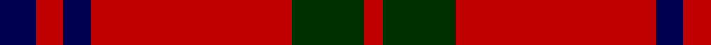

This page is one **sett** — a single exact thread-count. It belongs to the [tartan](/tartans/db4r3db3r22dg8r2/)
(the same proportion at any scale), whose colour order is pattern [BRBRGR](/stripes/brbrgr/).

Sourced from weddslist.  It is a [6 stripe tartan](/stripes/stripes6/).

Original link http://www.weddslist.com/cgi-bin/tartans/pg.pl?source=sts

## Thread count
DB/8 R6 DB6 R44 DG16 R/4

## Palette

Palette: <strong>custom</strong>
<table><thead><tr><th>Colour</th><th>Threads</th><th>Shade</th><th>Base</th><th>OKLCh</th></tr></thead><tbody><tr><td>DB/</td><td style="text-align:right;font-variant-numeric:tabular-nums">8</td><td><code style="background-color:#000050;">#000050</code> <small style="color:#888">#000050</small></td><td>B <code style="background-color:#2A418A;">#2A418A</code></td><td><small style="color:#888">oklch(19.5% 0.135 264.1)</small></td></tr><tr><td>R</td><td style="text-align:right;font-variant-numeric:tabular-nums">6</td><td><code style="background-color:#C00000;">#C00000</code> <small style="color:#888">#C00000</small></td><td>R <code style="background-color:#CC0000;">#CC0000</code></td><td><small style="color:#888">oklch(50.7% 0.208 29.2)</small></td></tr><tr><td>DB</td><td style="text-align:right;font-variant-numeric:tabular-nums">6</td><td><code style="background-color:#000050;">#000050</code> <small style="color:#888">#000050</small></td><td>B <code style="background-color:#2A418A;">#2A418A</code></td><td><small style="color:#888">oklch(19.5% 0.135 264.1)</small></td></tr><tr><td>R</td><td style="text-align:right;font-variant-numeric:tabular-nums">44</td><td><code style="background-color:#C00000;">#C00000</code> <small style="color:#888">#C00000</small></td><td>R <code style="background-color:#CC0000;">#CC0000</code></td><td><small style="color:#888">oklch(50.7% 0.208 29.2)</small></td></tr><tr><td>DG</td><td style="text-align:right;font-variant-numeric:tabular-nums">16</td><td><code style="background-color:#003000;">#003000</code> <small style="color:#888">#003000</small></td><td>G <code style="background-color:#006100;">#006100</code></td><td><small style="color:#888">oklch(26.8% 0.091 142.5)</small></td></tr><tr><td>R/</td><td style="text-align:right;font-variant-numeric:tabular-nums">4</td><td><code style="background-color:#C00000;">#C00000</code> <small style="color:#888">#C00000</small></td><td>R <code style="background-color:#CC0000;">#CC0000</code></td><td><small style="color:#888">oklch(50.7% 0.208 29.2)</small></td></tr></tbody></table>

# Sample pattern

## Nearest tartans

The nearest existing variants by ΔTartan distance, with this tartan at the top so the swatches line up against it.

ΔTartan

Tartan

Sett

—

<a href="/ttd/edit/#slug=db4r3db3r22dg8r2~x2">Auld Reekie</a> <a class="nn-out" href="/setts/s6/db4r3db3r22dg8r2~x2/" title="open its dictionary page">↗</a>

0.89

<a href="/ttd/edit/#slug=r13lb3r1dg3lb1~x6">Glen Shiel (Fashion)</a> <a class="nn-out" href="/setts/s5/r13lb3r1dg3lb1~x6/" title="open its dictionary page">↗</a>

0.92

<a href="/ttd/edit/#slug=db4r3db3r22g8r2~x2">Auld Reekie</a> <a class="nn-out" href="/setts/s6/db4r3db3r22g8r2~x2/" title="open its dictionary page">↗</a>

0.96

<a href="/ttd/edit/#slug=r4k8r12k1ly1~x2">MacKeane</a> <a class="nn-out" href="/setts/s5/r4k8r12k1ly1~x2/" title="open its dictionary page">↗</a>

1.00

<a href="/ttd/edit/#slug=r41k19r7k9w3~x2">MacGregor, Black (Personal)</a> <a class="nn-out" href="/setts/s5/r41k19r7k9w3~x2/" title="open its dictionary page">↗</a>

1.08

<a href="/ttd/edit/#slug=r36k18r4k7w2~x2">Hopkins (Name)</a> <a class="nn-out" href="/setts/s5/r36k18r4k7w2~x2/" title="open its dictionary page">↗</a>

1.13

<a href="/ttd/edit/#slug=r16db6r2dg6r2db1~x2">MacKintosh Plaid</a> <a class="nn-out" href="/setts/s6/r16db6r2dg6r2db1~x2/" title="open its dictionary page">↗</a>

1.15

<a href="/ttd/edit/#slug=r4g14r5k6r24g2r4~x2">Auld Lang Syne (red) Tartan Tartan Number: 2402. Earliest known date: Threadcount and colours aren't 100% original. Generated manually. See products available Copyright © Blair Urquhart, Comrie, 2015</a> <a class="nn-out" href="/setts/s7/r4g14r5k6r24g2r4~x2/" title="open its dictionary page">↗</a>

1.16

<a href="/ttd/edit/#slug=lb3r3k4lb2r18k1r2k2~x4">Lougheed</a> <a class="nn-out" href="/setts/s8/lb3r3k4lb2r18k1r2k2~x4/" title="open its dictionary page">↗</a>

1.16

<a href="/ttd/edit/#slug=r22db5r2dg11r3db1">MacKintosh D</a> <a class="nn-out" href="/setts/s6/r22db5r2dg11r3db1/" title="open its dictionary page">↗</a>

1.21

<a href="/ttd/edit/#slug=r4g5r2k6r18k2r4~x2">MacQuarrie 5</a> <a class="nn-out" href="/setts/s7/r4g5r2k6r18k2r4~x2/" title="open its dictionary page">↗</a>

## Neighbour map

Every grey dot is one of 14359 variants placed by the first two principal components of the ΔTartan feature space (44% of its variance). Red is this tartan; blue dots are its nearest — click one to open its page.

<svg viewBox="0 0 640 380" role="img" style="max-width:100%;height:auto;border:1px solid #e0e0e0;border-radius:4px;display:block" xmlns="http://www.w3.org/2000/svg"><image href="/nn/cloud.v1.png" width="640" height="380"/><a href="/setts/s5/r13lb3r1dg3lb1~x6/"><circle cx="417.0" cy="193.1" r="4" fill="#3465a4"><title>Glen Shiel (Fashion)</title></circle></a><a href="/setts/s6/db4r3db3r22g8r2~x2/"><circle cx="416.2" cy="207.9" r="4" fill="#3465a4"><title>Auld Reekie</title></circle></a><a href="/setts/s5/r4k8r12k1ly1~x2/"><circle cx="383.5" cy="213.9" r="4" fill="#3465a4"><title>MacKeane</title></circle></a><a href="/setts/s5/r41k19r7k9w3~x2/"><circle cx="381.4" cy="202.7" r="4" fill="#3465a4"><title>MacGregor, Black (Personal)</title></circle></a><a href="/setts/s5/r36k18r4k7w2~x2/"><circle cx="398.3" cy="190.3" r="4" fill="#3465a4"><title>Hopkins (Name)</title></circle></a><a href="/setts/s6/r16db6r2dg6r2db1~x2/"><circle cx="401.8" cy="200.6" r="4" fill="#3465a4"><title>MacKintosh Plaid</title></circle></a><a href="/setts/s7/r4g14r5k6r24g2r4~x2/"><circle cx="393.5" cy="206.5" r="4" fill="#3465a4"><title>Auld Lang Syne (red) Tartan Tartan Number: 2402. Earliest known date: Threadcount and colours aren't 100% original. Generated manually. See products available Copyright © Blair Urquhart, Comrie, 2015</title></circle></a><a href="/setts/s8/lb3r3k4lb2r18k1r2k2~x4/"><circle cx="422.1" cy="156.2" r="4" fill="#3465a4"><title>Lougheed</title></circle></a><a href="/setts/s6/r22db5r2dg11r3db1/"><circle cx="407.5" cy="178.1" r="4" fill="#3465a4"><title>MacKintosh D</title></circle></a><a href="/setts/s7/r4g5r2k6r18k2r4~x2/"><circle cx="388.8" cy="201.7" r="4" fill="#3465a4"><title>MacQuarrie 5</title></circle></a><circle cx="398.9" cy="202.8" r="5" fill="#c00000"/></svg>

ID: /setts/s6/db4r3db3r22dg8r2~x2/
