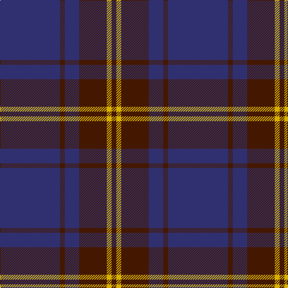

This page is one **sett** — a single exact thread-count. It belongs to the [tartan](/tartans/db50dr4db12dr23y4dr4/)
(the same proportion at any scale), whose colour order is pattern [BBBBYB](/stripes/bbbbyb/).

Sourced from register-of-tartans.  It is a [6 stripe tartan](/stripes/stripes6/).

Original link https://www.tartanregister.gov.uk/tartanDetails.aspx?ref=3819

2 attestations — the source records this cloth was collapsed from (oldest owns this page)

<ul>
<li>01/01/1996 — Sligo, County (register-of-tartans, <a href="https://www.tartanregister.gov.uk/tartanDetails.aspx?ref=3819">record</a>)</li>
<li>1997 — Sligo, County (District) (tartans-authority, <a href="http://www.tartansauthority.com/tartan-ferret/display/2256/">record</a>)</li>
</ul>

## Register references

External register numbers recorded for this tartan.

- Scottish Register of Tartans: [3819](https://www.tartanregister.gov.uk/tartanDetails.aspx?ref=3819)
- Scottish Tartans Authority (ITI): 2256
- Scottish Tartans World Register: 2256

## Thread count
DB/100 DR8 DB24 DR46 Y8 DR/8

## Palette
Each colour and the base-6 reference it is a variant of.

| Colour | Shade | Base |
|---|---|---|
| DB | <code style="background-color:#303070;">#303070</code> `oklch(34.7% 0.108 279.2)` <small>#303070</small> | B <code style="background-color:#2A418A;">#2A418A</code> |
| DR | <code style="background-color:#441800;">#441800</code> `oklch(27.3% 0.076 46.3)` <small>#441800</small> | B <code style="background-color:#2A418A;">#2A418A</code> |
| Y | <code style="background-color:#D8B000;">#D8B000</code> `oklch(77.1% 0.158 92.3)` <small>#D8B000</small> | Y <code style="background-color:#F2BF00;">#F2BF00</code> |

# Sample pattern

## Nearest tartans

The nearest existing variants by ΔTartan distance, with this tartan at the top so the swatches line up against it.

ΔTartan

Tartan

Sett

—

<a href="/ttd/edit/#slug=db50do4db12do23ly4do4~x2">Sligo, County</a> <a class="nn-out" href="/setts/s6/db50do4db12do23ly4do4~x2/" title="open its dictionary page">↗</a>

0.74

<a href="/ttd/edit/#slug=do3db3do3db27do40ly3">Keeper of the Quaich Corporate Tartan Tartan Number: 1731. Earliest known date: 1988 Restricted. Sample in STS collection. See products available Copyright © Blair Urquhart, Comrie, 2015</a> <a class="nn-out" href="/setts/s6/do3db3do3db27do40ly3/" title="open its dictionary page">↗</a>

1.20

<a href="/ttd/edit/#slug=db8k39db8k39db87r6">Largan (?)</a> <a class="nn-out" href="/setts/s6/db8k39db8k39db87r6/" title="open its dictionary page">↗</a>

1.24

<a href="/ttd/edit/#slug=dy3db3dy3db27dy40y3">Keeper of the Quaich</a> <a class="nn-out" href="/setts/s6/dy3db3dy3db27dy40y3/" title="open its dictionary page">↗</a>

1.30

<a href="/ttd/edit/#slug=db1k3db1k3db8r1~x4">Morgan (MacKay Blue) Clan Tartan Tartan Number: 264. Earliest known date: 1842 The design comes from the Vestiarium Scoticum (1842). The authors, the Sobieski Stuart brothers, enjoyed a popular following among the Scottish gentry in the early Victorian era, and in the spirit of the times, added mystery, romance and some spurious historical documentation to the subject of tartan. Of the better known tartans, the book offers some minor variation, but in other cases it provides the only recorded version of many tartans in use today. See products available Copyright © Blair Urquhart, Comrie, 2015</a> <a class="nn-out" href="/setts/s6/db1k3db1k3db8r1~x4/" title="open its dictionary page">↗</a>

1.38

<a href="/ttd/edit/#slug=lo3dy33db24dy2db2dy2~x2">Keepers of the Quaich</a> <a class="nn-out" href="/setts/s6/lo3dy33db24dy2db2dy2~x2/" title="open its dictionary page">↗</a>

1.42

<a href="/ttd/edit/#slug=db20dp2db3dp2db14g18db4~x2">Pringle, James (Fashion)</a> <a class="nn-out" href="/setts/s7/db20dp2db3dp2db14g18db4~x2/" title="open its dictionary page">↗</a>

1.43

<a href="/ttd/edit/#slug=db9dy12db44dy12db9r3~x2">Elliot</a> <a class="nn-out" href="/setts/s6/db9dy12db44dy12db9r3~x2/" title="open its dictionary page">↗</a>

1.43

<a href="/ttd/edit/#slug=dr26w2dr3dt15dt26dr2dt3~x2">Gavin</a> <a class="nn-out" href="/setts/s7/dr26w2dr3dt15dt26dr2dt3~x2/" title="open its dictionary page">↗</a>

1.44

<a href="/ttd/edit/#slug=dg1db2db5db11ly1~x4">Open Championship, The</a> <a class="nn-out" href="/setts/s5/dg1db2db5db11ly1~x4/" title="open its dictionary page">↗</a>

1.52

<a href="/ttd/edit/#slug=db64dg20r4dg3r4dg3">Wilson</a> <a class="nn-out" href="/setts/s6/db64dg20r4dg3r4dg3/" title="open its dictionary page">↗</a>

## Neighbour map

Every grey dot is one of 14299 variants placed by the first two principal components of the ΔTartan feature space (44% of its variance). Red is this tartan; blue dots are its nearest — click one to open its page.

<svg viewBox="0 0 640 380" role="img" style="max-width:100%;height:auto;border:1px solid #e0e0e0;border-radius:4px;display:block" xmlns="http://www.w3.org/2000/svg"><image href="/nn/cloud.v1.png" width="640" height="380"/><a href="/setts/s6/do3db3do3db27do40ly3/"><circle cx="457.7" cy="238.6" r="4" fill="#3465a4"><title>Keeper of the Quaich Corporate Tartan Tartan Number: 1731. Earliest known date: 1988 Restricted. Sample in STS collection. See products available Copyright © Blair Urquhart, Comrie, 2015</title></circle></a><a href="/setts/s6/db8k39db8k39db87r6/"><circle cx="429.9" cy="254.8" r="4" fill="#3465a4"><title>Largan (?)</title></circle></a><a href="/setts/s6/dy3db3dy3db27dy40y3/"><circle cx="472.2" cy="247.6" r="4" fill="#3465a4"><title>Keeper of the Quaich</title></circle></a><a href="/setts/s6/db1k3db1k3db8r1~x4/"><circle cx="404.3" cy="271.9" r="4" fill="#3465a4"><title>Morgan (MacKay Blue) Clan Tartan Tartan Number: 264. Earliest known date: 1842 The design comes from the Vestiarium Scoticum (1842). The authors, the Sobieski Stuart brothers, enjoyed a popular following among the Scottish gentry in the early Victorian era, and in the spirit of the times, added mystery, romance and some spurious historical documentation to the subject of tartan. Of the better known tartans, the book offers some minor variation, but in other cases it provides the only recorded version of many tartans in use today. See products available Copyright © Blair Urquhart, Comrie, 2015</title></circle></a><a href="/setts/s6/lo3dy33db24dy2db2dy2~x2/"><circle cx="440.9" cy="220.7" r="4" fill="#3465a4"><title>Keepers of the Quaich</title></circle></a><a href="/setts/s7/db20dp2db3dp2db14g18db4~x2/"><circle cx="434.9" cy="263.9" r="4" fill="#3465a4"><title>Pringle, James (Fashion)</title></circle></a><a href="/setts/s6/db9dy12db44dy12db9r3~x2/"><circle cx="532.3" cy="267.3" r="4" fill="#3465a4"><title>Elliot</title></circle></a><a href="/setts/s7/dr26w2dr3dt15dt26dr2dt3~x2/"><circle cx="412.0" cy="228.9" r="4" fill="#3465a4"><title>Gavin</title></circle></a><a href="/setts/s5/dg1db2db5db11ly1~x4/"><circle cx="424.4" cy="248.8" r="4" fill="#3465a4"><title>Open Championship, The</title></circle></a><a href="/setts/s6/db64dg20r4dg3r4dg3/"><circle cx="506.8" cy="210.8" r="4" fill="#3465a4"><title>Wilson</title></circle></a><circle cx="472.3" cy="247.8" r="5" fill="#c00000"/></svg>

ID: /setts/s6/db50do4db12do23ly4do4~x2/
