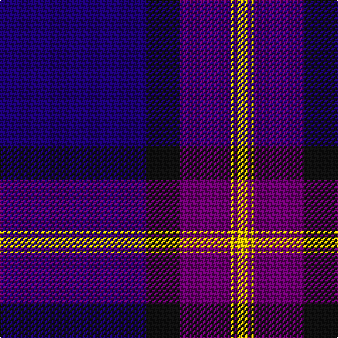

**Bands:** [BKBYBY](/stripes/bkbyby/) · **Stripes:** [DB K DP LY DP LY](/stripes/stripes6/) DB K DP LY DP LY

This was sourced from register-of-tartans.  It is a [6 band tartan](/bands/bands6/).

Original link https://www.tartanregister.gov.uk/tartanDetails.aspx?ref=362

## Attestations

This cloth appears in 2 source records; the oldest owns this page.

- 01/04/1996 — British Energy (register-of-tartans, [record](https://www.tartanregister.gov.uk/tartanDetails.aspx?ref=362))
- 1997 — British Energy (Corporate) (tartans-authority, [record](http://www.tartansauthority.com/tartan-ferret/display/2324/))

## Register references

External register numbers recorded for this tartan.

- Scottish Register of Tartans: [362](https://www.tartanregister.gov.uk/tartanDetails.aspx?ref=362)
- Scottish Tartans Authority (ITI): 2324
- Scottish Tartans World Register: 2324

## Thread count
DB/104 K24 P36 Y2 P2 Y/8

## Palette
Each colour and its ΔE from the base-6 reference it is a variant of.

| Colour | Shade | Base | ΔE (OKLab) |
|---|---|---|---|
| DB | <code style="background-color:#1C0070;">#1C0070</code> `#1C0070` | B <code style="background-color:#2A418A;">#2A418A</code> | 0.14 |
| DR | <code style="background-color:#880000;">#880000</code> `#880000` | R <code style="background-color:#CC0000;">#CC0000</code> | 0.15 |
| G | <code style="background-color:#006818;">#006818</code> `#006818` | G <code style="background-color:#006100;">#006100</code> | 0.02 |
| K | <code style="background-color:#101010;">#101010</code> `#101010` | K <code style="background-color:#000000;">#000000</code> | 0.17 |
| LP | <code style="background-color:#A8ACE8;">#A8ACE8</code> `#A8ACE8` | W <code style="background-color:#F7F7F7;">#F7F7F7</code> | 0.23 |
| N | <code style="background-color:#C0C0C0;">#C0C0C0</code> `#C0C0C0` | W <code style="background-color:#F7F7F7;">#F7F7F7</code> | 0.17 |
| P | <code style="background-color:#6C0070;">#6C0070</code> `#6C0070` | B <code style="background-color:#2A418A;">#2A418A</code> | 0.16 |
| Y | <code style="background-color:#E8C000;">#E8C000</code> `#E8C000` | Y <code style="background-color:#F2BF00;">#F2BF00</code> | 0.02 |

# Sample pattern

## Nearest tartans

The nearest existing variants by ΔTartan distance.

1. [NHS Grampian](/setts/s7/k4w1t2w1k16db36t4~x2/) — ΔT 1.25
1. [Koot Wedding (Personal)](/setts/s6/db48k32r1k8r3w3~x2/) — ΔT 1.32
1. [Finnie (Personal)](/setts/s8/db4w4db37k20w1dp5w1k4~x2/) — ΔT 1.40
1. [Edzell, U.S. Navy](/setts/s6/db45db7w3db27r1db7~x2/) — ΔT 1.48
1. [Grahame Laurie Band (Corporate)](/setts/s7/k8ly2dp6ly2k36db84w7/) — ΔT 1.51
1. [MacLaurin of Broich (Clan)](/setts/s7/db36k8g3r3g6k1lo2~x2/) — ΔT 1.53
1. [Edzell, U.S. Navy](/setts/s6/db104db16w8db66r3db16/) — ΔT 1.55
1. [Tyneside Blue, North Tyneside Pipe Band](/setts/s7/db62k22w3k2w2k3r1~x2/) — ΔT 1.73
1. [S.C.O.T.S.](/setts/s6/db55db18w3db2r2db6~x2/) — ΔT 1.74
1. [Danzas](/setts/s7/ly4dt3ly1dt17db40dt2db3~x2/) — ΔT 1.83

## Neighbour map

Every grey dot is one of 14313 variants placed by the first two principal components of the ΔTartan feature space (44% of its variance). Red is this tartan; blue dots are its nearest — click one to open its page.

<svg viewBox="0 0 640 380" role="img" style="max-width:100%;height:auto;border:1px solid #e0e0e0;border-radius:4px;display:block" xmlns="http://www.w3.org/2000/svg"><image href="/nn/cloud.v1.png" width="640" height="380"/><a href="/setts/s7/k4w1t2w1k16db36t4~x2/"><circle cx="395.5" cy="147.5" r="4" fill="#3465a4"><title>NHS Grampian</title></circle></a><a href="/setts/s6/db48k32r1k8r3w3~x2/"><circle cx="390.4" cy="155.8" r="4" fill="#3465a4"><title>Koot Wedding (Personal)</title></circle></a><a href="/setts/s8/db4w4db37k20w1dp5w1k4~x2/"><circle cx="365.4" cy="135.7" r="4" fill="#3465a4"><title>Finnie (Personal)</title></circle></a><a href="/setts/s6/db45db7w3db27r1db7~x2/"><circle cx="409.6" cy="179.5" r="4" fill="#3465a4"><title>Edzell, U.S. Navy</title></circle></a><a href="/setts/s7/k8ly2dp6ly2k36db84w7/"><circle cx="387.2" cy="118.2" r="4" fill="#3465a4"><title>Grahame Laurie Band (Corporate)</title></circle></a><a href="/setts/s7/db36k8g3r3g6k1lo2~x2/"><circle cx="399.9" cy="132.6" r="4" fill="#3465a4"><title>MacLaurin of Broich (Clan)</title></circle></a><a href="/setts/s6/db104db16w8db66r3db16/"><circle cx="387.2" cy="186.3" r="4" fill="#3465a4"><title>Edzell, U.S. Navy</title></circle></a><a href="/setts/s7/db62k22w3k2w2k3r1~x2/"><circle cx="477.0" cy="126.8" r="4" fill="#3465a4"><title>Tyneside Blue, North Tyneside Pipe Band</title></circle></a><a href="/setts/s6/db55db18w3db2r2db6~x2/"><circle cx="468.8" cy="179.2" r="4" fill="#3465a4"><title>S.C.O.T.S.</title></circle></a><a href="/setts/s7/ly4dt3ly1dt17db40dt2db3~x2/"><circle cx="476.6" cy="171.3" r="4" fill="#3465a4"><title>Danzas</title></circle></a><circle cx="427.6" cy="151.2" r="5" fill="#c00000"/></svg>

ID: /setts/s6/db52k12dp18ly1dp1ly4~x2/
