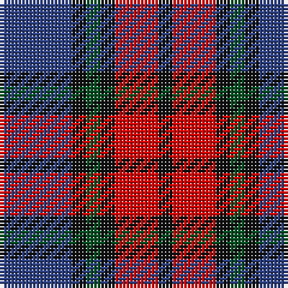

**Bands:** [BKGKRK](/stripes/bkgkrk/) · **Stripes:** [DB K DG K R K](/stripes/stripes6/) DB K DG K R K

This was sourced from register-of-tartans.  It is a [6 band tartan](/bands/bands6/).

Original link https://www.tartanregister.gov.uk/tartanDetails.aspx?ref=685

## Register references

External register numbers recorded for this tartan.

- Scottish Register of Tartans: [685](https://www.tartanregister.gov.uk/tartanDetails.aspx?ref=685)
- Scottish Tartans World Register: 326

## Thread count
B/20 K4 G4 K4 R12 K/4

## Palette
Each colour and its ΔE from the base-6 reference it is a variant of.

| Colour | Shade | Base | ΔE (OKLab) |
|---|---|---|---|
| B | <code style="background-color:#2C4084;">#2C4084</code> `#2C4084` | B <code style="background-color:#2A418A;">#2A418A</code> | 0.01 |
| G | <code style="background-color:#005020;">#005020</code> `#005020` | G <code style="background-color:#006100;">#006100</code> | 0.07 |
| K | <code style="background-color:#101010;">#101010</code> `#101010` | K <code style="background-color:#000000;">#000000</code> | 0.17 |
| R | <code style="background-color:#DC0000;">#DC0000</code> `#DC0000` | R <code style="background-color:#CC0000;">#CC0000</code> | 0.03 |

# Sample pattern

## Nearest tartans

The nearest existing variants by ΔTartan distance.

1. [MacTavish #2](/setts/s6/t1r6db1t3k3t1~x8/) — ΔT 0.63
1. [Grammar School at Leeds (School)](/setts/s6/n32w4n4k24dp29k4/) — ΔT 0.88
1. [Clerk](/setts/s6/db5k1g1k1r3k1~x4/) — ΔT 0.95
1. [Trinity College, Toronto Uni. (Corp](/setts/s5/k1r2t1db5lo1~x16/) — ΔT 1.18
1. [Unidentified #61](/setts/s8/db3db1g5db3r9db1r1db2~x4/) — ΔT 1.20
1. [Fife (McGill)](/setts/s6/db31t4db6k19r20ly4~x2/) — ΔT 1.21
1. [Baillie (Highland Society)](/setts/s7/dp3k1dp8k6dg8k1w2~x2/) — ΔT 1.22
1. [Lanark (Fashion #1)](/setts/s6/lb1dr5g3dr1db3r1~x4/) — ΔT 1.26
1. [University of Notre Dame](/setts/s6/r5db35k25db8ly10r5~x2/) — ΔT 1.27
1. [MacKean Red (Personal)](/setts/s8/r2k4r2k4db1lb1db4r1~x4/) — ΔT 1.28

## Neighbour map

Every grey dot is one of 14313 variants placed by the first two principal components of the ΔTartan feature space (44% of its variance). Red is this tartan; blue dots are its nearest — click one to open its page.

<svg viewBox="0 0 640 380" role="img" style="max-width:100%;height:auto;border:1px solid #e0e0e0;border-radius:4px;display:block" xmlns="http://www.w3.org/2000/svg"><image href="/nn/cloud.v1.png" width="640" height="380"/><a href="/setts/s6/t1r6db1t3k3t1~x8/"><circle cx="192.7" cy="234.6" r="4" fill="#3465a4"><title>MacTavish #2</title></circle></a><a href="/setts/s6/n32w4n4k24dp29k4/"><circle cx="207.4" cy="228.9" r="4" fill="#3465a4"><title>Grammar School at Leeds (School)</title></circle></a><a href="/setts/s6/db5k1g1k1r3k1~x4/"><circle cx="172.2" cy="233.2" r="4" fill="#3465a4"><title>Clerk</title></circle></a><a href="/setts/s5/k1r2t1db5lo1~x16/"><circle cx="205.7" cy="229.1" r="4" fill="#3465a4"><title>Trinity College, Toronto Uni. (Corp</title></circle></a><a href="/setts/s8/db3db1g5db3r9db1r1db2~x4/"><circle cx="217.9" cy="207.9" r="4" fill="#3465a4"><title>Unidentified #61</title></circle></a><a href="/setts/s6/db31t4db6k19r20ly4~x2/"><circle cx="188.5" cy="209.1" r="4" fill="#3465a4"><title>Fife (McGill)</title></circle></a><a href="/setts/s7/dp3k1dp8k6dg8k1w2~x2/"><circle cx="177.0" cy="225.7" r="4" fill="#3465a4"><title>Baillie (Highland Society)</title></circle></a><a href="/setts/s6/lb1dr5g3dr1db3r1~x4/"><circle cx="180.9" cy="246.1" r="4" fill="#3465a4"><title>Lanark (Fashion #1)</title></circle></a><a href="/setts/s6/r5db35k25db8ly10r5~x2/"><circle cx="220.8" cy="221.3" r="4" fill="#3465a4"><title>University of Notre Dame</title></circle></a><a href="/setts/s8/r2k4r2k4db1lb1db4r1~x4/"><circle cx="156.6" cy="253.4" r="4" fill="#3465a4"><title>MacKean Red (Personal)</title></circle></a><circle cx="195.4" cy="242.1" r="5" fill="#c00000"/></svg>

ID: /setts/s6/db5k1dg1k1r3k1~x4/
