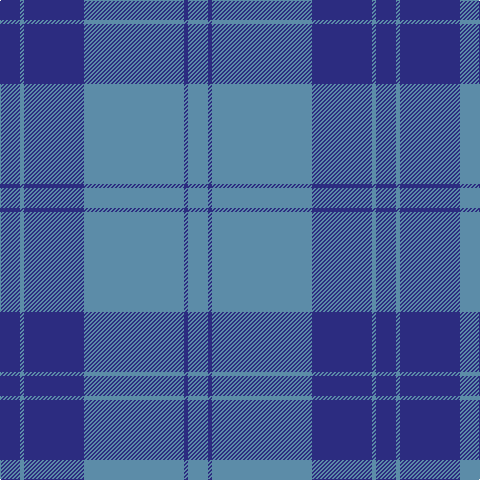

This page is one **sett** — a single exact thread-count. It belongs to the [tartan](/tartans/db5b1db15b25db1b5/)
(the same proportion at any scale), whose colour order is pattern [BBBBBB](/stripes/bbbbbb/).

Sourced from tartans-authority.  It is a [6 stripe tartan](/stripes/stripes6/).

Original link http://www.tartansauthority.com/tartan-ferret/display/7532/

2 attestations — the source records this cloth was collapsed from (oldest owns this page)

<ul>
<li>February 2008 — Dram! (Corporate) (tartans-authority, <a href="http://www.tartansauthority.com/tartan-ferret/display/7532/">record</a>)</li>
<li>undated — Dram! (register-of-tartans, <a href="https://www.tartanregister.gov.uk/tartanDetails.aspx?ref=5568">record</a>)</li>
</ul>

## Register references

External register numbers recorded for this tartan.

- Scottish Register of Tartans: [5568](https://www.tartanregister.gov.uk/tartanDetails.aspx?ref=5568)
- Scottish Tartans Authority (ITI): 7532

## Thread count
DB/20 B4 DB60 B100 DB4 B/20

## Palette
Each colour and the base-6 reference it is a variant of.

| Colour | Shade | Base |
|---|---|---|
| B | <code style="background-color:#5C8CA8;">#5C8CA8</code> `oklch(61.7% 0.067 235.0)` <small>#5C8CA8</small> | B <code style="background-color:#2A418A;">#2A418A</code> |
| DB | <code style="background-color:#2C2C80;">#2C2C80</code> `oklch(35.0% 0.138 276.6)` <small>#2C2C80</small> | B <code style="background-color:#2A418A;">#2A418A</code> |

# Sample pattern

## Nearest tartans

The nearest existing variants by ΔTartan distance, with this tartan at the top so the swatches line up against it.

ΔTartan

Tartan

Sett

—

<a href="/ttd/edit/#slug=db5t1db15t25db1t5~x4">Dram! (Corporate)</a> <a class="nn-out" href="/setts/s6/db5t1db15t25db1t5~x4/" title="open its dictionary page">↗</a>

1.43

<a href="/ttd/edit/#slug=t52db28w3db2w2db10~x2">St Andrews Earl of Royal family Tartan Tartan Number: 85. Earliest known date: c.1930 Count taken from a 'MacKinlay Strip'. Prince George is reputed to have worn this tartan at a Scottish Society dinner in 1919 and kept everyone guessing the name of the tartan. However, MacKinlay's record shows the design dating to 1930. No further details can be found. The sett has much in common with the Clan Donald. Royal titles of territorial origin provide a precedent for considering tartans of the name, District tartans. See products available Copyright © Blair Urquhart, Comrie, 2015</a> <a class="nn-out" href="/setts/s6/t52db28w3db2w2db10~x2/" title="open its dictionary page">↗</a>

1.44

<a href="/ttd/edit/#slug=b50db15w3db4w2~x2">Scottish Tourist Board (1990) (Corp)</a> <a class="nn-out" href="/setts/s5/b50db15w3db4w2~x2/" title="open its dictionary page">↗</a>

1.62

<a href="/ttd/edit/#slug=db13b1db3b6ly1b1~x4">Hepburn #2</a> <a class="nn-out" href="/setts/s6/db13b1db3b6ly1b1~x4/" title="open its dictionary page">↗</a>

1.64

<a href="/ttd/edit/#slug=o9db3o1db11o1~x6">MacCallum High School Corporate Tartan Tartan Number: 1279. Earliest known date: 0 From the J. Rutledge Collection, Belfast. MacCallum High School, Philadelphia See products available Copyright © Blair Urquhart, Comrie, 2015</a> <a class="nn-out" href="/setts/s5/o9db3o1db11o1~x6/" title="open its dictionary page">↗</a>

1.68

<a href="/ttd/edit/#slug=lg6r1lg17db3lg3db8lg1~x2">Dominion (Fashion)</a> <a class="nn-out" href="/setts/s7/lg6r1lg17db3lg3db8lg1~x2/" title="open its dictionary page">↗</a>

1.68

<a href="/ttd/edit/#slug=ly4b3ly1b17db40b2db3~x2">Danzas</a> <a class="nn-out" href="/setts/s7/ly4b3ly1b17db40b2db3~x2/" title="open its dictionary page">↗</a>

1.70

<a href="/ttd/edit/#slug=db12ly1t16db1t1db14t3db14ly1~x4">Orlando Police Department (Corporate</a> <a class="nn-out" href="/setts/s9/db12ly1t16db1t1db14t3db14ly1~x4/" title="open its dictionary page">↗</a>

1.80

<a href="/ttd/edit/#slug=dp11t90dy3t11dp7dy11dp13t11">Royal Conservatoire of Scotland</a> <a class="nn-out" href="/setts/s8/dp11t90dy3t11dp7dy11dp13t11/" title="open its dictionary page">↗</a>

1.84

<a href="/ttd/edit/#slug=db64g20r4g3r4g3">Wilson</a> <a class="nn-out" href="/setts/s6/db64g20r4g3r4g3/" title="open its dictionary page">↗</a>

1.84

<a href="/ttd/edit/#slug=db48g14r3g2r3g2~x2">Wilson</a> <a class="nn-out" href="/setts/s6/db48g14r3g2r3g2~x2/" title="open its dictionary page">↗</a>

## Neighbour map

Every grey dot is one of 14299 variants placed by the first two principal components of the ΔTartan feature space (44% of its variance). Red is this tartan; blue dots are its nearest — click one to open its page.

<svg viewBox="0 0 640 380" role="img" style="max-width:100%;height:auto;border:1px solid #e0e0e0;border-radius:4px;display:block" xmlns="http://www.w3.org/2000/svg"><image href="/nn/cloud.v1.png" width="640" height="380"/><a href="/setts/s6/t52db28w3db2w2db10~x2/"><circle cx="401.7" cy="191.4" r="4" fill="#3465a4"><title>St Andrews Earl of Royal family Tartan Tartan Number: 85. Earliest known date: c.1930 Count taken from a 'MacKinlay Strip'. Prince George is reputed to have worn this tartan at a Scottish Society dinner in 1919 and kept everyone guessing the name of the tartan. However, MacKinlay's record shows the design dating to 1930. No further details can be found. The sett has much in common with the Clan Donald. Royal titles of territorial origin provide a precedent for considering tartans of the name, District tartans. See products available Copyright © Blair Urquhart, Comrie, 2015</title></circle></a><a href="/setts/s5/b50db15w3db4w2~x2/"><circle cx="496.2" cy="207.6" r="4" fill="#3465a4"><title>Scottish Tourist Board (1990) (Corp)</title></circle></a><a href="/setts/s6/db13b1db3b6ly1b1~x4/"><circle cx="424.5" cy="224.5" r="4" fill="#3465a4"><title>Hepburn #2</title></circle></a><a href="/setts/s5/o9db3o1db11o1~x6/"><circle cx="404.3" cy="264.5" r="4" fill="#3465a4"><title>MacCallum High School Corporate Tartan Tartan Number: 1279. Earliest known date: 0 From the J. Rutledge Collection, Belfast. MacCallum High School, Philadelphia See products available Copyright © Blair Urquhart, Comrie, 2015</title></circle></a><a href="/setts/s7/lg6r1lg17db3lg3db8lg1~x2/"><circle cx="453.7" cy="207.7" r="4" fill="#3465a4"><title>Dominion (Fashion)</title></circle></a><a href="/setts/s7/ly4b3ly1b17db40b2db3~x2/"><circle cx="469.9" cy="166.8" r="4" fill="#3465a4"><title>Danzas</title></circle></a><a href="/setts/s9/db12ly1t16db1t1db14t3db14ly1~x4/"><circle cx="434.0" cy="215.7" r="4" fill="#3465a4"><title>Orlando Police Department (Corporate</title></circle></a><a href="/setts/s8/dp11t90dy3t11dp7dy11dp13t11/"><circle cx="514.4" cy="164.1" r="4" fill="#3465a4"><title>Royal Conservatoire of Scotland</title></circle></a><a href="/setts/s6/db64g20r4g3r4g3/"><circle cx="474.8" cy="193.1" r="4" fill="#3465a4"><title>Wilson</title></circle></a><a href="/setts/s6/db48g14r3g2r3g2~x2/"><circle cx="490.3" cy="188.3" r="4" fill="#3465a4"><title>Wilson</title></circle></a><circle cx="467.6" cy="224.8" r="5" fill="#c00000"/></svg>

ID: /setts/s6/db5t1db15t25db1t5~x4/
