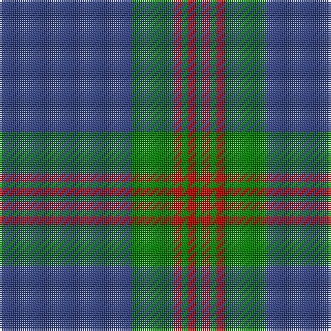

In pattern [BGRGRG](/stripes/bgrgrg/).

This was sourced from weddslist.  It is a [6 stripe tartan](/stripes/stripes6/).

Original link http://www.weddslist.com/cgi-bin/tartans/pg.pl?source=sts

## Thread count
B/64 G20 R4 G3 R4 G/3

## Palette
Each colour and the base-6 reference it is a variant of.

| Colour | Shade | Base |
|---|---|---|
| B | <code style="background-color:#304080;">#304080</code> `oklch(39.4% 0.109 270.2)` <small>#304080</small> | B <code style="background-color:#2A418A;">#2A418A</code> |
| G | <code style="background-color:#008000;">#008000</code> `oklch(52.0% 0.177 142.5)` <small>#008000</small> | G <code style="background-color:#006100;">#006100</code> |
| R | <code style="background-color:#C00000;">#C00000</code> `oklch(50.7% 0.208 29.2)` <small>#C00000</small> | R <code style="background-color:#CC0000;">#CC0000</code> |

# Sample pattern

## Nearest tartans

The nearest existing variants by ΔTartan distance.

1. [Wilson](/setts/s6/db48g14r3g2r3g2~x2/) — ΔT 0.25
1. [Wilson](/setts/s6/db64dg20r4dg3r4dg3/) — ΔT 1.24
1. [Wilson #2](/setts/s6/db48dg14r3dg2r3dg2~x2/) — ΔT 1.26
1. [Royal Conservatoire of Scotland](/setts/s8/dp11t90dy3t11dp7dy11dp13t11/) — ΔT 1.38
1. [Edinburgh, The University of](/setts/s7/k8m26k22dt110w4k5w4/) — ΔT 1.39
1. [Murray of Elibank](/setts/s7/b64k3g14k4b4k12lo4~x2/) — ΔT 1.46
1. [City Building (Glasgow) LLP](/setts/s10/k3n6k8lr2k8n3k5n36k2n3~x2/) — ΔT 1.50
1. [Connecticut State Police PB (Cor.)](/setts/s6/n42db2n2db17lo8db4~x2/) — ΔT 1.53
1. [Roxburgh](/setts/s8/db16w1db1w1db8dg16r1db2~x2/) — ΔT 1.55
1. [Salvation Army, Hunting](/setts/s7/db40g8k1ly2k1g8db5~x4/) — ΔT 1.56

## Neighbour map

Every grey dot is one of 14299 variants placed by the first two principal components of the ΔTartan feature space (44% of its variance). Red is this tartan; blue dots are its nearest — click one to open its page.

<svg viewBox="0 0 640 380" role="img" style="max-width:100%;height:auto;border:1px solid #e0e0e0;border-radius:4px;display:block" xmlns="http://www.w3.org/2000/svg"><image href="/nn/cloud.v1.png" width="640" height="380"/><a href="/setts/s6/db48g14r3g2r3g2~x2/"><circle cx="490.3" cy="188.3" r="4" fill="#3465a4"><title>Wilson</title></circle></a><a href="/setts/s6/db64dg20r4dg3r4dg3/"><circle cx="506.8" cy="210.8" r="4" fill="#3465a4"><title>Wilson</title></circle></a><a href="/setts/s6/db48dg14r3dg2r3dg2~x2/"><circle cx="520.7" cy="205.2" r="4" fill="#3465a4"><title>Wilson #2</title></circle></a><a href="/setts/s8/dp11t90dy3t11dp7dy11dp13t11/"><circle cx="514.4" cy="164.1" r="4" fill="#3465a4"><title>Royal Conservatoire of Scotland</title></circle></a><a href="/setts/s7/k8m26k22dt110w4k5w4/"><circle cx="427.5" cy="159.7" r="4" fill="#3465a4"><title>Edinburgh, The University of</title></circle></a><a href="/setts/s7/b64k3g14k4b4k12lo4~x2/"><circle cx="413.7" cy="161.7" r="4" fill="#3465a4"><title>Murray of Elibank</title></circle></a><a href="/setts/s10/k3n6k8lr2k8n3k5n36k2n3~x2/"><circle cx="452.9" cy="179.3" r="4" fill="#3465a4"><title>City Building (Glasgow) LLP</title></circle></a><a href="/setts/s6/n42db2n2db17lo8db4~x2/"><circle cx="381.3" cy="179.2" r="4" fill="#3465a4"><title>Connecticut State Police PB (Cor.)</title></circle></a><a href="/setts/s8/db16w1db1w1db8dg16r1db2~x2/"><circle cx="399.0" cy="197.5" r="4" fill="#3465a4"><title>Roxburgh</title></circle></a><a href="/setts/s7/db40g8k1ly2k1g8db5~x4/"><circle cx="487.3" cy="143.1" r="4" fill="#3465a4"><title>Salvation Army, Hunting</title></circle></a><circle cx="474.8" cy="193.1" r="5" fill="#c00000"/></svg>

ID: /setts/s6/db64g20r4g3r4g3/
