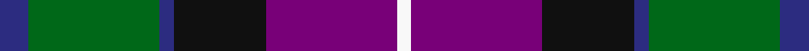

In pattern [BGBKBW](/stripes/bgbkbw/).

This was sourced from register-of-tartans.  It is a [6 stripe tartan](/stripes/stripes6/).

Original link https://www.tartanregister.gov.uk/tartanDetails.aspx?ref=1444

## Also known as

This cloth is also recorded under:

- Gold Brothers

## Attestations

This cloth appears in 2 source records; the oldest owns this page.

- 01/05/2005 — Gold Brothers (register-of-tartans, [record](https://www.tartanregister.gov.uk/tartanDetails.aspx?ref=1444))
- 2005 May — Freedom (Fashion) (tartans-authority, [record](http://www.tartansauthority.com/tartan-ferret/display/6865/))

## Register references

External register numbers recorded for this tartan.

- Scottish Register of Tartans: [1444](https://www.tartanregister.gov.uk/tartanDetails.aspx?ref=1444)
- Scottish Tartans Authority (ITI): 6865

## Thread count
DB/12 G54 DB6 K38 P54 W/6

## Palette
Each colour and its ΔE from the base-6 reference it is a variant of.

| Colour | Shade | Base | ΔE (OKLab) |
|---|---|---|---|
| DB | <code style="background-color:#2C2C80;">#2C2C80</code> `#2C2C80` | B <code style="background-color:#2A418A;">#2A418A</code> | 0.06 |
| G | <code style="background-color:#006818;">#006818</code> `#006818` | G <code style="background-color:#006100;">#006100</code> | 0.02 |
| K | <code style="background-color:#101010;">#101010</code> `#101010` | K <code style="background-color:#000000;">#000000</code> | 0.17 |
| P | <code style="background-color:#780078;">#780078</code> `#780078` | B <code style="background-color:#2A418A;">#2A418A</code> | 0.17 |
| W | <code style="background-color:#F8F8F8;">#F8F8F8</code> `#F8F8F8` | W <code style="background-color:#F7F7F7;">#F7F7F7</code> | 0.00 |

# Sample pattern

## Nearest tartans

The nearest existing variants by ΔTartan distance.

1. [Colquhoun #3](/setts/s7/dp6k3dp21k23w3dg24r3~x2/) — ΔT 0.68
1. [Fruin Colquhoun (Commemorative?)](/setts/s7/r5g19w3k19db19k3db2~x2/) — ΔT 0.69
1. [Swankie (Personal)](/setts/s7/k4b21dy10y4k20r6b3~x2/) — ΔT 0.69
1. [McEachern, Andrew](/setts/s6/do7w1r6db10g10w1~x4/) — ΔT 0.81
1. [Canine All Dogs (Fashion)](/setts/s6/r10db6g24db24r6ly3/) — ΔT 0.82
1. [Martin Hunting](/setts/s5/dp20k5k19g19ly2~x2/) — ΔT 0.83
1. [Patterson, John (Personal)](/setts/s6/g3db12w1dg12r12dg2~x2/) — ΔT 0.83
1. [Commonwealth Games Council (Corp.)](/setts/s6/m3k17n11m2o20w2~x2/) — ΔT 0.83
1. [Cala Homes (Corporate)](/setts/s6/ly5db24k8db18ly6dy3/) — ΔT 0.86
1. [Thom(p)son's, Fancy](/setts/s6/r2o8db2t4k4t1~x6/) — ΔT 0.86

## Neighbour map

Every grey dot is one of 14299 variants placed by the first two principal components of the ΔTartan feature space (44% of its variance). Red is this tartan; blue dots are its nearest — click one to open its page.

<svg viewBox="0 0 640 380" role="img" style="max-width:100%;height:auto;border:1px solid #e0e0e0;border-radius:4px;display:block" xmlns="http://www.w3.org/2000/svg"><image href="/nn/cloud.v1.png" width="640" height="380"/><a href="/setts/s7/dp6k3dp21k23w3dg24r3~x2/"><circle cx="158.2" cy="206.7" r="4" fill="#3465a4"><title>Colquhoun #3</title></circle></a><a href="/setts/s7/r5g19w3k19db19k3db2~x2/"><circle cx="148.1" cy="203.1" r="4" fill="#3465a4"><title>Fruin Colquhoun (Commemorative?)</title></circle></a><a href="/setts/s7/k4b21dy10y4k20r6b3~x2/"><circle cx="147.4" cy="213.4" r="4" fill="#3465a4"><title>Swankie (Personal)</title></circle></a><a href="/setts/s6/do7w1r6db10g10w1~x4/"><circle cx="104.6" cy="209.9" r="4" fill="#3465a4"><title>McEachern, Andrew</title></circle></a><a href="/setts/s6/r10db6g24db24r6ly3/"><circle cx="142.2" cy="214.1" r="4" fill="#3465a4"><title>Canine All Dogs (Fashion)</title></circle></a><a href="/setts/s5/dp20k5k19g19ly2~x2/"><circle cx="138.1" cy="228.6" r="4" fill="#3465a4"><title>Martin Hunting</title></circle></a><a href="/setts/s6/g3db12w1dg12r12dg2~x2/"><circle cx="169.2" cy="199.7" r="4" fill="#3465a4"><title>Patterson, John (Personal)</title></circle></a><a href="/setts/s6/m3k17n11m2o20w2~x2/"><circle cx="160.2" cy="191.2" r="4" fill="#3465a4"><title>Commonwealth Games Council (Corp.)</title></circle></a><a href="/setts/s6/ly5db24k8db18ly6dy3/"><circle cx="142.8" cy="211.7" r="4" fill="#3465a4"><title>Cala Homes (Corporate)</title></circle></a><a href="/setts/s6/r2o8db2t4k4t1~x6/"><circle cx="135.4" cy="210.8" r="4" fill="#3465a4"><title>Thom(p)son's, Fancy</title></circle></a><circle cx="141.0" cy="206.8" r="5" fill="#c00000"/></svg>

ID: /setts/s6/db6g27db3k19dp27w3~x2/
