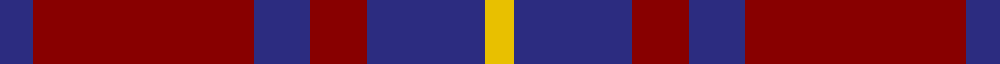
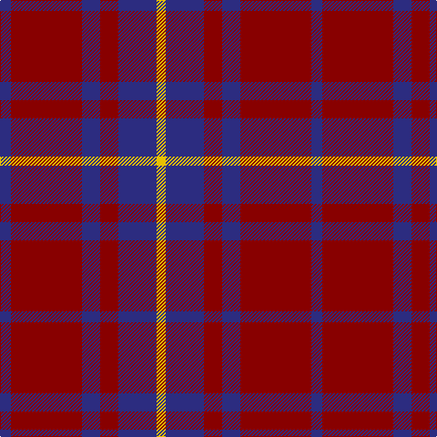

In pattern [BRBRBY](/stripes/brbrby/).

This was sourced from register-of-tartans.  It is a [6 stripe tartan](/stripes/stripes6/).

Original link https://www.tartanregister.gov.uk/tartanDetails.aspx?ref=3447

## Attestations

This cloth appears in 2 source records; the oldest owns this page.

- 01/01/2003 — Rajput (register-of-tartans, [record](https://www.tartanregister.gov.uk/tartanDetails.aspx?ref=3447))
- pre 2003 — Rajput (Military) (tartans-authority, [record](http://www.tartansauthority.com/tartan-ferret/display/6047/))

## Register references

External register numbers recorded for this tartan.

- Scottish Register of Tartans: [3447](https://www.tartanregister.gov.uk/tartanDetails.aspx?ref=3447)
- Scottish Tartans Authority (ITI): 6047

## Thread count
DB/12 DR78 DB20 DR20 DB42 Y/10

## Palette
Each colour and the base-6 reference it is a variant of.

| Colour | Shade | Base |
|---|---|---|
| DB | <code style="background-color:#2C2C80;">#2C2C80</code> `oklch(35.0% 0.138 276.6)` <small>#2C2C80</small> | B <code style="background-color:#2A418A;">#2A418A</code> |
| DR | <code style="background-color:#880000;">#880000</code> `oklch(39.4% 0.162 29.2)` <small>#880000</small> | R <code style="background-color:#CC0000;">#CC0000</code> |
| Y | <code style="background-color:#E8C000;">#E8C000</code> `oklch(81.9% 0.168 93.7)` <small>#E8C000</small> | Y <code style="background-color:#F2BF00;">#F2BF00</code> |

# Sample pattern

## Nearest tartans

The nearest existing variants by ΔTartan distance.

1. [British European](/setts/s6/r12db2r12db17w2r2~x2/) — ΔT 0.64
1. [British European (Corporate)](/setts/s6/r12db2r12db17w2r2~x4/) — ΔT 0.64
1. [Hamilton, (Red)](/setts/s5/db6r1db6r9w1~x2/) — ΔT 0.91
1. [Wotherspoon](/setts/s5/r12g8r54db45g6/) — ΔT 1.03
1. [Wotherspoon](/setts/s5/r5dg3r18db18dg3~x4/) — ΔT 1.11
1. [Butler](/setts/s6/db48r18db6r13ly4r14~x2/) — ΔT 1.12
1. [Hamilton Red Clan Tartan Tartan Number: 477. Earliest known date: 1842 First recorded in the Vestiarium Scoticum which was supposedly based on an ancient manuscript now known to have been forged. The original illustration shows the four main stripes in a very dark shade of blue. There is no evidence of a Hamilton tartan prior to the publication of this spectacular work. The authors, the Sobieski Stuart brothers, enjoyed a popular following amongst the Scottish gentry of the period and it is probable that the design can be attributed to Charles Edward Stuart (Allan Hay) who prepared the illustrations for the book. See products available Copyright © Blair Urquhart, Comrie, 2015](/setts/s5/db6r1db6r9w1~x4/) — ΔT 1.19
1. [Hebridean 2](/setts/s6/db2r2db15r15db2r2~x2/) — ΔT 1.30
1. [Matthews (Personal)](/setts/s6/db3r24db3r3db25w3~x2/) — ΔT 1.30
1. [Robbins](/setts/s6/db1r3db1r3db6g1~x8/) — ΔT 1.31

## Neighbour map

Every grey dot is one of 14299 variants placed by the first two principal components of the ΔTartan feature space (44% of its variance). Red is this tartan; blue dots are its nearest — click one to open its page.

<svg viewBox="0 0 640 380" role="img" style="max-width:100%;height:auto;border:1px solid #e0e0e0;border-radius:4px;display:block" xmlns="http://www.w3.org/2000/svg"><image href="/nn/cloud.v1.png" width="640" height="380"/><a href="/setts/s6/r12db2r12db17w2r2~x2/"><circle cx="347.9" cy="235.0" r="4" fill="#3465a4"><title>British European</title></circle></a><a href="/setts/s6/r12db2r12db17w2r2~x4/"><circle cx="347.9" cy="235.0" r="4" fill="#3465a4"><title>British European (Corporate)</title></circle></a><a href="/setts/s5/db6r1db6r9w1~x2/"><circle cx="332.6" cy="250.7" r="4" fill="#3465a4"><title>Hamilton, (Red)</title></circle></a><a href="/setts/s5/r12g8r54db45g6/"><circle cx="341.4" cy="240.6" r="4" fill="#3465a4"><title>Wotherspoon</title></circle></a><a href="/setts/s5/r5dg3r18db18dg3~x4/"><circle cx="290.4" cy="255.8" r="4" fill="#3465a4"><title>Wotherspoon</title></circle></a><a href="/setts/s6/db48r18db6r13ly4r14~x2/"><circle cx="348.9" cy="213.1" r="4" fill="#3465a4"><title>Butler</title></circle></a><a href="/setts/s5/db6r1db6r9w1~x4/"><circle cx="320.8" cy="243.9" r="4" fill="#3465a4"><title>Hamilton Red Clan Tartan Tartan Number: 477. Earliest known date: 1842 First recorded in the Vestiarium Scoticum which was supposedly based on an ancient manuscript now known to have been forged. The original illustration shows the four main stripes in a very dark shade of blue. There is no evidence of a Hamilton tartan prior to the publication of this spectacular work. The authors, the Sobieski Stuart brothers, enjoyed a popular following amongst the Scottish gentry of the period and it is probable that the design can be attributed to Charles Edward Stuart (Allan Hay) who prepared the illustrations for the book. See products available Copyright © Blair Urquhart, Comrie, 2015</title></circle></a><a href="/setts/s6/db2r2db15r15db2r2~x2/"><circle cx="392.0" cy="250.5" r="4" fill="#3465a4"><title>Hebridean 2</title></circle></a><a href="/setts/s6/db3r24db3r3db25w3~x2/"><circle cx="332.0" cy="211.1" r="4" fill="#3465a4"><title>Matthews (Personal)</title></circle></a><a href="/setts/s6/db1r3db1r3db6g1~x8/"><circle cx="332.3" cy="272.8" r="4" fill="#3465a4"><title>Robbins</title></circle></a><circle cx="349.0" cy="247.3" r="5" fill="#c00000"/></svg>

ID: /setts/s6/db6r39db10r10db21ly5~x2/
