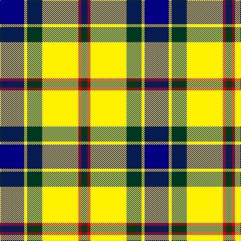

In pattern [BYGYRG](/stripes/bygyrg/).

This was sourced from register-of-tartans.  It is a [6 stripe tartan](/stripes/stripes6/).

Original link https://www.tartanregister.gov.uk/tartanDetails.aspx?ref=11461

## Register references

External register numbers recorded for this tartan.

- Scottish Register of Tartans: [11461](https://www.tartanregister.gov.uk/tartanDetails.aspx?ref=11461)

## Thread count
DB/48 Y6 DG30 Y72 R6 DG/12

## Palette
Each colour and the base-6 reference it is a variant of.

| Colour | Shade | Base |
|---|---|---|
| DB | <code style="background-color:#000080;">#000080</code> `oklch(27.1% 0.188 264.1)` <small>#000080</small> | B <code style="background-color:#2A418A;">#2A418A</code> |
| DG | <code style="background-color:#003820;">#003820</code> `oklch(30.0% 0.070 158.3)` <small>#003820</small> | G <code style="background-color:#006100;">#006100</code> |
| R | <code style="background-color:#DC0000;">#DC0000</code> `oklch(56.2% 0.230 29.2)` <small>#DC0000</small> | R <code style="background-color:#CC0000;">#CC0000</code> |
| Y | <code style="background-color:#FFF000;">#FFF000</code> `oklch(93.7% 0.199 105.0)` <small>#FFF000</small> | Y <code style="background-color:#F2BF00;">#F2BF00</code> |

# Sample pattern

## Nearest tartans

The nearest existing variants by ΔTartan distance.

1. [Black and White Golf](/setts/s7/ly9k32g6w20ly3w9k5~x2/) — ΔT 0.85
1. [Cape Breton (yellow stripes)](/setts/s7/ly6k6y30k8lb18k6ly3~x2/) — ΔT 1.10
1. [Black & White Golf (Corporate)](/setts/s7/lo9k32g6lb20lo3lb9k5~x2/) — ΔT 1.19
1. [Lawsons' Whisky](/setts/s7/k9w38k22g31k5g31ly5/) — ΔT 1.24
1. [Thomson, Camel (Fashion)](/setts/s6/r4ly30k6w13k13w3~x2/) — ΔT 1.26
1. [Thompson Camel Clan Tartan Tartan Number: 2421. Earliest known date: 1967 Designed by Scotty Thompson. It it a simple colour variation on the usual blue Thompson, but is often confused with the Burberry Check. See products available Copyright © Blair Urquhart, Comrie, 2015](/setts/s6/r2lo20k5w10k10w2~x2/) — ΔT 1.28
1. [Thomson Camel](/setts/s6/r4lo30k6w13k13w3~x2/) — ΔT 1.30
1. [Burberry (Genuine)](/setts/s5/k3w3k3ly10r1~x6/) — ΔT 1.31
1. [Barbour - Ancient](/setts/s7/w4k2w18k11db2y18ly2~x2/) — ΔT 1.33
1. [Hackett, William (Coatbridge) (Personal)](/setts/s8/k20w4r4w20dg20w5dg2g2~x2/) — ΔT 1.34

## Neighbour map

Every grey dot is one of 14299 variants placed by the first two principal components of the ΔTartan feature space (44% of its variance). Red is this tartan; blue dots are its nearest — click one to open its page.

<svg viewBox="0 0 640 380" role="img" style="max-width:100%;height:auto;border:1px solid #e0e0e0;border-radius:4px;display:block" xmlns="http://www.w3.org/2000/svg"><image href="/nn/cloud.v1.png" width="640" height="380"/><a href="/setts/s7/ly9k32g6w20ly3w9k5~x2/"><circle cx="177.9" cy="173.4" r="4" fill="#3465a4"><title>Black and White Golf</title></circle></a><a href="/setts/s7/ly6k6y30k8lb18k6ly3~x2/"><circle cx="148.1" cy="179.5" r="4" fill="#3465a4"><title>Cape Breton (yellow stripes)</title></circle></a><a href="/setts/s7/lo9k32g6lb20lo3lb9k5~x2/"><circle cx="190.2" cy="179.7" r="4" fill="#3465a4"><title>Black &amp; White Golf (Corporate)</title></circle></a><a href="/setts/s7/k9w38k22g31k5g31ly5/"><circle cx="151.6" cy="211.8" r="4" fill="#3465a4"><title>Lawsons' Whisky</title></circle></a><a href="/setts/s6/r4ly30k6w13k13w3~x2/"><circle cx="185.9" cy="183.4" r="4" fill="#3465a4"><title>Thomson, Camel (Fashion)</title></circle></a><a href="/setts/s6/r2lo20k5w10k10w2~x2/"><circle cx="176.4" cy="189.9" r="4" fill="#3465a4"><title>Thompson Camel Clan Tartan Tartan Number: 2421. Earliest known date: 1967 Designed by Scotty Thompson. It it a simple colour variation on the usual blue Thompson, but is often confused with the Burberry Check. See products available Copyright © Blair Urquhart, Comrie, 2015</title></circle></a><a href="/setts/s6/r4lo30k6w13k13w3~x2/"><circle cx="190.6" cy="186.9" r="4" fill="#3465a4"><title>Thomson Camel</title></circle></a><a href="/setts/s5/k3w3k3ly10r1~x6/"><circle cx="223.6" cy="194.8" r="4" fill="#3465a4"><title>Burberry (Genuine)</title></circle></a><a href="/setts/s7/w4k2w18k11db2y18ly2~x2/"><circle cx="130.5" cy="158.4" r="4" fill="#3465a4"><title>Barbour - Ancient</title></circle></a><a href="/setts/s8/k20w4r4w20dg20w5dg2g2~x2/"><circle cx="122.6" cy="152.3" r="4" fill="#3465a4"><title>Hackett, William (Coatbridge) (Personal)</title></circle></a><circle cx="188.2" cy="175.0" r="5" fill="#c00000"/></svg>

ID: /setts/s6/db8ly1dg5ly12r1dg2~x6/
