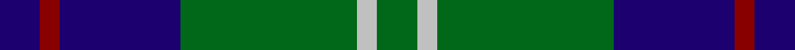
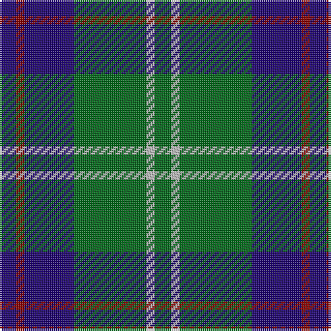

In pattern [BRBGWG](/stripes/brbgwg/).

This was sourced from register-of-tartans.  It is a [6 stripe tartan](/stripes/stripes6/).

Original link https://www.tartanregister.gov.uk/tartanDetails.aspx?ref=1697

## Attestations

This cloth appears in 2 source records; the oldest owns this page.

- 01/01/2002 — Heritage Tartan, The (register-of-tartans, [record](https://www.tartanregister.gov.uk/tartanDetails.aspx?ref=1697))
- pre 2002 — Heritage Tartan, The (Corporate) (tartans-authority, [record](http://www.tartansauthority.com/tartan-ferret/display/5185/))

## Register references

External register numbers recorded for this tartan.

- Scottish Register of Tartans: [1697](https://www.tartanregister.gov.uk/tartanDetails.aspx?ref=1697)
- Scottish Tartans Authority (ITI): 5185

## Thread count
DB/8 DR4 DB24 G35 N4 G/8

## Palette
Each colour and its ΔE from the base-6 reference it is a variant of.

| Colour | Shade | Base | ΔE (OKLab) |
|---|---|---|---|
| DB | <code style="background-color:#1C0070;">#1C0070</code> `#1C0070` | B <code style="background-color:#2A418A;">#2A418A</code> | 0.14 |
| DR | <code style="background-color:#880000;">#880000</code> `#880000` | R <code style="background-color:#CC0000;">#CC0000</code> | 0.15 |
| G | <code style="background-color:#006818;">#006818</code> `#006818` | G <code style="background-color:#006100;">#006100</code> | 0.02 |
| N | <code style="background-color:#C0C0C0;">#C0C0C0</code> `#C0C0C0` | W <code style="background-color:#F7F7F7;">#F7F7F7</code> | 0.17 |

# Sample pattern

## Nearest tartans

The nearest existing variants by ΔTartan distance.

1. [MacIntyre L](/setts/s6/dg4db12r3db12dg32lb4/) — ΔT 0.55
1. [Irving of Bonshaw Tower (Personal)](/setts/s6/r2g3db2g14db14lr2~x2/) — ΔT 0.70
1. [MacIntyre Hunting (VS)](/setts/s6/g4db12r3db12g32w4~x2/) — ΔT 0.75
1. [Cameron Hunting](/setts/s7/r3dg10r3dg14db16dg3ly2/) — ΔT 0.86
1. [Cameron of Lochiel (Hunting)](/setts/s7/r3g10r3g14db16g3ly2~x2/) — ΔT 0.86
1. [MacIntyre](/setts/s6/dg4db12r3db12dg32w4~x2/) — ΔT 0.89
1. [MacIntyre LC](/setts/s6/dg4db12r3db12dg32lr4~x2/) — ΔT 0.91
1. [MacIntyre LC](/setts/s6/dg4db12r3db12dg32lr4/) — ΔT 0.91
1. [Glen Esk](/setts/s8/dg10r1dg1r2dg8db10dg1ly1~x4/) — ΔT 0.93
1. [Thayer USA (Name)](/setts/s6/r5db25w5db3g25db3~x2/) — ΔT 0.94

## Neighbour map

Every grey dot is one of 14299 variants placed by the first two principal components of the ΔTartan feature space (44% of its variance). Red is this tartan; blue dots are its nearest — click one to open its page.

<svg viewBox="0 0 640 380" role="img" style="max-width:100%;height:auto;border:1px solid #e0e0e0;border-radius:4px;display:block" xmlns="http://www.w3.org/2000/svg"><image href="/nn/cloud.v1.png" width="640" height="380"/><a href="/setts/s6/dg4db12r3db12dg32lb4/"><circle cx="301.3" cy="218.4" r="4" fill="#3465a4"><title>MacIntyre L</title></circle></a><a href="/setts/s6/r2g3db2g14db14lr2~x2/"><circle cx="256.3" cy="230.2" r="4" fill="#3465a4"><title>Irving of Bonshaw Tower (Personal)</title></circle></a><a href="/setts/s6/g4db12r3db12g32w4~x2/"><circle cx="295.2" cy="210.9" r="4" fill="#3465a4"><title>MacIntyre Hunting (VS)</title></circle></a><a href="/setts/s7/r3dg10r3dg14db16dg3ly2/"><circle cx="263.7" cy="229.7" r="4" fill="#3465a4"><title>Cameron Hunting</title></circle></a><a href="/setts/s7/r3g10r3g14db16g3ly2~x2/"><circle cx="260.0" cy="224.9" r="4" fill="#3465a4"><title>Cameron of Lochiel (Hunting)</title></circle></a><a href="/setts/s6/dg4db12r3db12dg32w4~x2/"><circle cx="323.4" cy="225.9" r="4" fill="#3465a4"><title>MacIntyre</title></circle></a><a href="/setts/s6/dg4db12r3db12dg32lr4~x2/"><circle cx="322.2" cy="228.7" r="4" fill="#3465a4"><title>MacIntyre LC</title></circle></a><a href="/setts/s6/dg4db12r3db12dg32lr4/"><circle cx="322.2" cy="228.7" r="4" fill="#3465a4"><title>MacIntyre LC</title></circle></a><a href="/setts/s8/dg10r1dg1r2dg8db10dg1ly1~x4/"><circle cx="324.8" cy="207.8" r="4" fill="#3465a4"><title>Glen Esk</title></circle></a><a href="/setts/s6/r5db25w5db3g25db3~x2/"><circle cx="251.8" cy="215.9" r="4" fill="#3465a4"><title>Thayer USA (Name)</title></circle></a><circle cx="284.9" cy="228.3" r="5" fill="#c00000"/></svg>

ID: /setts/s6/db8r4db24g35lb4g8/
