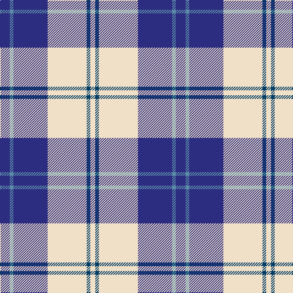

**Bands:** [BBBWBW](/stripes/bbbwbw/) · **Stripes:** [DB T DB W DT W](/stripes/stripes6/) DB T DB W DT W

This was sourced from tartans-authority.  It is a [6 band tartan](/bands/bands6/).

Original link http://www.tartansauthority.com/tartan-ferret/display/7595/

## Attestations

This cloth appears in 3 source records; the oldest owns this page.

- March 2008 — Ailsa, Royal Blue (Dance) (tartans-authority, [record](http://www.tartansauthority.com/tartan-ferret/display/7595/))
- undated — Ailsa Royal Blue (register-of-tartans, [record](https://www.tartanregister.gov.uk/tartanDetails.aspx?ref=5619))
- undated — Ailsa Royal Blue Fashion Tartan Tartan Number: 7595. Earliest known date: March 2008 One of a series of dancer's tartans for the House of Edgar's in-house collection designed by Kirsty Anderson. See products available Copyright © Blair Urquhart, Comrie, 2015 (house-of-tartan, [record](http://www.house-of-tartan.scotland.net/house/TartanViewjs.asp?colr=Def&tnam=7595))

## Register references

External register numbers recorded for this tartan.

- Scottish Register of Tartans: [5619](https://www.tartanregister.gov.uk/tartanDetails.aspx?ref=5619)
- Scottish Tartans Authority (ITI): 7595

## Thread count
DBa/16 B6 DBa56 W64 DB6 W/8

## Palette
Each colour and its ΔE from the base-6 reference it is a variant of.

| Colour | Shade | Base | ΔE (OKLab) |
|---|---|---|---|
| B | <code style="background-color:#5C8CA8;">#5C8CA8</code> `#5C8CA8` | B <code style="background-color:#2A418A;">#2A418A</code> | 0.23 |
| DB | <code style="background-color:#003C64;">#003C64</code> `#003C64` | B <code style="background-color:#2A418A;">#2A418A</code> | 0.08 |
| DBa | <code style="background-color:#2C2C80;">#2C2C80</code> `#2C2C80` | B <code style="background-color:#2A418A;">#2A418A</code> | 0.06 |
| W | <code style="background-color:#F0E0C8;">#F0E0C8</code> `#F0E0C8` | W <code style="background-color:#F7F7F7;">#F7F7F7</code> | 0.07 |

# Sample pattern

## Nearest tartans

The nearest existing variants by ΔTartan distance.

1. [MacPherson Dress Blue (Dance)](/setts/s7/w5k3w26db21w3db8ly3~x2/) — ΔT 0.54
1. [MacPherson, Blue & White](/setts/s7/w5r3w26db21w3db8ly3~x2/) — ΔT 0.79
1. [Ailsa, Navy (Dance)](/setts/s6/db8w3db28w32k3w4~x2/) — ΔT 1.06
1. [Cunningham, Dress Blue (Dance)](/setts/s7/b3db2k2db28w30db2w3~x2/) — ΔT 1.20
1. [Bonnie Royal](/setts/s6/w5db32g12db2w30k4~x2/) — ΔT 1.22
1. [Eildon/Longniddry Blue Dress Fashion Tartan Tartan Number: 4799. Earliest known date: 01/01/1980 A Dancers' Fancy from Dalgliesh. This appears under three different names - Longniddry #5486, Eildon #4799 and Harmony Eildon #87 (original Scottish Tartans Authority references). Needs resolving. Sample in Scottish Tartans Authority's Dalgety Collection. /Threadcount and colours aren't 100% original. Generated manually./ See products available Copyright © Blair Urquhart, Comrie, 2015](/setts/s8/db30t2w2t2db4t10w25db4~x2/) — ΔT 1.23
1. [Clemens and August (Personal)](/setts/s8/w32db3r4db3r8db32w3db4~x2/) — ΔT 1.24
1. [Torridon, Royal Blue (Dance)](/setts/s7/dt3n2w2n30w30r2w3~x2/) — ΔT 1.27
1. [MacPherson Dress (1951)](/setts/s7/ly3k9w3k20w30p3w3~x2/) — ΔT 1.31
1. [Torridon, Saphire (Dance)](/setts/s7/ly3db2k2db30w30db2w3~x2/) — ΔT 1.34

## Neighbour map

Every grey dot is one of 14313 variants placed by the first two principal components of the ΔTartan feature space (44% of its variance). Red is this tartan; blue dots are its nearest — click one to open its page.

<svg viewBox="0 0 640 380" role="img" style="max-width:100%;height:auto;border:1px solid #e0e0e0;border-radius:4px;display:block" xmlns="http://www.w3.org/2000/svg"><image href="/nn/cloud.v1.png" width="640" height="380"/><a href="/setts/s7/w5k3w26db21w3db8ly3~x2/"><circle cx="235.1" cy="177.4" r="4" fill="#3465a4"><title>MacPherson Dress Blue (Dance)</title></circle></a><a href="/setts/s7/w5r3w26db21w3db8ly3~x2/"><circle cx="242.2" cy="178.1" r="4" fill="#3465a4"><title>MacPherson, Blue &amp; White</title></circle></a><a href="/setts/s6/db8w3db28w32k3w4~x2/"><circle cx="279.5" cy="190.2" r="4" fill="#3465a4"><title>Ailsa, Navy (Dance)</title></circle></a><a href="/setts/s7/b3db2k2db28w30db2w3~x2/"><circle cx="269.3" cy="140.9" r="4" fill="#3465a4"><title>Cunningham, Dress Blue (Dance)</title></circle></a><a href="/setts/s6/w5db32g12db2w30k4~x2/"><circle cx="198.1" cy="162.0" r="4" fill="#3465a4"><title>Bonnie Royal</title></circle></a><a href="/setts/s8/db30t2w2t2db4t10w25db4~x2/"><circle cx="244.3" cy="147.0" r="4" fill="#3465a4"><title>Eildon/Longniddry Blue Dress Fashion Tartan Tartan Number: 4799. Earliest known date: 01/01/1980 A Dancers' Fancy from Dalgliesh. This appears under three different names - Longniddry #5486, Eildon #4799 and Harmony Eildon #87 (original Scottish Tartans Authority references). Needs resolving. Sample in Scottish Tartans Authority's Dalgety Collection. /Threadcount and colours aren't 100% original. Generated manually./ See products available Copyright © Blair Urquhart, Comrie, 2015</title></circle></a><a href="/setts/s8/w32db3r4db3r8db32w3db4~x2/"><circle cx="229.0" cy="148.3" r="4" fill="#3465a4"><title>Clemens and August (Personal)</title></circle></a><a href="/setts/s7/dt3n2w2n30w30r2w3~x2/"><circle cx="285.5" cy="142.0" r="4" fill="#3465a4"><title>Torridon, Royal Blue (Dance)</title></circle></a><a href="/setts/s7/ly3k9w3k20w30p3w3~x2/"><circle cx="247.9" cy="163.8" r="4" fill="#3465a4"><title>MacPherson Dress (1951)</title></circle></a><a href="/setts/s7/ly3db2k2db30w30db2w3~x2/"><circle cx="239.9" cy="122.0" r="4" fill="#3465a4"><title>Torridon, Saphire (Dance)</title></circle></a><circle cx="243.5" cy="175.8" r="5" fill="#c00000"/></svg>

ID: /setts/s6/db8t3db28w32dt3w4~x2/
