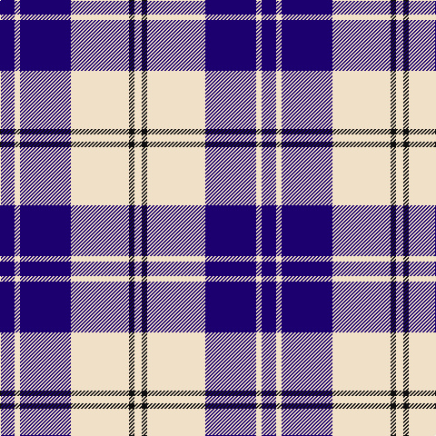

In pattern [BWBWKW](/stripes/bwbwkw/).

This was sourced from tartans-authority.  It is a [6 stripe tartan](/stripes/stripes6/).

Original link http://www.tartansauthority.com/tartan-ferret/display/7591/

## Also known as

This cloth is also recorded under:

- Ailsa, Navy

## Attestations

This cloth appears in 3 source records; the oldest owns this page.

- March 2008 — Ailsa, Navy (Dance) (tartans-authority, [record](http://www.tartansauthority.com/tartan-ferret/display/7591/))
- undated — Ailsa Navy (register-of-tartans, [record](https://www.tartanregister.gov.uk/tartanDetails.aspx?ref=5615))
- undated — Ailsa Navy Fashion Tartan Tartan Number: 7591. Earliest known date: March 2008 One of a series of dancer's tartans for the House of Edgar's in-house collection designed by Kirsty Anderson. See products available Copyright © Blair Urquhart, Comrie, 2015 (house-of-tartan, [record](http://www.house-of-tartan.scotland.net/house/TartanViewjs.asp?colr=Def&tnam=7591))

## Register references

External register numbers recorded for this tartan.

- Scottish Register of Tartans: [5615](https://www.tartanregister.gov.uk/tartanDetails.aspx?ref=5615)
- Scottish Tartans Authority (ITI): 7591

## Thread count
DB/16 W6 DB56 W64 K6 W/8

## Palette
Each colour and the base-6 reference it is a variant of.

| Colour | Shade | Base |
|---|---|---|
| DB | <code style="background-color:#1C0070;">#1C0070</code> `oklch(26.3% 0.162 277.1)` <small>#1C0070</small> | B <code style="background-color:#2A418A;">#2A418A</code> |
| K | <code style="background-color:#101010;">#101010</code> `oklch(17.3% 0.000 89.9)` <small>#101010</small> | K <code style="background-color:#000000;">#000000</code> |
| W | <code style="background-color:#F0E0C8;">#F0E0C8</code> `oklch(91.3% 0.036 78.1)` <small>#F0E0C8</small> | W <code style="background-color:#F7F7F7;">#F7F7F7</code> |

# Sample pattern

## Nearest tartans

The nearest existing variants by ΔTartan distance, with this tartan at the top so the swatches line up against it.

ΔTartan

Tartan

Sett

—

<a href="/ttd/edit/#slug=db8w3db28w32k3w4~x2">Ailsa, Navy (Dance)</a> <a class="nn-out" href="/setts/s6/db8w3db28w32k3w4~x2/" title="open its dictionary page">↗</a>

0.92

<a href="/ttd/edit/#slug=k1w3db2w4db8w1db1~x6">Queen Margaret University (Corporate</a> <a class="nn-out" href="/setts/s7/k1w3db2w4db8w1db1~x6/" title="open its dictionary page">↗</a>

0.92

<a href="/ttd/edit/#slug=w5db16w5db16w33r3~x2">Buchanan Dress Blue (Dance)</a> <a class="nn-out" href="/setts/s6/w5db16w5db16w33r3~x2/" title="open its dictionary page">↗</a>

1.06

<a href="/ttd/edit/#slug=db8t3db28w32dt3w4~x2">Ailsa, Royal Blue (Dance)</a> <a class="nn-out" href="/setts/s6/db8t3db28w32dt3w4~x2/" title="open its dictionary page">↗</a>

1.17

<a href="/ttd/edit/#slug=w5k3w26db21w3db8ly3~x2">MacPherson Dress Blue (Dance)</a> <a class="nn-out" href="/setts/s7/w5k3w26db21w3db8ly3~x2/" title="open its dictionary page">↗</a>

1.23

<a href="/ttd/edit/#slug=w6b3w20k2w3k25w3~x2">Forbes Dress (Clans Originaux)</a> <a class="nn-out" href="/setts/s7/w6b3w20k2w3k25w3~x2/" title="open its dictionary page">↗</a>

1.25

<a href="/ttd/edit/#slug=k3lr16k4lr3k12w2~x3">MacMugen</a> <a class="nn-out" href="/setts/s6/k3lr16k4lr3k12w2~x3/" title="open its dictionary page">↗</a>

1.28

<a href="/ttd/edit/#slug=db6w2db29w29db2w6~x2">Erskine Blue (Dance)</a> <a class="nn-out" href="/setts/s6/db6w2db29w29db2w6~x2/" title="open its dictionary page">↗</a>

1.36

<a href="/ttd/edit/#slug=lb5k4lb32k32lb5k4~x2">Valley Forge (Artefact)</a> <a class="nn-out" href="/setts/s6/lb5k4lb32k32lb5k4~x2/" title="open its dictionary page">↗</a>

1.39

<a href="/ttd/edit/#slug=db4w35db31w4~x2">Lewis, Navy (Dance)</a> <a class="nn-out" href="/setts/s4/db4w35db31w4~x2/" title="open its dictionary page">↗</a>

1.40

<a href="/ttd/edit/#slug=db19ly2db3w7db3w7db9w3db2w19~x2">Yorkshire, The Spirit of</a> <a class="nn-out" href="/setts/s10/db19ly2db3w7db3w7db9w3db2w19~x2/" title="open its dictionary page">↗</a>

## Neighbour map

Every grey dot is one of 14299 variants placed by the first two principal components of the ΔTartan feature space (44% of its variance). Red is this tartan; blue dots are its nearest — click one to open its page.

<svg viewBox="0 0 640 380" role="img" style="max-width:100%;height:auto;border:1px solid #e0e0e0;border-radius:4px;display:block" xmlns="http://www.w3.org/2000/svg"><image href="/nn/cloud.v1.png" width="640" height="380"/><a href="/setts/s7/k1w3db2w4db8w1db1~x6/"><circle cx="280.5" cy="208.6" r="4" fill="#3465a4"><title>Queen Margaret University (Corporate</title></circle></a><a href="/setts/s6/w5db16w5db16w33r3~x2/"><circle cx="283.7" cy="194.6" r="4" fill="#3465a4"><title>Buchanan Dress Blue (Dance)</title></circle></a><a href="/setts/s6/db8t3db28w32dt3w4~x2/"><circle cx="243.3" cy="175.5" r="4" fill="#3465a4"><title>Ailsa, Royal Blue (Dance)</title></circle></a><a href="/setts/s7/w5k3w26db21w3db8ly3~x2/"><circle cx="234.9" cy="177.1" r="4" fill="#3465a4"><title>MacPherson Dress Blue (Dance)</title></circle></a><a href="/setts/s7/w6b3w20k2w3k25w3~x2/"><circle cx="282.1" cy="169.7" r="4" fill="#3465a4"><title>Forbes Dress (Clans Originaux)</title></circle></a><a href="/setts/s6/k3lr16k4lr3k12w2~x3/"><circle cx="251.6" cy="220.9" r="4" fill="#3465a4"><title>MacMugen</title></circle></a><a href="/setts/s6/db6w2db29w29db2w6~x2/"><circle cx="320.1" cy="190.1" r="4" fill="#3465a4"><title>Erskine Blue (Dance)</title></circle></a><a href="/setts/s6/lb5k4lb32k32lb5k4~x2/"><circle cx="304.6" cy="219.1" r="4" fill="#3465a4"><title>Valley Forge (Artefact)</title></circle></a><a href="/setts/s4/db4w35db31w4~x2/"><circle cx="307.3" cy="241.2" r="4" fill="#3465a4"><title>Lewis, Navy (Dance)</title></circle></a><a href="/setts/s10/db19ly2db3w7db3w7db9w3db2w19~x2/"><circle cx="265.2" cy="183.9" r="4" fill="#3465a4"><title>Yorkshire, The Spirit of</title></circle></a><circle cx="279.3" cy="189.9" r="5" fill="#c00000"/></svg>

ID: /setts/s6/db8w3db28w32k3w4~x2/
