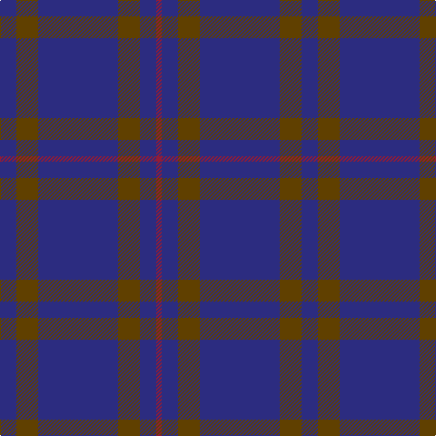

This page is one **sett** — a single exact thread-count. It belongs to the [tartan](/tartans/db9dy12db44dy12db9r3/)
(the same proportion at any scale), whose colour order is pattern [BGBGBR](/stripes/bgbgbr/).

Sourced from register-of-tartans.  It is a [6 stripe tartan](/stripes/stripes6/).

Original link https://www.tartanregister.gov.uk/tartanDetails.aspx?ref=1102

## Register references

External register numbers recorded for this tartan.

- Scottish Register of Tartans: [1102](https://www.tartanregister.gov.uk/tartanDetails.aspx?ref=1102)
- Scottish Tartans Authority (ITI): 596
- Scottish Tartans World Register: 596

## Thread count
DB/18 T24 DB88 T24 DB18 DR/6

## Palette

Palette: <strong>Tartan Register</strong>
<table><thead><tr><th>Colour</th><th>Threads</th><th>Shade</th><th>Base</th><th>OKLCh</th></tr></thead><tbody><tr><td>DB/</td><td style="text-align:right;font-variant-numeric:tabular-nums">18</td><td><code style="background-color:#2C2C80;">#2C2C80</code> <small style="color:#888">#2C2C80</small></td><td>B <code style="background-color:#2A418A;">#2A418A</code></td><td><small style="color:#888">oklch(35.0% 0.138 276.6)</small></td></tr><tr><td>T</td><td style="text-align:right;font-variant-numeric:tabular-nums">24</td><td><code style="background-color:#604000;">#604000</code> <small style="color:#888">#604000</small></td><td>G <code style="background-color:#006100;">#006100</code></td><td><small style="color:#888">oklch(39.8% 0.083 76.8)</small></td></tr><tr><td>DB</td><td style="text-align:right;font-variant-numeric:tabular-nums">88</td><td><code style="background-color:#2C2C80;">#2C2C80</code> <small style="color:#888">#2C2C80</small></td><td>B <code style="background-color:#2A418A;">#2A418A</code></td><td><small style="color:#888">oklch(35.0% 0.138 276.6)</small></td></tr><tr><td>T</td><td style="text-align:right;font-variant-numeric:tabular-nums">24</td><td><code style="background-color:#604000;">#604000</code> <small style="color:#888">#604000</small></td><td>G <code style="background-color:#006100;">#006100</code></td><td><small style="color:#888">oklch(39.8% 0.083 76.8)</small></td></tr><tr><td>DB</td><td style="text-align:right;font-variant-numeric:tabular-nums">18</td><td><code style="background-color:#2C2C80;">#2C2C80</code> <small style="color:#888">#2C2C80</small></td><td>B <code style="background-color:#2A418A;">#2A418A</code></td><td><small style="color:#888">oklch(35.0% 0.138 276.6)</small></td></tr><tr><td>DR/</td><td style="text-align:right;font-variant-numeric:tabular-nums">6</td><td><code style="background-color:#901C38;">#901C38</code> <small style="color:#888">#901C38</small></td><td>R <code style="background-color:#CC0000;">#CC0000</code></td><td><small style="color:#888">oklch(43.2% 0.150 13.1)</small></td></tr></tbody></table>

# Sample pattern

## Nearest tartans

The nearest existing variants by ΔTartan distance, with this tartan at the top so the swatches line up against it.

ΔTartan

Tartan

Sett

—

<a href="/ttd/edit/#slug=db9dy12db44dy12db9r3~x2">Elliot</a> <a class="nn-out" href="/setts/s6/db9dy12db44dy12db9r3~x2/" title="open its dictionary page">↗</a>

1.43

<a href="/ttd/edit/#slug=db44dy12db9r3~x2">Elliot (Clan)</a> <a class="nn-out" href="/setts/s4/db44dy12db9r3~x2/" title="open its dictionary page">↗</a>

1.43

<a href="/ttd/edit/#slug=db50do4db12do23ly4do4~x2">Sligo, County</a> <a class="nn-out" href="/setts/s6/db50do4db12do23ly4do4~x2/" title="open its dictionary page">↗</a>

1.67

<a href="/ttd/edit/#slug=dt68b7dt16k16lo4~x2">Burnett's &amp; Struth (Corporate)</a> <a class="nn-out" href="/setts/s5/dt68b7dt16k16lo4~x2/" title="open its dictionary page">↗</a>

1.70

<a href="/ttd/edit/#slug=db20dp2db3dp2db14g18db4~x2">Pringle, James (Fashion)</a> <a class="nn-out" href="/setts/s7/db20dp2db3dp2db14g18db4~x2/" title="open its dictionary page">↗</a>

1.73

<a href="/ttd/edit/#slug=do14db14do14db40do3db2~x2">Atlin</a> <a class="nn-out" href="/setts/s6/do14db14do14db40do3db2~x2/" title="open its dictionary page">↗</a>

1.82

<a href="/ttd/edit/#slug=db16m4db3r1~x2">Elliot</a> <a class="nn-out" href="/setts/s4/db16m4db3r1~x2/" title="open its dictionary page">↗</a>

1.84

<a href="/ttd/edit/#slug=db8k39db8k39db87r6">Largan (?)</a> <a class="nn-out" href="/setts/s6/db8k39db8k39db87r6/" title="open its dictionary page">↗</a>

1.86

<a href="/ttd/edit/#slug=dt68t7dt16k16lo4~x2">Burnetts &amp; Struth</a> <a class="nn-out" href="/setts/s5/dt68t7dt16k16lo4~x2/" title="open its dictionary page">↗</a>

1.88

<a href="/ttd/edit/#slug=do3db3do3db27do40ly3">Keeper of the Quaich Corporate Tartan Tartan Number: 1731. Earliest known date: 1988 Restricted. Sample in STS collection. See products available Copyright © Blair Urquhart, Comrie, 2015</a> <a class="nn-out" href="/setts/s6/do3db3do3db27do40ly3/" title="open its dictionary page">↗</a>

1.90

<a href="/ttd/edit/#slug=db64dg20r4dg3r4dg3">Wilson</a> <a class="nn-out" href="/setts/s6/db64dg20r4dg3r4dg3/" title="open its dictionary page">↗</a>

## Neighbour map

Every grey dot is one of 14299 variants placed by the first two principal components of the ΔTartan feature space (44% of its variance). Red is this tartan; blue dots are its nearest — click one to open its page.

<svg viewBox="0 0 640 380" role="img" style="max-width:100%;height:auto;border:1px solid #e0e0e0;border-radius:4px;display:block" xmlns="http://www.w3.org/2000/svg"><image href="/nn/cloud.v1.png" width="640" height="380"/><a href="/setts/s4/db44dy12db9r3~x2/"><circle cx="612.0" cy="290.5" r="4" fill="#3465a4"><title>Elliot (Clan)</title></circle></a><a href="/setts/s6/db50do4db12do23ly4do4~x2/"><circle cx="472.3" cy="247.8" r="4" fill="#3465a4"><title>Sligo, County</title></circle></a><a href="/setts/s5/dt68b7dt16k16lo4~x2/"><circle cx="548.1" cy="240.6" r="4" fill="#3465a4"><title>Burnett's &amp; Struth (Corporate)</title></circle></a><a href="/setts/s7/db20dp2db3dp2db14g18db4~x2/"><circle cx="434.9" cy="263.9" r="4" fill="#3465a4"><title>Pringle, James (Fashion)</title></circle></a><a href="/setts/s6/do14db14do14db40do3db2~x2/"><circle cx="552.3" cy="294.4" r="4" fill="#3465a4"><title>Atlin</title></circle></a><a href="/setts/s4/db16m4db3r1~x2/"><circle cx="626.0" cy="291.2" r="4" fill="#3465a4"><title>Elliot</title></circle></a><a href="/setts/s6/db8k39db8k39db87r6/"><circle cx="429.9" cy="254.8" r="4" fill="#3465a4"><title>Largan (?)</title></circle></a><a href="/setts/s5/dt68t7dt16k16lo4~x2/"><circle cx="551.2" cy="244.7" r="4" fill="#3465a4"><title>Burnetts &amp; Struth</title></circle></a><a href="/setts/s6/do3db3do3db27do40ly3/"><circle cx="457.7" cy="238.6" r="4" fill="#3465a4"><title>Keeper of the Quaich Corporate Tartan Tartan Number: 1731. Earliest known date: 1988 Restricted. Sample in STS collection. See products available Copyright © Blair Urquhart, Comrie, 2015</title></circle></a><a href="/setts/s6/db64dg20r4dg3r4dg3/"><circle cx="506.8" cy="210.8" r="4" fill="#3465a4"><title>Wilson</title></circle></a><circle cx="532.3" cy="267.3" r="5" fill="#c00000"/></svg>

ID: /setts/s6/db9dy12db44dy12db9r3~x2/
