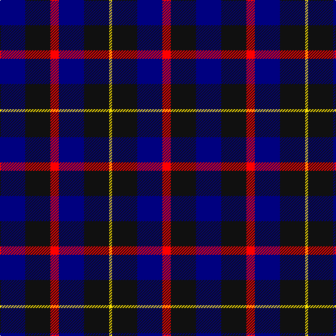

In pattern [BKRBKY](/stripes/bkrbky/).

This was sourced from register-of-tartans.  It is a [6 stripe tartan](/stripes/stripes6/).

Original link https://www.tartanregister.gov.uk/tartanDetails.aspx?ref=10718

## Attestations

This cloth appears in 3 source records; the oldest owns this page.

- 08/10/2012 — Old Brigade (register-of-tartans, [record](https://www.tartanregister.gov.uk/tartanDetails.aspx?ref=10718))
- 08/10/2012 — Old Brigade (tartans-authority, [record](http://www.tartansauthority.com/tartan-ferret/display/10718/))
- undated — Old Brigade Corporate Tartan Tartan Number: 10718. Earliest known date: 12/10/12 This tartan was designed to celebrate the 25th anniversary of the formation of the Old Brigade an informal fraternal society dedicated to good fellowship, formed in 1987. The colours relate to the regiment in which the founding members of the society were serving at the time, with the addition of a gold stripe for excellence. See products available Copyright © Blair Urquhart, Comrie, 2015 (house-of-tartan, [record](http://www.house-of-tartan.scotland.net/house/TartanViewjs.asp?colr=Def&tnam=10718))

## Register references

External register numbers recorded for this tartan.

- Scottish Register of Tartans: [10718](https://www.tartanregister.gov.uk/tartanDetails.aspx?ref=10718)

## Thread count
DB/36 K36 R12 DB36 K36 Y/4

## Palette
Each colour and its ΔE from the base-6 reference it is a variant of.

| Colour | Shade | Base | ΔE (OKLab) |
|---|---|---|---|
| DB | <code style="background-color:#000080;">#000080</code> `#000080` | B <code style="background-color:#2A418A;">#2A418A</code> | 0.14 |
| K | <code style="background-color:#101010;">#101010</code> `#101010` | K <code style="background-color:#000000;">#000000</code> | 0.17 |
| R | <code style="background-color:#FF0000;">#FF0000</code> `#FF0000` | R <code style="background-color:#CC0000;">#CC0000</code> | 0.11 |
| Y | <code style="background-color:#FFE600;">#FFE600</code> `#FFE600` | Y <code style="background-color:#F2BF00;">#F2BF00</code> | 0.10 |

# Sample pattern

## Nearest tartans

The nearest existing variants by ΔTartan distance.

1. [College of Radiographers](/setts/s5/k15lo2k10db18lb3~x2/) — ΔT 1.04
1. [St. Johnstone F.C. (Sports)](/setts/s7/k6lb3k8db7lo2db7lb1~x4/) — ΔT 1.19
1. [College of Radiographers Corporate Tartan Tartan Number: 1274. Earliest known date: 1988 Marketed in Edinburgh around 1930s but no longer seen. See products available Copyright © Blair Urquhart, Comrie, 2015](/setts/s5/k15ly2k10db18w3~x2/) — ΔT 1.23
1. [Britannia](/setts/s5/k14r4k25db30w4~x2/) — ΔT 1.39
1. [Scottish Express International](/setts/s6/k1db7k4lb1k4p1~x4/) — ΔT 1.41
1. [Scottish Express International](/setts/s6/k6db50k29b6k29db6/) — ΔT 1.42
1. [Allianz Deutschland 2012](/setts/s7/n6db3n6db20k20db8w4~x2/) — ΔT 1.44
1. [Lexington Fire Department](/setts/s8/k8db8k2db2w2k5db5r2~x5/) — ΔT 1.45
1. [Gifford (Personal)](/setts/s7/k15r8ly2db25k5db13k5~x2/) — ΔT 1.50
1. [Unnamed, No 54](/setts/s6/db2g6db6dp5db1dp2~x2/) — ΔT 1.54

## Neighbour map

Every grey dot is one of 14299 variants placed by the first two principal components of the ΔTartan feature space (44% of its variance). Red is this tartan; blue dots are its nearest — click one to open its page.

<svg viewBox="0 0 640 380" role="img" style="max-width:100%;height:auto;border:1px solid #e0e0e0;border-radius:4px;display:block" xmlns="http://www.w3.org/2000/svg"><image href="/nn/cloud.v1.png" width="640" height="380"/><a href="/setts/s5/k15lo2k10db18lb3~x2/"><circle cx="273.8" cy="252.7" r="4" fill="#3465a4"><title>College of Radiographers</title></circle></a><a href="/setts/s7/k6lb3k8db7lo2db7lb1~x4/"><circle cx="180.7" cy="242.7" r="4" fill="#3465a4"><title>St. Johnstone F.C. (Sports)</title></circle></a><a href="/setts/s5/k15ly2k10db18w3~x2/"><circle cx="267.5" cy="244.6" r="4" fill="#3465a4"><title>College of Radiographers Corporate Tartan Tartan Number: 1274. Earliest known date: 1988 Marketed in Edinburgh around 1930s but no longer seen. See products available Copyright © Blair Urquhart, Comrie, 2015</title></circle></a><a href="/setts/s5/k14r4k25db30w4~x2/"><circle cx="285.5" cy="262.5" r="4" fill="#3465a4"><title>Britannia</title></circle></a><a href="/setts/s6/k1db7k4lb1k4p1~x4/"><circle cx="285.7" cy="256.9" r="4" fill="#3465a4"><title>Scottish Express International</title></circle></a><a href="/setts/s6/k6db50k29b6k29db6/"><circle cx="255.9" cy="234.7" r="4" fill="#3465a4"><title>Scottish Express International</title></circle></a><a href="/setts/s7/n6db3n6db20k20db8w4~x2/"><circle cx="199.7" cy="236.2" r="4" fill="#3465a4"><title>Allianz Deutschland 2012</title></circle></a><a href="/setts/s8/k8db8k2db2w2k5db5r2~x5/"><circle cx="201.8" cy="268.7" r="4" fill="#3465a4"><title>Lexington Fire Department</title></circle></a><a href="/setts/s7/k15r8ly2db25k5db13k5~x2/"><circle cx="299.8" cy="225.0" r="4" fill="#3465a4"><title>Gifford (Personal)</title></circle></a><a href="/setts/s6/db2g6db6dp5db1dp2~x2/"><circle cx="207.6" cy="288.4" r="4" fill="#3465a4"><title>Unnamed, No 54</title></circle></a><circle cx="233.7" cy="264.0" r="5" fill="#c00000"/></svg>

ID: /setts/s6/db9k9r3db9k9ly1~x4/
