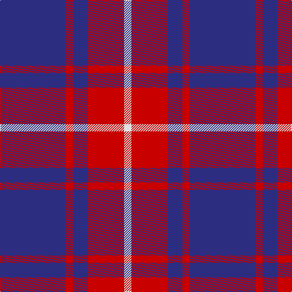

This page is one **sett** — a single exact thread-count. It belongs to the [tartan](/tartans/db9r1db2r1r4w1/)
(the same proportion at any scale), whose colour order is pattern [BRBRRW](/stripes/brbrrw/).

Sourced from tartans-authority.  It is a [6 stripe tartan](/stripes/stripes6/).

Original link http://www.tartansauthority.com/tartan-ferret/display/7953/

## Thread count
DB/108 R12 DBa24 R12 R48 LN/12

## Palette

Palette: <strong>Tartan Register</strong>
<table><thead><tr><th>Colour</th><th>Threads</th><th>Shade</th><th>Base</th><th>OKLCh</th></tr></thead><tbody><tr><td>DB/</td><td style="text-align:right;font-variant-numeric:tabular-nums">108</td><td><code style="background-color:#2C2C80;">#2C2C80</code> <small style="color:#888">#2C2C80</small></td><td>B <code style="background-color:#2A418A;">#2A418A</code></td><td><small style="color:#888">oklch(35.0% 0.138 276.6)</small></td></tr><tr><td>R</td><td style="text-align:right;font-variant-numeric:tabular-nums">12</td><td><code style="background-color:#C80000;">#C80000</code> <small style="color:#888">#C80000</small></td><td>R <code style="background-color:#CC0000;">#CC0000</code></td><td><small style="color:#888">oklch(52.3% 0.215 29.2)</small></td></tr><tr><td>DBa</td><td style="text-align:right;font-variant-numeric:tabular-nums">24</td><td><code style="background-color:#2C2C80;">#2C2C80</code> <small style="color:#888">#2C2C80</small></td><td>B <code style="background-color:#2A418A;">#2A418A</code></td><td><small style="color:#888">oklch(35.0% 0.138 276.6)</small></td></tr><tr><td>R</td><td style="text-align:right;font-variant-numeric:tabular-nums">12</td><td><code style="background-color:#C80000;">#C80000</code> <small style="color:#888">#C80000</small></td><td>R <code style="background-color:#CC0000;">#CC0000</code></td><td><small style="color:#888">oklch(52.3% 0.215 29.2)</small></td></tr><tr><td>R</td><td style="text-align:right;font-variant-numeric:tabular-nums">48</td><td><code style="background-color:#C80000;">#C80000</code> <small style="color:#888">#C80000</small></td><td>R <code style="background-color:#CC0000;">#CC0000</code></td><td><small style="color:#888">oklch(52.3% 0.215 29.2)</small></td></tr><tr><td>LN/</td><td style="text-align:right;font-variant-numeric:tabular-nums">12</td><td><code style="background-color:#E0E0E0;">#E0E0E0</code> <small style="color:#888">#E0E0E0</small></td><td>W <code style="background-color:#F7F7F7;">#F7F7F7</code></td><td><small style="color:#888">oklch(90.7% 0.000 89.9)</small></td></tr></tbody></table>

# Sample pattern

## Nearest tartans

The nearest existing variants by ΔTartan distance, with this tartan at the top so the swatches line up against it.

ΔTartan

Tartan

Sett

—

<a href="/ttd/edit/#slug=db9r1db2r1r4w1~x12">McIntosh, Georgina (Personal)</a> <a class="nn-out" href="/setts/s6/db9r1db2r1r4w1~x12/" title="open its dictionary page">↗</a>

1.16

<a href="/ttd/edit/#slug=ly3dg8o20dp30ly2~x2">Wicks (Personal)</a> <a class="nn-out" href="/setts/s5/ly3dg8o20dp30ly2~x2/" title="open its dictionary page">↗</a>

1.18

<a href="/ttd/edit/#slug=r2b13dr3b3dr16lb2~x4">MacArthur-Fox Blue (Personal)</a> <a class="nn-out" href="/setts/s6/r2b13dr3b3dr16lb2~x4/" title="open its dictionary page">↗</a>

1.19

<a href="/ttd/edit/#slug=g3r2db22r22db2w3~x2">Galloway Red</a> <a class="nn-out" href="/setts/s6/g3r2db22r22db2w3~x2/" title="open its dictionary page">↗</a>

1.23

<a href="/ttd/edit/#slug=k1r7k1r7db16g1~x4">Robinson Dress (Pendleton) #1</a> <a class="nn-out" href="/setts/s6/k1r7k1r7db16g1~x4/" title="open its dictionary page">↗</a>

1.24

<a href="/ttd/edit/#slug=k4b32r30b2w5k2~x2">Masai Shuka 17 (Artefact)</a> <a class="nn-out" href="/setts/s6/k4b32r30b2w5k2~x2/" title="open its dictionary page">↗</a>

1.32

<a href="/ttd/edit/#slug=r10db4r6db30k10db5w2~x2">Heritage of Wales (Fashion)</a> <a class="nn-out" href="/setts/s7/r10db4r6db30k10db5w2~x2/" title="open its dictionary page">↗</a>

1.33

<a href="/ttd/edit/#slug=k60w8lo15dp74k14">Gingles (Personal)</a> <a class="nn-out" href="/setts/s5/k60w8lo15dp74k14/" title="open its dictionary page">↗</a>

1.34

<a href="/ttd/edit/#slug=k1r7k1r7db16g1~x2">Robinson, dress</a> <a class="nn-out" href="/setts/s6/k1r7k1r7db16g1~x2/" title="open its dictionary page">↗</a>

1.40

<a href="/ttd/edit/#slug=db3r24db3r3db25w3~x2">Matthews (Personal)</a> <a class="nn-out" href="/setts/s6/db3r24db3r3db25w3~x2/" title="open its dictionary page">↗</a>

1.40

<a href="/ttd/edit/#slug=dp46p15k12m8g8dp8~x2">Haut (Personal)</a> <a class="nn-out" href="/setts/s6/dp46p15k12m8g8dp8~x2/" title="open its dictionary page">↗</a>

## Neighbour map

Every grey dot is one of 14299 variants placed by the first two principal components of the ΔTartan feature space (44% of its variance). Red is this tartan; blue dots are its nearest — click one to open its page.

<svg viewBox="0 0 640 380" role="img" style="max-width:100%;height:auto;border:1px solid #e0e0e0;border-radius:4px;display:block" xmlns="http://www.w3.org/2000/svg"><image href="/nn/cloud.v1.png" width="640" height="380"/><a href="/setts/s5/ly3dg8o20dp30ly2~x2/"><circle cx="280.6" cy="194.5" r="4" fill="#3465a4"><title>Wicks (Personal)</title></circle></a><a href="/setts/s6/r2b13dr3b3dr16lb2~x4/"><circle cx="279.1" cy="216.5" r="4" fill="#3465a4"><title>MacArthur-Fox Blue (Personal)</title></circle></a><a href="/setts/s6/g3r2db22r22db2w3~x2/"><circle cx="277.4" cy="178.6" r="4" fill="#3465a4"><title>Galloway Red</title></circle></a><a href="/setts/s6/k1r7k1r7db16g1~x4/"><circle cx="329.1" cy="182.1" r="4" fill="#3465a4"><title>Robinson Dress (Pendleton) #1</title></circle></a><a href="/setts/s6/k4b32r30b2w5k2~x2/"><circle cx="284.9" cy="162.3" r="4" fill="#3465a4"><title>Masai Shuka 17 (Artefact)</title></circle></a><a href="/setts/s7/r10db4r6db30k10db5w2~x2/"><circle cx="340.1" cy="187.2" r="4" fill="#3465a4"><title>Heritage of Wales (Fashion)</title></circle></a><a href="/setts/s5/k60w8lo15dp74k14/"><circle cx="248.1" cy="217.5" r="4" fill="#3465a4"><title>Gingles (Personal)</title></circle></a><a href="/setts/s6/k1r7k1r7db16g1~x2/"><circle cx="324.9" cy="181.2" r="4" fill="#3465a4"><title>Robinson, dress</title></circle></a><a href="/setts/s6/db3r24db3r3db25w3~x2/"><circle cx="332.0" cy="211.1" r="4" fill="#3465a4"><title>Matthews (Personal)</title></circle></a><a href="/setts/s6/dp46p15k12m8g8dp8~x2/"><circle cx="258.4" cy="215.2" r="4" fill="#3465a4"><title>Haut (Personal)</title></circle></a><circle cx="285.6" cy="201.3" r="5" fill="#c00000"/></svg>

ID: /setts/s6/db9r1db2r1r4w1~x12/
