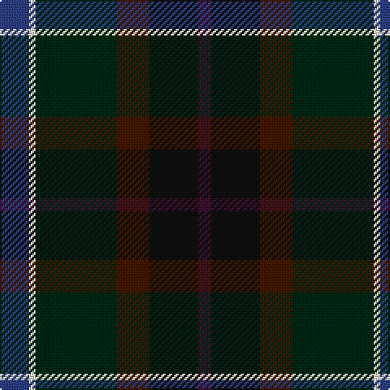

**Bands:** [BKBGWB](/stripes/bkbgwb/) · **Stripes:** [DP K DO DG W DB](/stripes/stripes6/) DP K DO DG W DB

This was sourced from register-of-tartans.  It is a [6 band tartan](/bands/bands6/).

Original link https://www.tartanregister.gov.uk/tartanDetails.aspx?ref=11185

## Attestations

This cloth appears in 2 source records; the oldest owns this page.

- 06/11/2014 — Staley (2014) (register-of-tartans, [record](https://www.tartanregister.gov.uk/tartanDetails.aspx?ref=11185))
- 2014 — Staley (2014) (tartans-authority, [record](http://www.tartansauthority.com/tartan-ferret/display/11185/))

## Register references

External register numbers recorded for this tartan.

- Scottish Register of Tartans: [11185](https://www.tartanregister.gov.uk/tartanDetails.aspx?ref=11185)

## Thread count
B/18 LY4 DG50 DR20 K30 DP/8

## Palette
Each colour and its ΔE from the base-6 reference it is a variant of.

| Colour | Shade | Base | ΔE (OKLab) |
|---|---|---|---|
| B | <code style="background-color:#2C4084;">#2C4084</code> `#2C4084` | B <code style="background-color:#2A418A;">#2A418A</code> | 0.01 |
| DG | <code style="background-color:#002814;">#002814</code> `#002814` | G <code style="background-color:#006100;">#006100</code> | 0.20 |
| DP | <code style="background-color:#3D1130;">#3D1130</code> `#3D1130` | B <code style="background-color:#2A418A;">#2A418A</code> | 0.19 |
| DR | <code style="background-color:#441800;">#441800</code> `#441800` | B <code style="background-color:#2A418A;">#2A418A</code> | 0.23 |
| K | <code style="background-color:#101010;">#101010</code> `#101010` | K <code style="background-color:#000000;">#000000</code> | 0.17 |
| LY | <code style="background-color:#F8F4D0;">#F8F4D0</code> `#F8F4D0` | W <code style="background-color:#F7F7F7;">#F7F7F7</code> | 0.05 |

# Sample pattern

## Nearest tartans

The nearest existing variants by ΔTartan distance.

1. [McHale, Barry Name Tartan Tartan Number: 10708. Earliest known date: 27 September 2012 Barry McHale commissioned the production of this tartan to be worn at his wedding. It may be worn by any of his McHale relatives. See products available Copyright © Blair Urquhart, Comrie, 2015](/setts/s6/n15k10dt30dy11w3lg5~x2/) — ΔT 1.21
1. [Meeson Hunting](/setts/s6/k26n10dt19r6ly2db9~x2/) — ΔT 1.31
1. [Waterford, County (District)](/setts/s6/dg24lo2y16db7do16r5~x2/) — ΔT 1.40
1. [Haughfoot (Commemorative)](/setts/s6/r4k15t4dt15dg24y4~x2/) — ΔT 1.46
1. [Swankie](/setts/s7/dg3dt22dr10o5dg21r6dt3~x2/) — ΔT 1.58
1. [Coffield-Limesand (Personal)](/setts/s9/dp8k1dg2k1do2k6dg8k1w2~x4/) — ΔT 1.64
1. [Unidentified Waistcoat](/setts/s7/db4db4dg16dg16db4db4ly1~x4/) — ΔT 1.64
1. [Cultoquhey Hotel Corporate Tartan Tartan Number: 3393. Earliest known date: circa1990 Designed by Peter MacDonald as a Cook tartan for the former owners (David & Anna) of the Cultoquhey Hotel near Crieff. When they left, if became the house tartan of the hotel See products available Copyright © Blair Urquhart, Comrie, 2015](/setts/s5/r3db22k11dg32ly3~x2/) — ΔT 1.68
1. [Haughfoot](/setts/s10/k15t4dt15dg24y4dg24dt15t4k15r4~x2/) — ΔT 1.69
1. [Linden](/setts/s8/dt4k9g20dp2dg20k5dt6lb2~x2/) — ΔT 1.71

## Neighbour map

Every grey dot is one of 14299 variants placed by the first two principal components of the ΔTartan feature space (44% of its variance). Red is this tartan; blue dots are its nearest — click one to open its page.

<svg viewBox="0 0 640 380" role="img" style="max-width:100%;height:auto;border:1px solid #e0e0e0;border-radius:4px;display:block" xmlns="http://www.w3.org/2000/svg"><image href="/nn/cloud.v1.png" width="640" height="380"/><a href="/setts/s6/n15k10dt30dy11w3lg5~x2/"><circle cx="192.5" cy="219.8" r="4" fill="#3465a4"><title>McHale, Barry Name Tartan Tartan Number: 10708. Earliest known date: 27 September 2012 Barry McHale commissioned the production of this tartan to be worn at his wedding. It may be worn by any of his McHale relatives. See products available Copyright © Blair Urquhart, Comrie, 2015</title></circle></a><a href="/setts/s6/k26n10dt19r6ly2db9~x2/"><circle cx="181.2" cy="214.4" r="4" fill="#3465a4"><title>Meeson Hunting</title></circle></a><a href="/setts/s6/dg24lo2y16db7do16r5~x2/"><circle cx="181.6" cy="222.8" r="4" fill="#3465a4"><title>Waterford, County (District)</title></circle></a><a href="/setts/s6/r4k15t4dt15dg24y4~x2/"><circle cx="157.6" cy="244.8" r="4" fill="#3465a4"><title>Haughfoot (Commemorative)</title></circle></a><a href="/setts/s7/dg3dt22dr10o5dg21r6dt3~x2/"><circle cx="217.3" cy="248.4" r="4" fill="#3465a4"><title>Swankie</title></circle></a><a href="/setts/s9/dp8k1dg2k1do2k6dg8k1w2~x4/"><circle cx="198.9" cy="228.8" r="4" fill="#3465a4"><title>Coffield-Limesand (Personal)</title></circle></a><a href="/setts/s7/db4db4dg16dg16db4db4ly1~x4/"><circle cx="233.3" cy="223.3" r="4" fill="#3465a4"><title>Unidentified Waistcoat</title></circle></a><a href="/setts/s5/r3db22k11dg32ly3~x2/"><circle cx="271.4" cy="243.3" r="4" fill="#3465a4"><title>Cultoquhey Hotel Corporate Tartan Tartan Number: 3393. Earliest known date: circa1990 Designed by Peter MacDonald as a Cook tartan for the former owners (David &amp; Anna) of the Cultoquhey Hotel near Crieff. When they left, if became the house tartan of the hotel See products available Copyright © Blair Urquhart, Comrie, 2015</title></circle></a><a href="/setts/s10/k15t4dt15dg24y4dg24dt15t4k15r4~x2/"><circle cx="178.6" cy="247.2" r="4" fill="#3465a4"><title>Haughfoot</title></circle></a><a href="/setts/s8/dt4k9g20dp2dg20k5dt6lb2~x2/"><circle cx="159.2" cy="208.7" r="4" fill="#3465a4"><title>Linden</title></circle></a><circle cx="209.2" cy="228.9" r="5" fill="#c00000"/></svg>

ID: /setts/s6/db9w2dg25do10k15dp4~x2/
