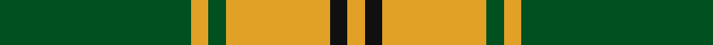

In pattern [GYGYKY](/stripes/gygyky/).

This was sourced from register-of-tartans.  It is a [6 stripe tartan](/stripes/stripes6/).

Original link https://www.tartanregister.gov.uk/tartanDetails.aspx?ref=11025

## Register references

External register numbers recorded for this tartan.

- Scottish Register of Tartans: [11025](https://www.tartanregister.gov.uk/tartanDetails.aspx?ref=11025)

## Thread count
G/44 Y4 G4 Y24 K4 Y/4

## Palette
Each colour and the base-6 reference it is a variant of.

| Colour | Shade | Base |
|---|---|---|
| G | <code style="background-color:#005020;">#005020</code> `oklch(37.7% 0.105 149.6)` <small>#005020</small> | G <code style="background-color:#006100;">#006100</code> |
| K | <code style="background-color:#101010;">#101010</code> `oklch(17.3% 0.000 89.9)` <small>#101010</small> | K <code style="background-color:#000000;">#000000</code> |
| Y | <code style="background-color:#E0A126;">#E0A126</code> `oklch(75.1% 0.146 78.3)` <small>#E0A126</small> | Y <code style="background-color:#F2BF00;">#F2BF00</code> |

# Sample pattern

## Nearest tartans

The nearest existing variants by ΔTartan distance.

1. [Big Spruce Brewing](/setts/s6/dg11ly1dg1ly6k1ly1~x8/) — ΔT 0.78
1. [Forget Family (Yonne)](/setts/s6/dg8lo1dg8lo12r1lo1~x4/) — ΔT 1.01
1. [Sir Billi (Corporate)](/setts/s6/r8g12w5k11g42k3~x2/) — ΔT 1.32
1. [Loch Rannoch](/setts/s5/g19w5g2k5w2~x2/) — ΔT 1.47
1. [Wilson's, No 192](/setts/s4/p4g10r1ly1~x2/) — ΔT 1.49
1. [Sugell (Name?)](/setts/s4/g72r25ly8w5/) — ΔT 1.54
1. [Maxwell, hunting](/setts/s7/g3r16g4k6g28r1g3~x2/) — ΔT 1.56
1. [Limerick County Crest (Fashion)](/setts/s6/w12k3g50w3k13lo6~x2/) — ΔT 1.56
1. [Wilson's, No 189](/setts/s4/p4g10w1r1~x2/) — ΔT 1.56
1. [Beard](/setts/s8/lo4r4k2r10g30lo2g3r2~x2/) — ΔT 1.60

## Neighbour map

Every grey dot is one of 14299 variants placed by the first two principal components of the ΔTartan feature space (44% of its variance). Red is this tartan; blue dots are its nearest — click one to open its page.

<svg viewBox="0 0 640 380" role="img" style="max-width:100%;height:auto;border:1px solid #e0e0e0;border-radius:4px;display:block" xmlns="http://www.w3.org/2000/svg"><image href="/nn/cloud.v1.png" width="640" height="380"/><a href="/setts/s6/dg11ly1dg1ly6k1ly1~x8/"><circle cx="330.1" cy="192.0" r="4" fill="#3465a4"><title>Big Spruce Brewing</title></circle></a><a href="/setts/s6/dg8lo1dg8lo12r1lo1~x4/"><circle cx="321.5" cy="211.4" r="4" fill="#3465a4"><title>Forget Family (Yonne)</title></circle></a><a href="/setts/s6/r8g12w5k11g42k3~x2/"><circle cx="373.7" cy="191.9" r="4" fill="#3465a4"><title>Sir Billi (Corporate)</title></circle></a><a href="/setts/s5/g19w5g2k5w2~x2/"><circle cx="333.1" cy="216.4" r="4" fill="#3465a4"><title>Loch Rannoch</title></circle></a><a href="/setts/s4/p4g10r1ly1~x2/"><circle cx="348.1" cy="222.1" r="4" fill="#3465a4"><title>Wilson's, No 192</title></circle></a><a href="/setts/s4/g72r25ly8w5/"><circle cx="392.4" cy="208.0" r="4" fill="#3465a4"><title>Sugell (Name?)</title></circle></a><a href="/setts/s7/g3r16g4k6g28r1g3~x2/"><circle cx="397.9" cy="166.6" r="4" fill="#3465a4"><title>Maxwell, hunting</title></circle></a><a href="/setts/s6/w12k3g50w3k13lo6~x2/"><circle cx="309.7" cy="166.2" r="4" fill="#3465a4"><title>Limerick County Crest (Fashion)</title></circle></a><a href="/setts/s4/p4g10w1r1~x2/"><circle cx="343.3" cy="220.0" r="4" fill="#3465a4"><title>Wilson's, No 189</title></circle></a><a href="/setts/s8/lo4r4k2r10g30lo2g3r2~x2/"><circle cx="361.3" cy="165.1" r="4" fill="#3465a4"><title>Beard</title></circle></a><circle cx="351.6" cy="201.1" r="5" fill="#c00000"/></svg>

ID: /setts/s6/dg11lo1dg1lo6k1lo1~x4/
