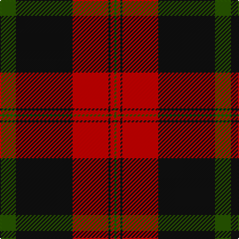

In pattern [GKRKRG](/stripes/gkrkrg/).

This was sourced from register-of-tartans.  It is a [6 stripe tartan](/stripes/stripes6/).

Original link https://www.tartanregister.gov.uk/tartanDetails.aspx?ref=3567

## Also known as

This cloth is also recorded under:

- Rosser of Wales

## Attestations

This cloth appears in 2 source records; the oldest owns this page.

- 01/01/2002 — Rosser of Wales (register-of-tartans, [record](https://www.tartanregister.gov.uk/tartanDetails.aspx?ref=3567))
- undated — Rosser Welsh Name Tartan Tartan Number: 4128. Earliest known date: 2002 The tartan for this Welsh surname and its variations, is actually woven in Wales at the Cambrian Woollen Mill, weaving on the same site since 1830. This tartan differs from many traditional patterns in that the warp and weft differ, giving the finished worsted wool cloth more of a predominant stripe, vertically noticeable in the finished Kilt, or Cilt in Wales. See products available Copyright © Blair Urquhart, Comrie, 2015 (house-of-tartan, [record](http://www.house-of-tartan.scotland.net/house/TartanViewjs.asp?colr=Def&tnam=4128))

## Register references

External register numbers recorded for this tartan.

- Scottish Register of Tartans: [3567](https://www.tartanregister.gov.uk/tartanDetails.aspx?ref=3567)
- Scottish Tartans Authority (ITI): 4128

## Thread count
G/16 K57 R36 K2 R4 G/2

## Palette
Each colour and the base-6 reference it is a variant of.

| Colour | Shade | Base |
|---|---|---|
| G | <code style="background-color:#285800;">#285800</code> `oklch(41.0% 0.122 135.8)` <small>#285800</small> | G <code style="background-color:#006100;">#006100</code> |
| K | <code style="background-color:#101010;">#101010</code> `oklch(17.3% 0.000 89.9)` <small>#101010</small> | K <code style="background-color:#000000;">#000000</code> |
| R | <code style="background-color:#C80000;">#C80000</code> `oklch(52.3% 0.215 29.2)` <small>#C80000</small> | R <code style="background-color:#CC0000;">#CC0000</code> |

# Sample pattern

## Nearest tartans

The nearest existing variants by ΔTartan distance.

1. [Rosser (Welsh Name)](/setts/s6/r16k57r36k2r4r2/) — ΔT 0.94
1. [Dunbar](/setts/s6/r6dg21k8r28k1r4~x2/) — ΔT 1.03
1. [Fraser](/setts/s6/r2db12r2dg12r24w1~x2/) — ΔT 1.30
1. [Ruthven](/setts/s6/lr3dg15db18r30dg1r2~x2/) — ΔT 1.33
1. [Dunbar](/setts/s6/r6dg21k8r28dg1r4~x2/) — ΔT 1.39
1. [Stewart of Atholl (Clan)](/setts/s9/dg22k1dg2k1dg3k8r20k1r3~x4/) — ΔT 1.39
1. [Hungerford RFC](/setts/s6/k50dt3ly3r50~x2/) — ΔT 1.40
1. [MacAlister of Skye (Clan?)](/setts/s9/r4k5lo1r26lb1k30lo1k1lo4~x2/) — ΔT 1.41
1. [Stewart of Atholl](/setts/s9/dg22k1dg2k1dg3k8r20k1r6~x2/) — ΔT 1.41
1. [Greater Victoria Police PB (Corp)](/setts/s7/r7dt1r26dt31w1dt1w2~x2/) — ΔT 1.43

## Neighbour map

Every grey dot is one of 14299 variants placed by the first two principal components of the ΔTartan feature space (44% of its variance). Red is this tartan; blue dots are its nearest — click one to open its page.

<svg viewBox="0 0 640 380" role="img" style="max-width:100%;height:auto;border:1px solid #e0e0e0;border-radius:4px;display:block" xmlns="http://www.w3.org/2000/svg"><image href="/nn/cloud.v1.png" width="640" height="380"/><a href="/setts/s6/r16k57r36k2r4r2/"><circle cx="362.5" cy="166.3" r="4" fill="#3465a4"><title>Rosser (Welsh Name)</title></circle></a><a href="/setts/s6/r6dg21k8r28k1r4~x2/"><circle cx="378.3" cy="185.6" r="4" fill="#3465a4"><title>Dunbar</title></circle></a><a href="/setts/s6/r2db12r2dg12r24w1~x2/"><circle cx="322.0" cy="161.5" r="4" fill="#3465a4"><title>Fraser</title></circle></a><a href="/setts/s6/lr3dg15db18r30dg1r2~x2/"><circle cx="301.0" cy="162.9" r="4" fill="#3465a4"><title>Ruthven</title></circle></a><a href="/setts/s6/r6dg21k8r28dg1r4~x2/"><circle cx="366.5" cy="175.3" r="4" fill="#3465a4"><title>Dunbar</title></circle></a><a href="/setts/s9/dg22k1dg2k1dg3k8r20k1r3~x4/"><circle cx="327.5" cy="162.1" r="4" fill="#3465a4"><title>Stewart of Atholl (Clan)</title></circle></a><a href="/setts/s6/k50dt3ly3r50~x2/"><circle cx="328.8" cy="175.0" r="4" fill="#3465a4"><title>Hungerford RFC</title></circle></a><a href="/setts/s9/r4k5lo1r26lb1k30lo1k1lo4~x2/"><circle cx="365.0" cy="127.2" r="4" fill="#3465a4"><title>MacAlister of Skye (Clan?)</title></circle></a><a href="/setts/s9/dg22k1dg2k1dg3k8r20k1r6~x2/"><circle cx="292.4" cy="153.7" r="4" fill="#3465a4"><title>Stewart of Atholl</title></circle></a><a href="/setts/s7/r7dt1r26dt31w1dt1w2~x2/"><circle cx="410.8" cy="168.3" r="4" fill="#3465a4"><title>Greater Victoria Police PB (Corp)</title></circle></a><circle cx="359.1" cy="173.0" r="5" fill="#c00000"/></svg>

ID: /setts/s6/dg16k57r36k2r4dg2/
