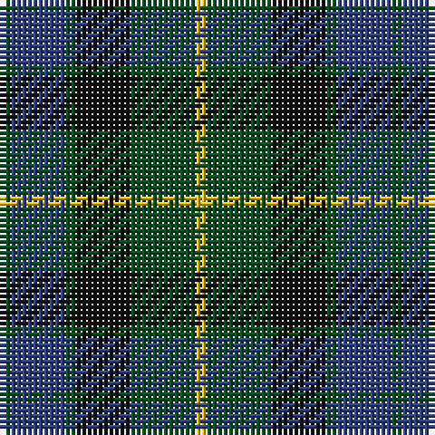

This page is one **sett** — a single exact thread-count. It belongs to the [tartan](/tartans/y1g6k5g1b5g1/)
(the same proportion at any scale), whose colour order is pattern [GBGKGY](/stripes/gbgkgy/).

Sourced from register-of-tartans.  It is a [6 stripe tartan](/stripes/stripes6/).

Original link https://www.tartanregister.gov.uk/tartanDetails.aspx?ref=2499

## Register references

External register numbers recorded for this tartan.

- Scottish Register of Tartans: [2499](https://www.tartanregister.gov.uk/tartanDetails.aspx?ref=2499)
- Scottish Tartans World Register: 718

## Thread count
Y/2 G12 K10 G2 B10 G/2

## Palette
Each colour and the base-6 reference it is a variant of.

| Colour | Shade | Base |
|---|---|---|
| B | <code style="background-color:#2C4084;">#2C4084</code> `oklch(39.4% 0.117 268.3)` <small>#2C4084</small> | B <code style="background-color:#2A418A;">#2A418A</code> |
| G | <code style="background-color:#005020;">#005020</code> `oklch(37.7% 0.105 149.6)` <small>#005020</small> | G <code style="background-color:#006100;">#006100</code> |
| K | <code style="background-color:#101010;">#101010</code> `oklch(17.3% 0.000 89.9)` <small>#101010</small> | K <code style="background-color:#000000;">#000000</code> |
| Y | <code style="background-color:#E8C000;">#E8C000</code> `oklch(81.9% 0.168 93.7)` <small>#E8C000</small> | Y <code style="background-color:#F2BF00;">#F2BF00</code> |

# Sample pattern

## Nearest tartans

The nearest existing variants by ΔTartan distance, with this tartan at the top so the swatches line up against it.

ΔTartan

Tartan

Sett

—

<a href="/ttd/edit/#slug=dg1db5dg1k5dg6ly1~x2">MacKay (Bonner)</a> <a class="nn-out" href="/setts/s6/dg1db5dg1k5dg6ly1~x2/" title="open its dictionary page">↗</a>

0.48

<a href="/ttd/edit/#slug=g1db6k6g6r1g1~x6">Callum Beg (Fashion)</a> <a class="nn-out" href="/setts/s6/g1db6k6g6r1g1~x6/" title="open its dictionary page">↗</a>

0.61

<a href="/ttd/edit/#slug=g21k6t3g11k17db17k3~x2">MacCallum</a> <a class="nn-out" href="/setts/s7/g21k6t3g11k17db17k3~x2/" title="open its dictionary page">↗</a>

0.62

<a href="/ttd/edit/#slug=g8t1g1k6db6k1~x4">Graham of Menteith (Clan)</a> <a class="nn-out" href="/setts/s6/g8t1g1k6db6k1~x4/" title="open its dictionary page">↗</a>

0.62

<a href="/ttd/edit/#slug=g24db6t3k6db12k15g4~x2">Blaylock Annandale (Name)</a> <a class="nn-out" href="/setts/s7/g24db6t3k6db12k15g4~x2/" title="open its dictionary page">↗</a>

0.68

<a href="/ttd/edit/#slug=k3db14r2k14g14k3~x2">Gallamore</a> <a class="nn-out" href="/setts/s6/k3db14r2k14g14k3~x2/" title="open its dictionary page">↗</a>

0.69

<a href="/ttd/edit/#slug=n4g18n3k17n18p4~x2">Scottish Airports</a> <a class="nn-out" href="/setts/s6/n4g18n3k17n18p4~x2/" title="open its dictionary page">↗</a>

0.74

<a href="/ttd/edit/#slug=g52lb7g9k35db35k7">Redland</a> <a class="nn-out" href="/setts/s6/g52lb7g9k35db35k7/" title="open its dictionary page">↗</a>

0.79

<a href="/ttd/edit/#slug=g7db1g1k4dp4k1~x4">MacArthur of Milton (Clan)</a> <a class="nn-out" href="/setts/s6/g7db1g1k4dp4k1~x4/" title="open its dictionary page">↗</a>

0.79

<a href="/ttd/edit/#slug=g8b1g1k6db6k1~x4">Graham of Menteith</a> <a class="nn-out" href="/setts/s6/g8b1g1k6db6k1~x4/" title="open its dictionary page">↗</a>

0.81

<a href="/ttd/edit/#slug=k4dg19k16w2db15dg4~x2">Graham of Montrose</a> <a class="nn-out" href="/setts/s6/k4dg19k16w2db15dg4~x2/" title="open its dictionary page">↗</a>

## Neighbour map

Every grey dot is one of 14299 variants placed by the first two principal components of the ΔTartan feature space (44% of its variance). Red is this tartan; blue dots are its nearest — click one to open its page.

<svg viewBox="0 0 640 380" role="img" style="max-width:100%;height:auto;border:1px solid #e0e0e0;border-radius:4px;display:block" xmlns="http://www.w3.org/2000/svg"><image href="/nn/cloud.v1.png" width="640" height="380"/><a href="/setts/s6/g1db6k6g6r1g1~x6/"><circle cx="197.7" cy="260.1" r="4" fill="#3465a4"><title>Callum Beg (Fashion)</title></circle></a><a href="/setts/s7/g21k6t3g11k17db17k3~x2/"><circle cx="205.9" cy="262.1" r="4" fill="#3465a4"><title>MacCallum</title></circle></a><a href="/setts/s6/g8t1g1k6db6k1~x4/"><circle cx="218.0" cy="248.8" r="4" fill="#3465a4"><title>Graham of Menteith (Clan)</title></circle></a><a href="/setts/s7/g24db6t3k6db12k15g4~x2/"><circle cx="212.8" cy="248.1" r="4" fill="#3465a4"><title>Blaylock Annandale (Name)</title></circle></a><a href="/setts/s6/k3db14r2k14g14k3~x2/"><circle cx="214.2" cy="260.7" r="4" fill="#3465a4"><title>Gallamore</title></circle></a><a href="/setts/s6/n4g18n3k17n18p4~x2/"><circle cx="211.4" cy="275.0" r="4" fill="#3465a4"><title>Scottish Airports</title></circle></a><a href="/setts/s6/g52lb7g9k35db35k7/"><circle cx="207.6" cy="246.5" r="4" fill="#3465a4"><title>Redland</title></circle></a><a href="/setts/s6/g7db1g1k4dp4k1~x4/"><circle cx="233.3" cy="248.6" r="4" fill="#3465a4"><title>MacArthur of Milton (Clan)</title></circle></a><a href="/setts/s6/g8b1g1k6db6k1~x4/"><circle cx="220.4" cy="250.2" r="4" fill="#3465a4"><title>Graham of Menteith</title></circle></a><a href="/setts/s6/k4dg19k16w2db15dg4~x2/"><circle cx="222.9" cy="254.1" r="4" fill="#3465a4"><title>Graham of Montrose</title></circle></a><circle cx="212.9" cy="265.6" r="5" fill="#c00000"/></svg>

ID: /setts/s6/dg1db5dg1k5dg6ly1~x2/
