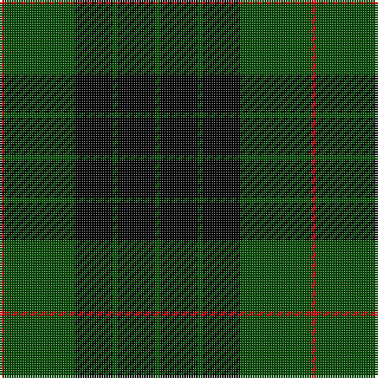

In pattern [GKGKGR](/stripes/gkgkgr/).

This was sourced from weddslist.  It is a [6 stripe tartan](/stripes/stripes6/).

Original link http://www.weddslist.com/cgi-bin/tartans/pg.pl?source=rb

## Attestations

This cloth appears in 2 source records; the oldest owns this page.

- undated — Gunn VS (weddslist, [record](http://www.weddslist.com/cgi-bin/tartans/pg.pl?source=rb))
- undated — Gunn VS (weddslist, [record](http://www.weddslist.com/cgi-bin/tartans/pg.pl?source=x))

## Thread count
R/2 G30 K16 G2 K16 G/2

## Palette
Each colour and the base-6 reference it is a variant of.

| Colour | Shade | Base |
|---|---|---|
| G | <code style="background-color:#004C00;">#004C00</code> `oklch(36.1% 0.123 142.5)` <small>#004C00</small> | G <code style="background-color:#006100;">#006100</code> |
| K | <code style="background-color:#000000;">#000000</code> `oklch(0.0% 0.000 0.0)` <small>#000000</small> | K <code style="background-color:#000000;">#000000</code> |
| R | <code style="background-color:#C80000;">#C80000</code> `oklch(52.3% 0.215 29.2)` <small>#C80000</small> | R <code style="background-color:#CC0000;">#CC0000</code> |

# Sample pattern

## Nearest tartans

The nearest existing variants by ΔTartan distance, with this tartan at the top so the swatches line up against it.

ΔTartan

Tartan

Sett

—

<a href="/ttd/edit/#slug=dg1k8dg1k8dg15r1~x2">Gunn VS</a> <a class="nn-out" href="/setts/s6/dg1k8dg1k8dg15r1~x2/" title="open its dictionary page">↗</a>

0.38

<a href="/ttd/edit/#slug=dg1k8dg1k8dg15r1~x4">Gunn VS</a> <a class="nn-out" href="/setts/s6/dg1k8dg1k8dg15r1~x4/" title="open its dictionary page">↗</a>

0.88

<a href="/ttd/edit/#slug=dg3k6lr1k6dg2k2dg16k1~x2">MacLean VS</a> <a class="nn-out" href="/setts/s8/dg3k6lr1k6dg2k2dg16k1~x2/" title="open its dictionary page">↗</a>

0.96

<a href="/ttd/edit/#slug=dg3k6lb1k6dg2k2dg16k1~x2">MacLean VS</a> <a class="nn-out" href="/setts/s8/dg3k6lb1k6dg2k2dg16k1~x2/" title="open its dictionary page">↗</a>

0.99

<a href="/ttd/edit/#slug=k32dg6k12dg30ly3~x2">MacArthur</a> <a class="nn-out" href="/setts/s5/k32dg6k12dg30ly3~x2/" title="open its dictionary page">↗</a>

1.09

<a href="/ttd/edit/#slug=r1dg16k8dg3k4ly1~x2">Forbes VS</a> <a class="nn-out" href="/setts/s6/r1dg16k8dg3k4ly1~x2/" title="open its dictionary page">↗</a>

1.11

<a href="/ttd/edit/#slug=k32dg6k12dg30ly3">MacArthur</a> <a class="nn-out" href="/setts/s5/k32dg6k12dg30ly3/" title="open its dictionary page">↗</a>

1.21

<a href="/ttd/edit/#slug=r1dg16k8dg3k4ly1">Forbes VS</a> <a class="nn-out" href="/setts/s6/r1dg16k8dg3k4ly1/" title="open its dictionary page">↗</a>

1.33

<a href="/ttd/edit/#slug=r2g12k12g1k12g2~x2">Gunn</a> <a class="nn-out" href="/setts/s6/r2g12k12g1k12g2~x2/" title="open its dictionary page">↗</a>

1.39

<a href="/ttd/edit/#slug=k1dg8k8ly1">Wallace Hunting</a> <a class="nn-out" href="/setts/s4/k1dg8k8ly1/" title="open its dictionary page">↗</a>

1.43

<a href="/ttd/edit/#slug=k2db11k26g11k2~x2">Campbell of Lochawe</a> <a class="nn-out" href="/setts/s5/k2db11k26g11k2~x2/" title="open its dictionary page">↗</a>

## Neighbour map

Every grey dot is one of 14299 variants placed by the first two principal components of the ΔTartan feature space (44% of its variance). Red is this tartan; blue dots are its nearest — click one to open its page.

<svg viewBox="0 0 640 380" role="img" style="max-width:100%;height:auto;border:1px solid #e0e0e0;border-radius:4px;display:block" xmlns="http://www.w3.org/2000/svg"><image href="/nn/cloud.v1.png" width="640" height="380"/><a href="/setts/s6/dg1k8dg1k8dg15r1~x4/"><circle cx="353.6" cy="230.5" r="4" fill="#3465a4"><title>Gunn VS</title></circle></a><a href="/setts/s8/dg3k6lr1k6dg2k2dg16k1~x2/"><circle cx="375.9" cy="206.6" r="4" fill="#3465a4"><title>MacLean VS</title></circle></a><a href="/setts/s8/dg3k6lb1k6dg2k2dg16k1~x2/"><circle cx="364.7" cy="202.1" r="4" fill="#3465a4"><title>MacLean VS</title></circle></a><a href="/setts/s5/k32dg6k12dg30ly3~x2/"><circle cx="327.8" cy="261.9" r="4" fill="#3465a4"><title>MacArthur</title></circle></a><a href="/setts/s6/r1dg16k8dg3k4ly1~x2/"><circle cx="353.3" cy="204.3" r="4" fill="#3465a4"><title>Forbes VS</title></circle></a><a href="/setts/s5/k32dg6k12dg30ly3/"><circle cx="311.0" cy="254.3" r="4" fill="#3465a4"><title>MacArthur</title></circle></a><a href="/setts/s6/r1dg16k8dg3k4ly1/"><circle cx="340.5" cy="198.4" r="4" fill="#3465a4"><title>Forbes VS</title></circle></a><a href="/setts/s6/r2g12k12g1k12g2~x2/"><circle cx="324.0" cy="233.3" r="4" fill="#3465a4"><title>Gunn</title></circle></a><a href="/setts/s4/k1dg8k8ly1/"><circle cx="302.7" cy="272.6" r="4" fill="#3465a4"><title>Wallace Hunting</title></circle></a><a href="/setts/s5/k2db11k26g11k2~x2/"><circle cx="323.4" cy="233.8" r="4" fill="#3465a4"><title>Campbell of Lochawe</title></circle></a><circle cx="343.8" cy="226.3" r="5" fill="#c00000"/></svg>

ID: /setts/s6/dg1k8dg1k8dg15r1~x2/
