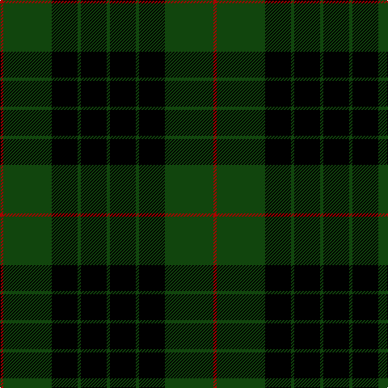

**Bands:** [RGKGKG](/stripes/rgkgkg/) · **Stripes:** [R DG K DG K DG](/stripes/stripes6/) R DG K DG K DG

This was sourced from weddslist.  It is a [6 band tartan](/bands/bands6/).

Original link http://www.weddslist.com/cgi-bin/tartans/pg.pl?source=tinsel

## Register references

External register numbers recorded for this tartan.

- Scottish Register of Tartans: [1166](https://www.tartanregister.gov.uk/tartanDetails.aspx?ref=1166)
- Scottish Register of Tartans: [1510](https://www.tartanregister.gov.uk/tartanDetails.aspx?ref=1510)
- Scottish Register of Tartans: [1758](https://www.tartanregister.gov.uk/tartanDetails.aspx?ref=1758)
- Scottish Register of Tartans: [2307](https://www.tartanregister.gov.uk/tartanDetails.aspx?ref=2307)
- Scottish Register of Tartans: [2349](https://www.tartanregister.gov.uk/tartanDetails.aspx?ref=2349)
- Scottish Register of Tartans: [2540](https://www.tartanregister.gov.uk/tartanDetails.aspx?ref=2540)
- Scottish Register of Tartans: [2582](https://www.tartanregister.gov.uk/tartanDetails.aspx?ref=2582)
- Scottish Register of Tartans: [2585](https://www.tartanregister.gov.uk/tartanDetails.aspx?ref=2585)
- Scottish Register of Tartans: [2625](https://www.tartanregister.gov.uk/tartanDetails.aspx?ref=2625)
- Scottish Register of Tartans: [2730](https://www.tartanregister.gov.uk/tartanDetails.aspx?ref=2730)
- Scottish Register of Tartans: [2862](https://www.tartanregister.gov.uk/tartanDetails.aspx?ref=2862)
- Scottish Register of Tartans: [3072](https://www.tartanregister.gov.uk/tartanDetails.aspx?ref=3072)
- Scottish Register of Tartans: [3555](https://www.tartanregister.gov.uk/tartanDetails.aspx?ref=3555)
- Scottish Register of Tartans: [4925](https://www.tartanregister.gov.uk/tartanDetails.aspx?ref=4925)
- Scottish Register of Tartans: [696](https://www.tartanregister.gov.uk/tartanDetails.aspx?ref=696)
- Scottish Register of Tartans: [697](https://www.tartanregister.gov.uk/tartanDetails.aspx?ref=697)
- Scottish Register of Tartans: [982](https://www.tartanregister.gov.uk/tartanDetails.aspx?ref=982)
- Scottish Tartans Authority (ITI): 1277
- Scottish Tartans Authority (ITI): 1429
- Scottish Tartans Authority (ITI): 218
- Scottish Tartans Authority (ITI): 977
- Scottish Tartans World Register: 1042
- Scottish Tartans World Register: 127
- Scottish Tartans World Register: 1277
- Scottish Tartans World Register: 1399
- Scottish Tartans World Register: 1429
- Scottish Tartans World Register: 1593
- Scottish Tartans World Register: 218
- Scottish Tartans World Register: 2218
- Scottish Tartans World Register: 3061
- Scottish Tartans World Register: 441
- Scottish Tartans World Register: 737
- Scottish Tartans World Register: 858
- Scottish Tartans World Register: 864
- Scottish Tartans World Register: 873
- Scottish Tartans World Register: 897
- Scottish Tartans World Register: 977
- Scottish Tartans World Register: 978

## Variants

Other setts woven to the same stripe pattern.

- [Gunn (Logan)](/setts/s6/dg2k12dg1k12dg12r2~x2/)
- [Gunn VS](/setts/s6/dg1k8dg1k8dg15r1~x2/)

## Thread count
DR/4 DG60 K32 DG4 K32 DG/4

## Palette
Each colour and its ΔE from the base-6 reference it is a variant of.

| Colour | Shade | Base | ΔE (OKLab) |
|---|---|---|---|
| DG | <code style="background-color:#11450D;">#11450D</code> `#11450D` | G <code style="background-color:#006100;">#006100</code> | 0.09 |
| DR | <code style="background-color:#AA0000;">#AA0000</code> `#AA0000` | R <code style="background-color:#CC0000;">#CC0000</code> | 0.07 |
| K | <code style="background-color:#000000;">#000000</code> `#000000` | K <code style="background-color:#000000;">#000000</code> | 0.00 |

# Sample pattern

## Nearest tartans

The nearest existing variants by ΔTartan distance.

1. [Gunn VS](/setts/s6/dg1k8dg1k8dg15r1~x2/) — ΔT 0.38
1. [MacLean VS](/setts/s8/dg3k6lr1k6dg2k2dg16k1~x2/) — ΔT 0.93
1. [MacArthur](/setts/s5/k32dg6k12dg30ly3~x2/) — ΔT 1.01
1. [MacLean VS](/setts/s8/dg3k6lb1k6dg2k2dg16k1~x2/) — ΔT 1.16
1. [Forbes VS](/setts/s6/r1dg16k8dg3k4ly1~x2/) — ΔT 1.17
1. [MacArthur](/setts/s5/k32dg6k12dg30ly3/) — ΔT 1.31
1. [Forbes VS](/setts/s6/r1dg16k8dg3k4ly1/) — ΔT 1.42
1. [MacAulay Hunting](/setts/s8/dg6k16lr1k16dg8k4dg12r2~x2/) — ΔT 1.44
1. [Wallace Hunting](/setts/s4/k1dg8k8ly1/) — ΔT 1.46
1. [Campbell of Lochawe](/setts/s5/k2db11k26g11k2~x2/) — ΔT 1.49

## Neighbour map

Every grey dot is one of 14299 variants placed by the first two principal components of the ΔTartan feature space (44% of its variance). Red is this tartan; blue dots are its nearest — click one to open its page.

<svg viewBox="0 0 640 380" role="img" style="max-width:100%;height:auto;border:1px solid #e0e0e0;border-radius:4px;display:block" xmlns="http://www.w3.org/2000/svg"><image href="/nn/cloud.v1.png" width="640" height="380"/><a href="/setts/s6/dg1k8dg1k8dg15r1~x2/"><circle cx="343.8" cy="226.3" r="4" fill="#3465a4"><title>Gunn VS</title></circle></a><a href="/setts/s8/dg3k6lr1k6dg2k2dg16k1~x2/"><circle cx="375.9" cy="206.6" r="4" fill="#3465a4"><title>MacLean VS</title></circle></a><a href="/setts/s5/k32dg6k12dg30ly3~x2/"><circle cx="327.8" cy="261.9" r="4" fill="#3465a4"><title>MacArthur</title></circle></a><a href="/setts/s8/dg3k6lb1k6dg2k2dg16k1~x2/"><circle cx="364.7" cy="202.1" r="4" fill="#3465a4"><title>MacLean VS</title></circle></a><a href="/setts/s6/r1dg16k8dg3k4ly1~x2/"><circle cx="353.3" cy="204.3" r="4" fill="#3465a4"><title>Forbes VS</title></circle></a><a href="/setts/s5/k32dg6k12dg30ly3/"><circle cx="311.0" cy="254.3" r="4" fill="#3465a4"><title>MacArthur</title></circle></a><a href="/setts/s6/r1dg16k8dg3k4ly1/"><circle cx="340.5" cy="198.4" r="4" fill="#3465a4"><title>Forbes VS</title></circle></a><a href="/setts/s8/dg6k16lr1k16dg8k4dg12r2~x2/"><circle cx="323.8" cy="218.6" r="4" fill="#3465a4"><title>MacAulay Hunting</title></circle></a><a href="/setts/s4/k1dg8k8ly1/"><circle cx="302.7" cy="272.6" r="4" fill="#3465a4"><title>Wallace Hunting</title></circle></a><a href="/setts/s5/k2db11k26g11k2~x2/"><circle cx="323.4" cy="233.8" r="4" fill="#3465a4"><title>Campbell of Lochawe</title></circle></a><circle cx="353.6" cy="230.5" r="5" fill="#c00000"/></svg>

ID: /setts/s6/dg1k8dg1k8dg15r1~x4/
