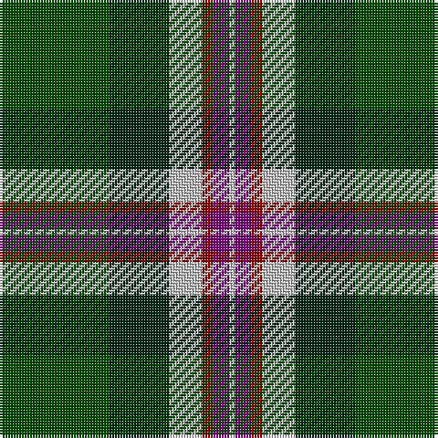

In pattern [GGWRBW](/stripes/ggwrbw/).

This was sourced from register-of-tartans.  It is a [6 stripe tartan](/stripes/stripes6/).

Original link https://www.tartanregister.gov.uk/tartanDetails.aspx?ref=11344

## Register references

External register numbers recorded for this tartan.

- Scottish Register of Tartans: [11344](https://www.tartanregister.gov.uk/tartanDetails.aspx?ref=11344)

## Thread count
G/40 DG22 N12 DR4 P6 N/2

## Palette
Each colour and its ΔE from the base-6 reference it is a variant of.

| Colour | Shade | Base | ΔE (OKLab) |
|---|---|---|---|
| DG | <code style="background-color:#002814;">#002814</code> `#002814` | G <code style="background-color:#006100;">#006100</code> | 0.20 |
| DR | <code style="background-color:#880000;">#880000</code> `#880000` | R <code style="background-color:#CC0000;">#CC0000</code> | 0.15 |
| G | <code style="background-color:#004C00;">#004C00</code> `#004C00` | G <code style="background-color:#006100;">#006100</code> | 0.07 |
| N | <code style="background-color:#C0C0C0;">#C0C0C0</code> `#C0C0C0` | W <code style="background-color:#F7F7F7;">#F7F7F7</code> | 0.17 |
| P | <code style="background-color:#780078;">#780078</code> `#780078` | B <code style="background-color:#2A418A;">#2A418A</code> | 0.17 |

# Sample pattern

## Nearest tartans

The nearest existing variants by ΔTartan distance.

1. [Ferguson, Jerrfey S (Personal)](/setts/s6/g27db12k12r9k1ly2~x2/) — ΔT 0.87
1. [MacNeil 3](/setts/s8/g45w2r3k15r3db15r3db15~x2/) — ΔT 1.02
1. [Colquhoun](/setts/s7/db4k2db16w1k8g24r4~x2/) — ΔT 1.03
1. [Smoke Showing (UFES)](/setts/s9/g3n5k4n33g12k4w2k18lo3~x2/) — ΔT 1.06
1. [Ferguson, Jeffrey S (Personal)](/setts/s6/dg27db12k12r9k1ly2~x2/) — ΔT 1.07
1. [Sinclair Green (Personal)](/setts/s7/r4db15w2n15g30r2g4~x2/) — ΔT 1.07
1. [Hibernian Football Club](/setts/s8/g22w2g22k18dg12dp6k2w1~x2/) — ΔT 1.08
1. [MacLamroc](/setts/s6/ly4k1dg16k16r1w3~x2/) — ΔT 1.09
1. [Crumlish (2015)](/setts/s9/k44ly2dg27ly2dg16w8dg16w2dg8~x2/) — ΔT 1.10
1. [Afternoon Tea / Afternoon Tea](/setts/s6/w15k8m25k72g98ly15/) — ΔT 1.14

## Neighbour map

Every grey dot is one of 14299 variants placed by the first two principal components of the ΔTartan feature space (44% of its variance). Red is this tartan; blue dots are its nearest — click one to open its page.

<svg viewBox="0 0 640 380" role="img" style="max-width:100%;height:auto;border:1px solid #e0e0e0;border-radius:4px;display:block" xmlns="http://www.w3.org/2000/svg"><image href="/nn/cloud.v1.png" width="640" height="380"/><a href="/setts/s6/g27db12k12r9k1ly2~x2/"><circle cx="229.0" cy="165.4" r="4" fill="#3465a4"><title>Ferguson, Jerrfey S (Personal)</title></circle></a><a href="/setts/s8/g45w2r3k15r3db15r3db15~x2/"><circle cx="230.4" cy="135.1" r="4" fill="#3465a4"><title>MacNeil 3</title></circle></a><a href="/setts/s7/db4k2db16w1k8g24r4~x2/"><circle cx="212.9" cy="148.6" r="4" fill="#3465a4"><title>Colquhoun</title></circle></a><a href="/setts/s9/g3n5k4n33g12k4w2k18lo3~x2/"><circle cx="240.3" cy="148.3" r="4" fill="#3465a4"><title>Smoke Showing (UFES)</title></circle></a><a href="/setts/s6/dg27db12k12r9k1ly2~x2/"><circle cx="231.8" cy="164.6" r="4" fill="#3465a4"><title>Ferguson, Jeffrey S (Personal)</title></circle></a><a href="/setts/s7/r4db15w2n15g30r2g4~x2/"><circle cx="255.1" cy="182.9" r="4" fill="#3465a4"><title>Sinclair Green (Personal)</title></circle></a><a href="/setts/s8/g22w2g22k18dg12dp6k2w1~x2/"><circle cx="271.6" cy="175.6" r="4" fill="#3465a4"><title>Hibernian Football Club</title></circle></a><a href="/setts/s6/ly4k1dg16k16r1w3~x2/"><circle cx="212.8" cy="162.7" r="4" fill="#3465a4"><title>MacLamroc</title></circle></a><a href="/setts/s9/k44ly2dg27ly2dg16w8dg16w2dg8~x2/"><circle cx="227.4" cy="152.4" r="4" fill="#3465a4"><title>Crumlish (2015)</title></circle></a><a href="/setts/s6/w15k8m25k72g98ly15/"><circle cx="201.5" cy="180.6" r="4" fill="#3465a4"><title>Afternoon Tea / Afternoon Tea</title></circle></a><circle cx="245.1" cy="169.8" r="5" fill="#c00000"/></svg>

ID: /setts/s6/dg20dg11lb6r2dp3lb1~x2/
