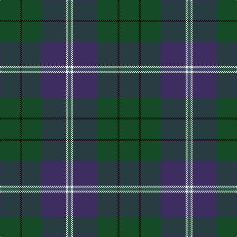

In pattern [BWBGKG](/stripes/bwbgkg/).

This was sourced from register-of-tartans.  It is a [6 stripe tartan](/stripes/stripes6/).

Original link https://www.tartanregister.gov.uk/tartanDetails.aspx?ref=10375

## Register references

External register numbers recorded for this tartan.

- Scottish Register of Tartans: [10375](https://www.tartanregister.gov.uk/tartanDetails.aspx?ref=10375)

## Thread count
G/40 K4 G40 DB50 W4 Ga/6

## Palette
Each colour and the base-6 reference it is a variant of.

| Colour | Shade | Base |
|---|---|---|
| DB | <code style="background-color:#3D2E60;">#3D2E60</code> `oklch(34.4% 0.086 295.4)` <small>#3D2E60</small> | B <code style="background-color:#2A418A;">#2A418A</code> |
| G | <code style="background-color:#124B24;">#124B24</code> `oklch(36.6% 0.088 149.9)` <small>#124B24</small> | G <code style="background-color:#006100;">#006100</code> |
| Ga | <code style="background-color:#3E647A;">#3E647A</code> `oklch(48.4% 0.056 235.0)` <small>#3E647A</small> | B <code style="background-color:#2A418A;">#2A418A</code> |
| K | <code style="background-color:#120A01;">#120A01</code> `oklch(15.2% 0.028 78.6)` <small>#120A01</small> | K <code style="background-color:#000000;">#000000</code> |
| W | <code style="background-color:#F7F1E8;">#F7F1E8</code> `oklch(96.0% 0.014 78.3)` <small>#F7F1E8</small> | W <code style="background-color:#F7F7F7;">#F7F7F7</code> |

# Sample pattern

## Nearest tartans

The nearest existing variants by ΔTartan distance.

1. [Hesco](/setts/s7/dp3n24n10n2g11n8w3~x2/) — ΔT 1.37
1. [Scottish Pup](/setts/s8/dg8do2dg13db4dg12n22dg5ly3~x2/) — ΔT 1.41
1. [Devlin, Craig (Personal)](/setts/s6/g8w3n6db11n30db5~x2/) — ΔT 1.42
1. [Hardie (Name)](/setts/s6/m4dg9w2dg24dt37r3~x2/) — ΔT 1.45
1. [MacConnell](/setts/s10/dt20dg6dt6lb2dg20r8dg6r4dg10lr3~x2/) — ΔT 1.47
1. [Dallard Personal Tartan Tartan Number: 7424. Earliest known date: 2007 The material was going towards a kilt for my wedding in June 2008. See products available Copyright © Blair Urquhart, Comrie, 2015](/setts/s5/dt37dg37o8k3dp5~x2/) — ΔT 1.47
1. [Mackison](/setts/s6/dt18dp1dt12k14g14r2~x2/) — ΔT 1.49
1. [St. Andrews New Golf Club](/setts/s9/dp4dt18r2dt2r2dt9g20dt3g4~x2/) — ΔT 1.49
1. [Bressuire](/setts/s7/dr1dg4y1dg3dr4dt15w1~x4/) — ΔT 1.52
1. [Hardie](/setts/s10/dg9w2dg24dt37r3dt37dg24w2dg9m4~x2/) — ΔT 1.52

## Neighbour map

Every grey dot is one of 14299 variants placed by the first two principal components of the ΔTartan feature space (44% of its variance). Red is this tartan; blue dots are its nearest — click one to open its page.

<svg viewBox="0 0 640 380" role="img" style="max-width:100%;height:auto;border:1px solid #e0e0e0;border-radius:4px;display:block" xmlns="http://www.w3.org/2000/svg"><image href="/nn/cloud.v1.png" width="640" height="380"/><a href="/setts/s7/dp3n24n10n2g11n8w3~x2/"><circle cx="324.2" cy="217.5" r="4" fill="#3465a4"><title>Hesco</title></circle></a><a href="/setts/s8/dg8do2dg13db4dg12n22dg5ly3~x2/"><circle cx="358.1" cy="250.2" r="4" fill="#3465a4"><title>Scottish Pup</title></circle></a><a href="/setts/s6/g8w3n6db11n30db5~x2/"><circle cx="357.6" cy="242.2" r="4" fill="#3465a4"><title>Devlin, Craig (Personal)</title></circle></a><a href="/setts/s6/m4dg9w2dg24dt37r3~x2/"><circle cx="333.9" cy="200.9" r="4" fill="#3465a4"><title>Hardie (Name)</title></circle></a><a href="/setts/s10/dt20dg6dt6lb2dg20r8dg6r4dg10lr3~x2/"><circle cx="279.0" cy="225.0" r="4" fill="#3465a4"><title>MacConnell</title></circle></a><a href="/setts/s5/dt37dg37o8k3dp5~x2/"><circle cx="287.7" cy="237.0" r="4" fill="#3465a4"><title>Dallard Personal Tartan Tartan Number: 7424. Earliest known date: 2007 The material was going towards a kilt for my wedding in June 2008. See products available Copyright © Blair Urquhart, Comrie, 2015</title></circle></a><a href="/setts/s6/dt18dp1dt12k14g14r2~x2/"><circle cx="293.1" cy="235.6" r="4" fill="#3465a4"><title>Mackison</title></circle></a><a href="/setts/s9/dp4dt18r2dt2r2dt9g20dt3g4~x2/"><circle cx="341.2" cy="233.2" r="4" fill="#3465a4"><title>St. Andrews New Golf Club</title></circle></a><a href="/setts/s7/dr1dg4y1dg3dr4dt15w1~x4/"><circle cx="338.7" cy="193.8" r="4" fill="#3465a4"><title>Bressuire</title></circle></a><a href="/setts/s10/dg9w2dg24dt37r3dt37dg24w2dg9m4~x2/"><circle cx="353.4" cy="200.1" r="4" fill="#3465a4"><title>Hardie</title></circle></a><circle cx="360.6" cy="237.3" r="5" fill="#c00000"/></svg>

ID: /setts/s6/dg20k2dg20dp25w2n3~x2/
