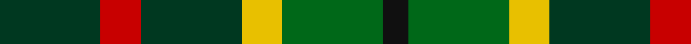

In pattern [GRGYGK](/stripes/grgygk/).

This was sourced from register-of-tartans.  It is a [6 stripe tartan](/stripes/stripes6/).

Original link https://www.tartanregister.gov.uk/tartanDetails.aspx?ref=595

## Attestations

This cloth appears in 2 source records; the oldest owns this page.

- 01/01/2006 — Cates Armigers (Personal) (register-of-tartans, [record](https://www.tartanregister.gov.uk/tartanDetails.aspx?ref=595))
- pre 2006 — Cates Armigers (Personal) (tartans-authority, [record](http://www.tartansauthority.com/tartan-ferret/display/6929/))

## Register references

External register numbers recorded for this tartan.

- Scottish Register of Tartans: [595](https://www.tartanregister.gov.uk/tartanDetails.aspx?ref=595)
- Scottish Tartans Authority (ITI): 6929

## Thread count
DG/40 R16 DG40 Y16 G40 K/10

## Palette
Each colour and its ΔE from the base-6 reference it is a variant of.

| Colour | Shade | Base | ΔE (OKLab) |
|---|---|---|---|
| DG | <code style="background-color:#003820;">#003820</code> `#003820` | G <code style="background-color:#006100;">#006100</code> | 0.15 |
| G | <code style="background-color:#006818;">#006818</code> `#006818` | G <code style="background-color:#006100;">#006100</code> | 0.02 |
| K | <code style="background-color:#101010;">#101010</code> `#101010` | K <code style="background-color:#000000;">#000000</code> | 0.17 |
| R | <code style="background-color:#C80000;">#C80000</code> `#C80000` | R <code style="background-color:#CC0000;">#CC0000</code> | 0.01 |
| Y | <code style="background-color:#E8C000;">#E8C000</code> `#E8C000` | Y <code style="background-color:#F2BF00;">#F2BF00</code> | 0.02 |

# Sample pattern

## Nearest tartans

The nearest existing variants by ΔTartan distance.

1. [MacDonagh](/setts/s7/r20g29db10g16r6g10k19~x2/) — ΔT 1.22
1. [MacDonagh (Name)](/setts/s7/r20dg29db10dg16r6dg10k19~x2/) — ΔT 1.44
1. [MacDona](/setts/s7/r35g52db18g17r12g17k18/) — ΔT 1.52
1. [Gallowater Old District Tartan Tartan Number: 1025. Earliest known date: 1819 Both 'Old' and 'New' appear in Wilson's 1819 pattern book. See products available Copyright © Blair Urquhart, Comrie, 2015](/setts/s5/k19t10dp19g40ly10/) — ΔT 1.53
1. [Forres](/setts/s6/g2lo1g5k4do5r1~x4/) — ΔT 1.54
1. [Ramsay Hunting Family Tartan Tartan Number: 1198. Earliest known date: pre 2003 This sample comes from the MacGregor-Hastie collection which forms the basis of the cloth archive of the Scottish Tartans Society. Some of the samples, including this one, were unmarked. One can assume that the sample dates between 1930 and 1950. See products available Copyright © Blair Urquhart, Comrie, 2015](/setts/s7/k4dy9k13g6dy3g9w4~x2/) — ΔT 1.57
1. [Scottish Parliament (unofficial)](/setts/s7/db14g18k3g18r20k14lo3~x2/) — ΔT 1.59
1. [Wilson's No.122](/setts/s8/g14dt11y3k5y3dt11g14ly2~x2/) — ΔT 1.62
1. [CSCA (Corporate)](/setts/s8/g5r4g19k10g8w4db18r4~x2/) — ΔT 1.63
1. [Rotary International](/setts/s7/g15r3t15r8g15ly2db4~x2/) — ΔT 1.64

## Neighbour map

Every grey dot is one of 14299 variants placed by the first two principal components of the ΔTartan feature space (44% of its variance). Red is this tartan; blue dots are its nearest — click one to open its page.

<svg viewBox="0 0 640 380" role="img" style="max-width:100%;height:auto;border:1px solid #e0e0e0;border-radius:4px;display:block" xmlns="http://www.w3.org/2000/svg"><image href="/nn/cloud.v1.png" width="640" height="380"/><a href="/setts/s7/r20g29db10g16r6g10k19~x2/"><circle cx="197.2" cy="275.4" r="4" fill="#3465a4"><title>MacDonagh</title></circle></a><a href="/setts/s7/r20dg29db10dg16r6dg10k19~x2/"><circle cx="209.5" cy="280.1" r="4" fill="#3465a4"><title>MacDonagh (Name)</title></circle></a><a href="/setts/s7/r35g52db18g17r12g17k18/"><circle cx="182.0" cy="253.9" r="4" fill="#3465a4"><title>MacDona</title></circle></a><a href="/setts/s5/k19t10dp19g40ly10/"><circle cx="108.8" cy="255.8" r="4" fill="#3465a4"><title>Gallowater Old District Tartan Tartan Number: 1025. Earliest known date: 1819 Both 'Old' and 'New' appear in Wilson's 1819 pattern book. See products available Copyright © Blair Urquhart, Comrie, 2015</title></circle></a><a href="/setts/s6/g2lo1g5k4do5r1~x4/"><circle cx="166.4" cy="268.6" r="4" fill="#3465a4"><title>Forres</title></circle></a><a href="/setts/s7/k4dy9k13g6dy3g9w4~x2/"><circle cx="117.2" cy="273.0" r="4" fill="#3465a4"><title>Ramsay Hunting Family Tartan Tartan Number: 1198. Earliest known date: pre 2003 This sample comes from the MacGregor-Hastie collection which forms the basis of the cloth archive of the Scottish Tartans Society. Some of the samples, including this one, were unmarked. One can assume that the sample dates between 1930 and 1950. See products available Copyright © Blair Urquhart, Comrie, 2015</title></circle></a><a href="/setts/s7/db14g18k3g18r20k14lo3~x2/"><circle cx="143.3" cy="245.8" r="4" fill="#3465a4"><title>Scottish Parliament (unofficial)</title></circle></a><a href="/setts/s8/g14dt11y3k5y3dt11g14ly2~x2/"><circle cx="200.1" cy="241.9" r="4" fill="#3465a4"><title>Wilson's No.122</title></circle></a><a href="/setts/s8/g5r4g19k10g8w4db18r4~x2/"><circle cx="140.9" cy="224.8" r="4" fill="#3465a4"><title>CSCA (Corporate)</title></circle></a><a href="/setts/s7/g15r3t15r8g15ly2db4~x2/"><circle cx="205.9" cy="226.5" r="4" fill="#3465a4"><title>Rotary International</title></circle></a><circle cx="166.6" cy="273.3" r="5" fill="#c00000"/></svg>

ID: /setts/s6/dg20r8dg20ly8g20k5~x2/
